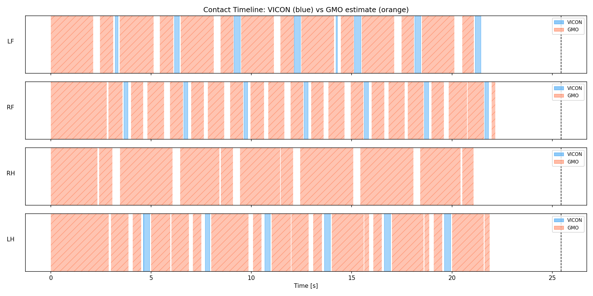
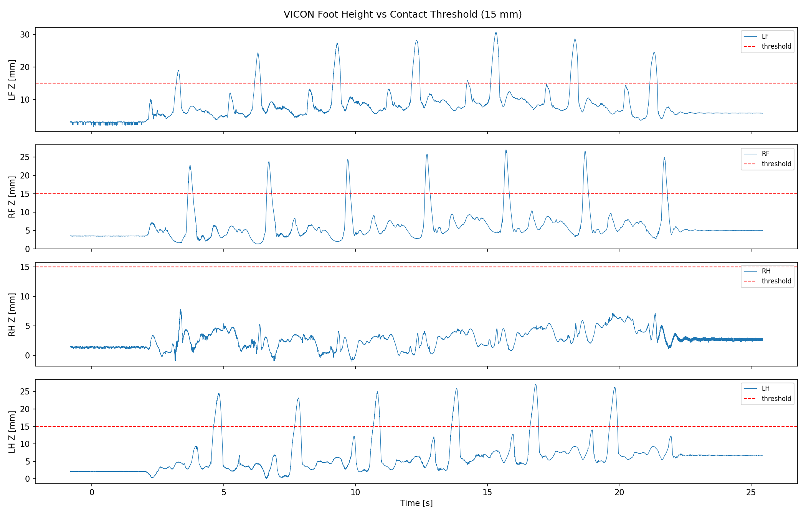
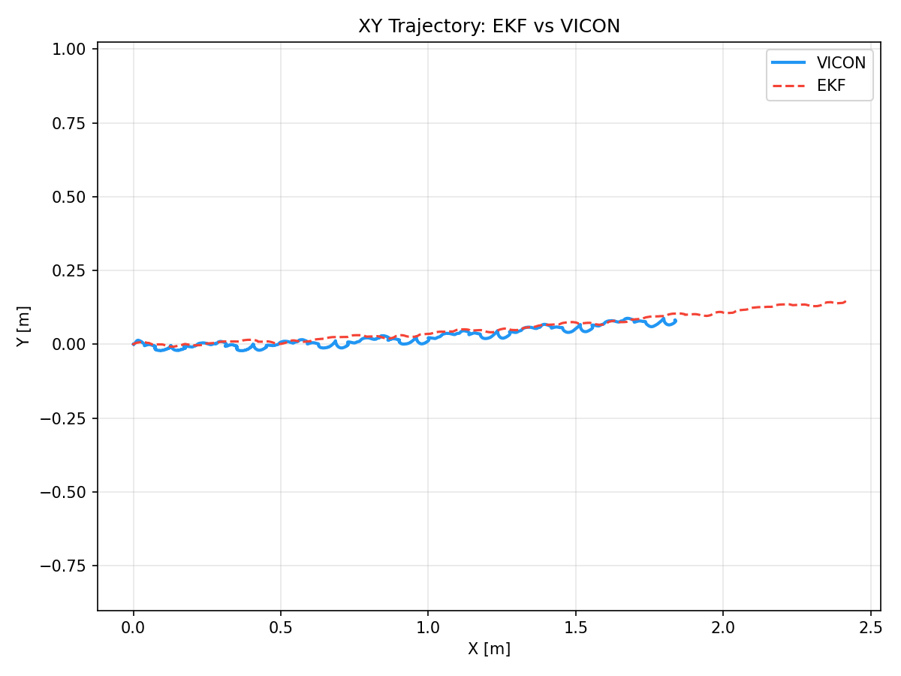
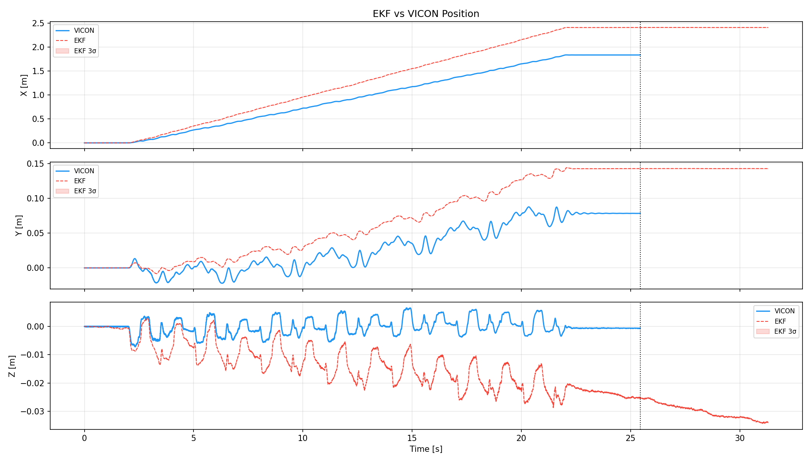
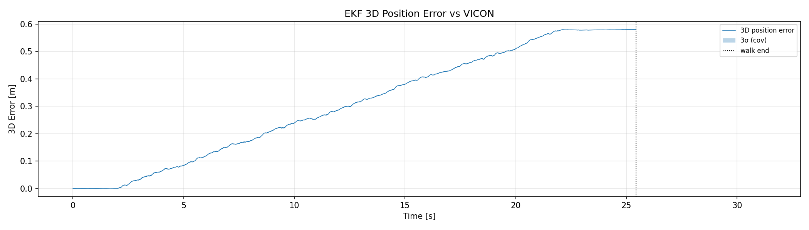
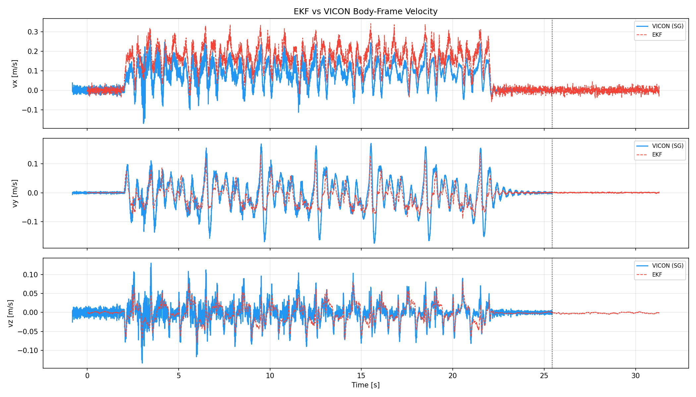
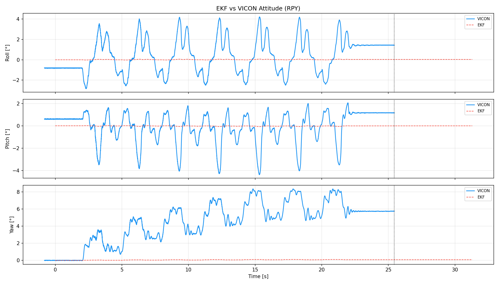
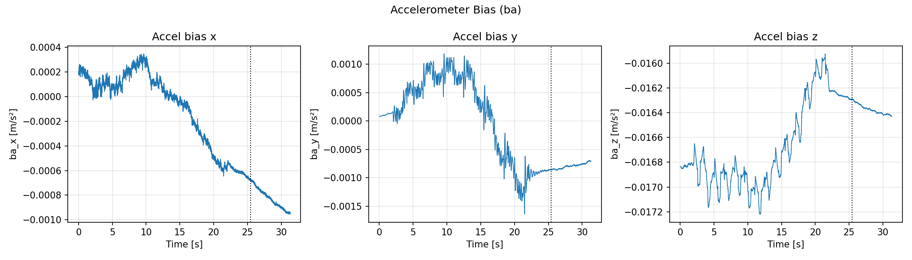
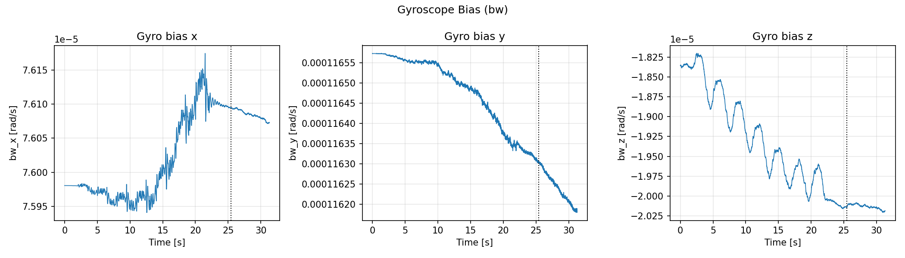

# CORGI 實驗分析報告

**日期：** 2026-05-07  
**實驗：** `walk_2m_01`  
**Bag 檔：** `leg_odom20260507_161231`  
**VICON CSV：** `walk_2m_01.csv`  
**分析時段：** t = 0 – 25.4 s（EKF 與 VICON 重疊段）  
**分析腳本：** `analyze.py`

---

## 系統架構

```
/imu_raw ──┐
/motor/state ──┤──► corgi_leg_odom ──► corgi_ekf ──► /ekf  (odom→base_link)
/trigger ──────┘
/gmo/contact_state ← corgi_gmo
```

*（本 bag 不含外層 fusion 或 LiDAR 話題）*

---

## 1. 觸地偵測

### 1.1 VICON 真值觸地判斷（G1–G4）

觸地閾值：**15 mm**（本資料集：支撐相約 2–10 mm，擺動相約 20–30 mm，閾值經過調整）。




| 腿 | 支撐相比例（行走段） |
|----|------------------|
| LF (G1) | 92.3% |
| RF (G2) | 94.6% |
| RH (G3) | 100.0% |
| LH (G4) | 93.3% |

**觀察：**
- 腳高閾值法可清楚區分支撐相與擺動相。
- 橘色斜線區域為 GMO 估算的觸地區間。

---

## 2. 內層 EKF 分析

### 2.1 位置





| 指標 | 數值 |
|------|------|
| RMSE X（對 VICON） | 0.3629 m |
| RMSE Y（對 VICON） | 0.0398 m |
| RMSE Z（對 VICON） | 0.0156 m |
| RMSE 3D（對 VICON） | 0.3654 m |
| 最大 3D 誤差 | 0.5804 m |
| 終點位置（EKF） | (2.412, 0.143) m |
| 終點位置（VICON） | (1.837, 0.079) m |

### 2.2 速度



| 指標 | 數值 |
|------|------|
| RMSE vx（對 VICON） | 0.0792 m/s |
| RMSE vy（對 VICON） | 0.0331 m/s |
| RMSE vz（對 VICON） | 0.0180 m/s |
| 最大前進速度 | 0.358 m/s |

### 2.3 姿態（RPY）



| 指標 | 數值 |
|------|------|
| RMSE roll（對 VICON） | 1.71° |
| RMSE pitch（對 VICON） | 1.35° |
| RMSE yaw（對 VICON） | 5.08° |
| 終點 yaw（EKF） | 4.58° |
| 終點 yaw（VICON） | 5.74° |

### 2.4 加速度計偏差（ba）



| 軸 | 初始值 [m/s²] | 穩態值 [m/s²] | 標準差 [m/s²] |
|----|--------------|--------------|---------------|
| x | 0.00020 | -0.00067 | 0.000005 |
| y | 0.00008 | -0.00086 | 0.000003 |
| z | -0.01683 | -0.01629 | 0.000001 |

### 2.5 陀螺儀偏差（bw）



| 軸 | 初始值 [rad/s] | 穩態值 [rad/s] | 標準差 [rad/s] |
|----|---------------|---------------|----------------|
| x | 0.000076 | 0.000076 | 0.0000000 |
| y | 0.000117 | 0.000116 | 0.0000000 |
| z | -0.000018 | -0.000020 | 0.0000000 |
