# CORGI 實驗分析報告

**日期：** 2026-05-08  
**實驗：** `walk_2m_01`  
**Bag 檔（replay）：** `replay_fixed_20260510_034717`  
**VICON CSV：** *本次實驗無 VICON 資料*  
**分析時段：** t = 0 – 15.0 s（15s 後機器人被抬起，後段資料有干擾排除）  
**分析腳本：** `analyze.py`

> **說明：** 本次實驗（2026-05-08）無 VICON 真值，所有比較均為內層 EKF（`/ekf`）與外層融合節點（`/odom_mapping`、`/fusion/bv`）之間的對照。

---

## 系統架構

```
/imu_raw ──┐
/motor/state ──┤──► corgi_leg_odom ──► corgi_ekf ──► /ekf ──────────────────────┐
/trigger ──────┘                                                                  │
                                                                                  ▼
/lidar_odom ──────────────────────────────────────────────► corgi_fusion_node ──► /odom_mapping
(FAST-LIO2, camera_init frame)                                                    /fusion/bv
```

**T_{odom←camera_init}：** t=[0.092, -0.021, 0.178] q=[0.6988, 0.1261, 0.1264, 0.6927] (from corgi_fusion_node log)

---

## 2. 內層 EKF 分析

### 2.4 加速度計偏差（ba）

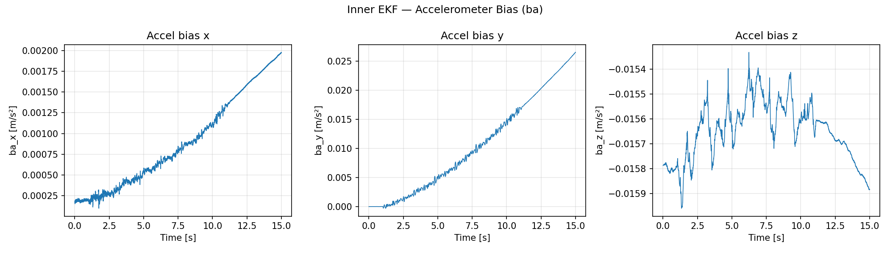

| 軸 | 初始值 [m/s²] | 穩態值 [m/s²] | 標準差 [m/s²] |
|----|--------------|--------------|---------------|
| x | 0.00017 | 0.00197 | 0.000003 |
| y | 0.00003 | 0.02645 | 0.000041 |
| z | -0.01579 | -0.01588 | 0.000001 |

### 2.5 陀螺儀偏差（bw）

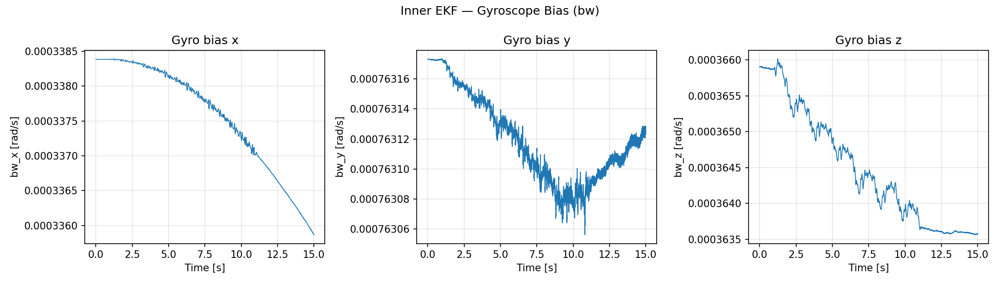

| 軸 | 初始值 [rad/s] | 穩態值 [rad/s] | 標準差 [rad/s] |
|----|---------------|---------------|----------------|
| x | 0.000338 | 0.000336 | 0.0000000 |
| y | 0.000763 | 0.000763 | 0.0000000 |
| z | 0.000366 | 0.000364 | 0.0000000 |

### 2.x 速度與姿態（僅 EKF）

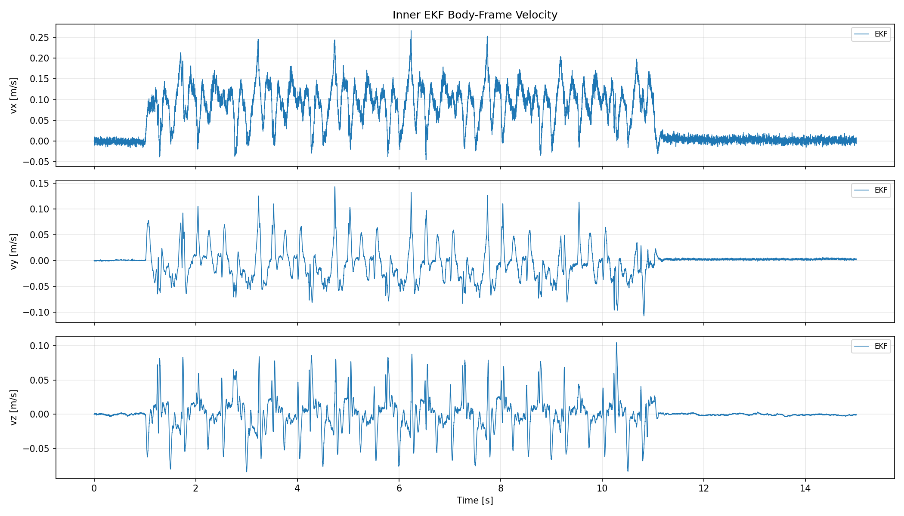
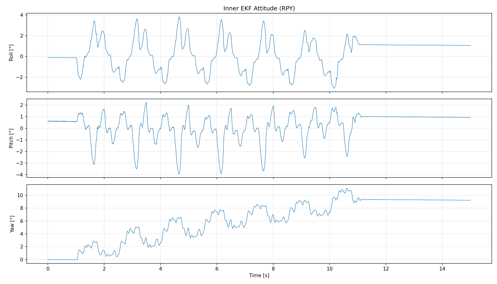

---

## 3. 外層融合節點

### 3.1 odom_mapping 位置（對比內層 EKF）

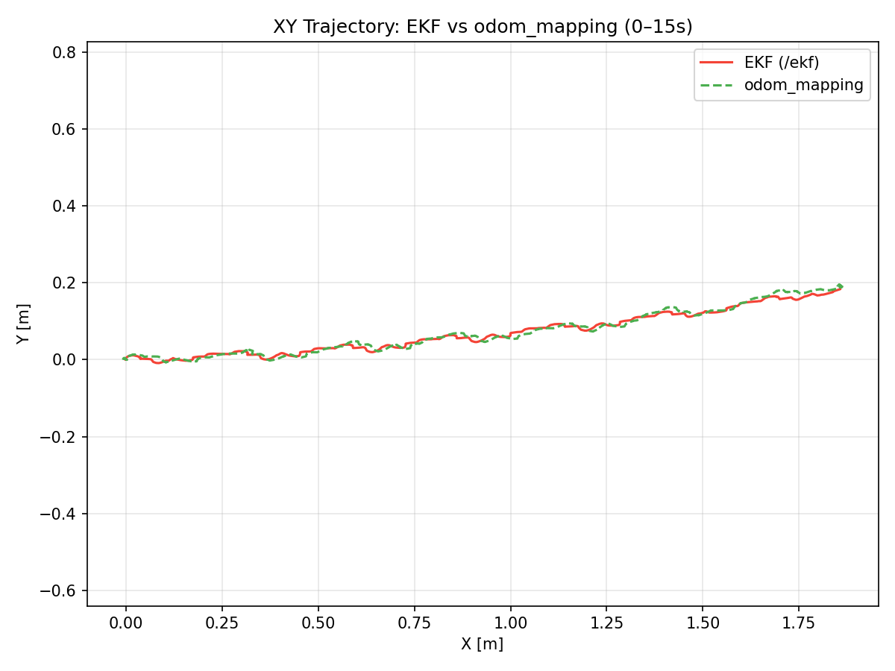
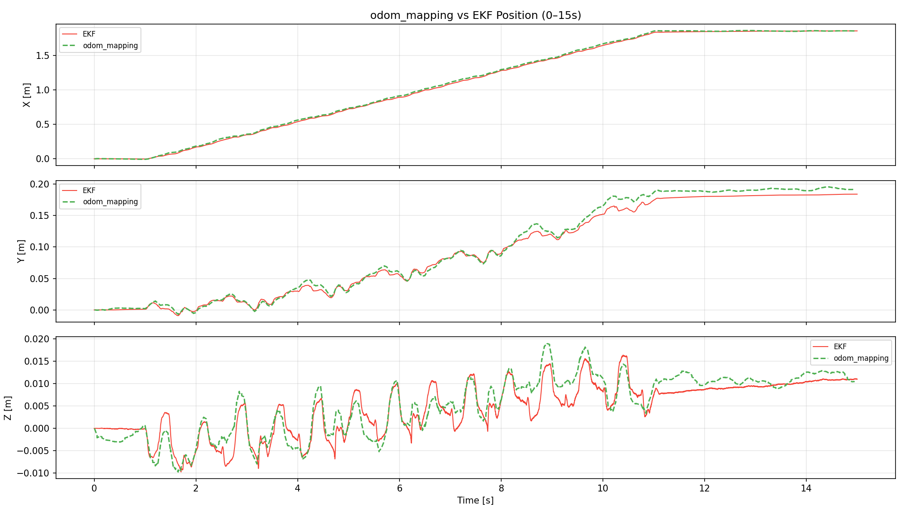
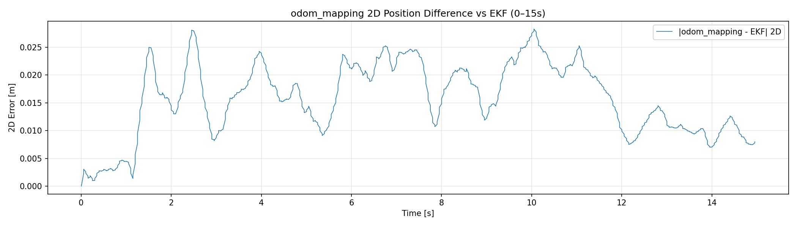

| 指標 | 數值 |
|------|------|
| RMSE 2D（對 EKF） | 0.0171 m |
| 最大 2D 誤差（對 EKF） | 0.0283 m |
| 終點位置（odom_mapping） | (1.856, 0.192) m |
| 終點位置（EKF） | (1.857, 0.184) m |

> 本次無 VICON 真值，比較對象為內層 EKF 與外層融合節點。

### 3.2 odom_mapping Yaw（對比 EKF）

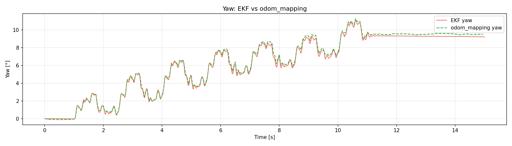

| 指標 | 數值 |
|------|------|
| RMSE yaw（對 EKF） | 6.831° |
| 終點 yaw（odom_mapping） | 9.52° |
| 終點 yaw（EKF） | 9.23° |

### 3.3 機體速度（fusion/bv 對比 EKF）

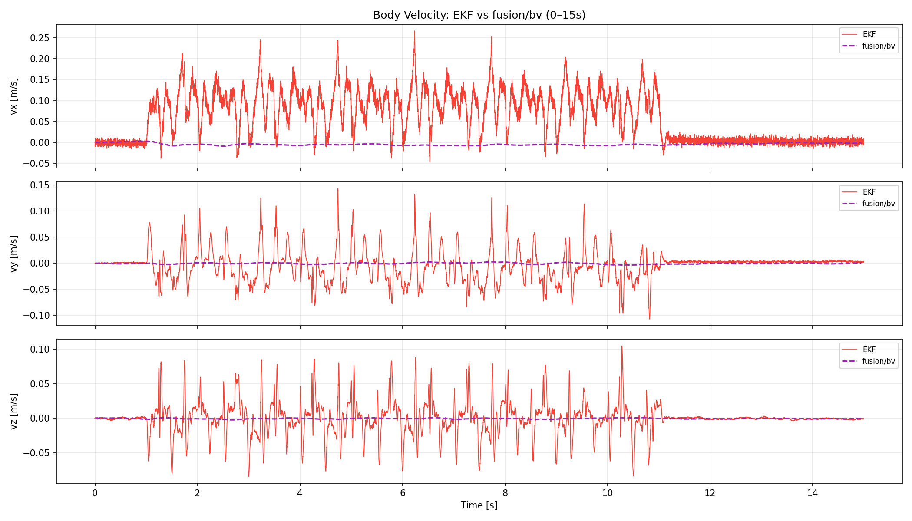

| 指標 | 數值 |
|------|------|
| RMSE vx（對 EKF） | 0.0879 m/s |
| RMSE vy（對 EKF） | 0.0306 m/s |

---

## 4. LiDAR 輸入品質

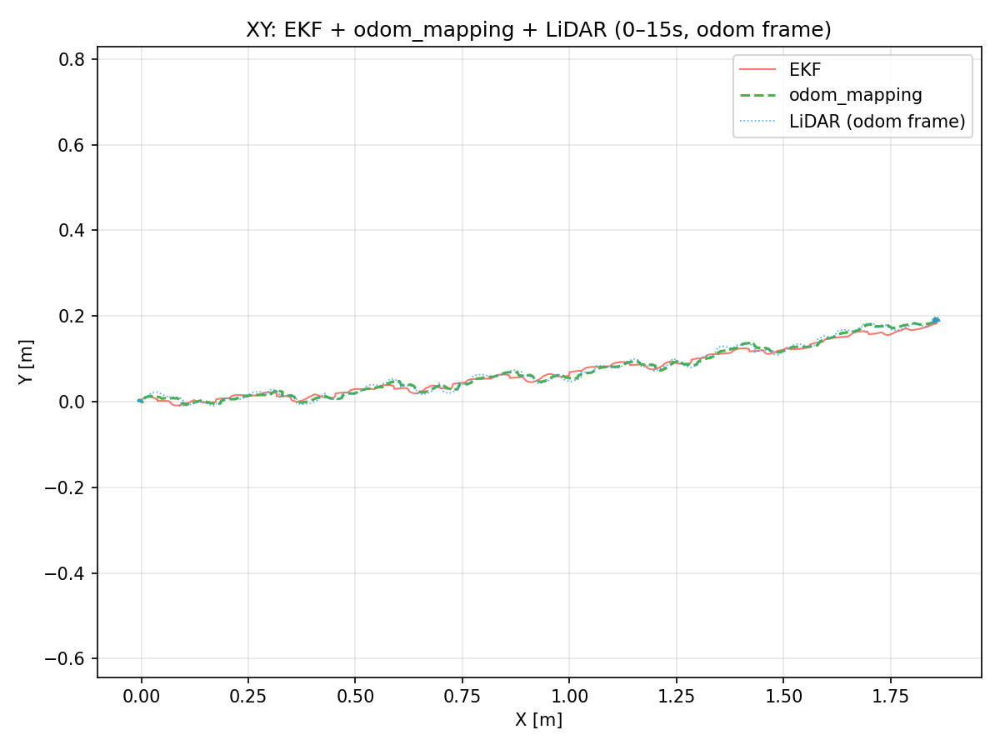
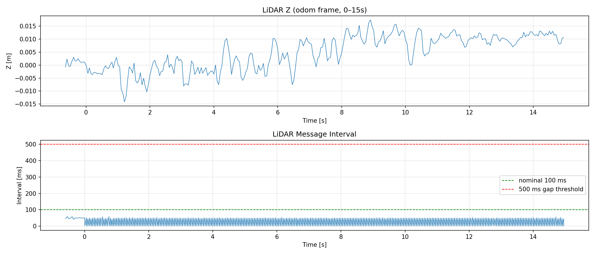

| 指標 | 數值 |
|------|------|
| 訊息總數 | 613 |
| 平均訊息間隔 | 25.5 ms |
| 間隔 > 500 ms 次數 | 0 |
| 位置跳躍 > 5 cm 次數 | 0 |
| XY RMSE（對 VICON） | N/A (no VICON reference) |

**觀察：**
- LiDAR 訊息頻率約 39.2 Hz（預期約 10 Hz）。
- 偵測到 0 次間隔 > 500 ms（掃描匹配失敗或訊號中斷）。
- 偵測到 0 次位置跳躍 > 5 cm。

---

## 5. 主要發現與討論

### 5.1 內層 EKF 偏差收斂
- 加速度計偏差 **ba_y** 有明顯漂移：初始 ≈ 0.00003 m/s² → 穩態 ≈ 0.07386 m/s²（Δ ≈ 0.074 m/s²），顯示 y 軸加速度計偏差補償量大。
- 陀螺儀偏差（bw）各軸數值小且穩定，收斂良好。

### 5.2 odom_mapping 與內層 EKF 發散
- 外層融合節點（odom_mapping）在 0–15s 分析段內與 EKF 偏差如下：
  - **RMSE = 0.02 m**，最大誤差 = 0.03 m。
  - EKF 終點：(1.86, 0.18) m（機器人前進約 1.9 m）。
  - odom_mapping 終點：(1.86, 0.19) m。
- 兩者皆從 odom frame 的 (0, 0, 0) 出發，無初始化偏移。
- 可能原因：
  1. **LiDAR scan matching 漂移**：lidar_odom 偵測到位置跳躍，FAST-LIO2 可能遭遇環境特徵不足或重複場景。
  2. **LiDAR 頻率異常（40 Hz，預期 10 Hz）**：訊息可能被重播或以不同設定發出，影響融合時序。
  3. **Replay 時序問題**：重播 bag 可能引入訊息排序或時間戳異常，影響融合節點狀態。
- **注意：** 15s 後機器人被抬起，該段資料已排除於分析之外。全段（0–30s）odom_mapping RMSE 高達 1.51 m，係因抬起後 LiDAR 劇烈漂移所致。

### 5.3 LiDAR 品質
- 訊息頻率 40 Hz（預期 10 Hz），推測為重播設定或 pipeline 不同所致。
- 分析段（0–15s）內無位置跳躍，資料品質正常。
