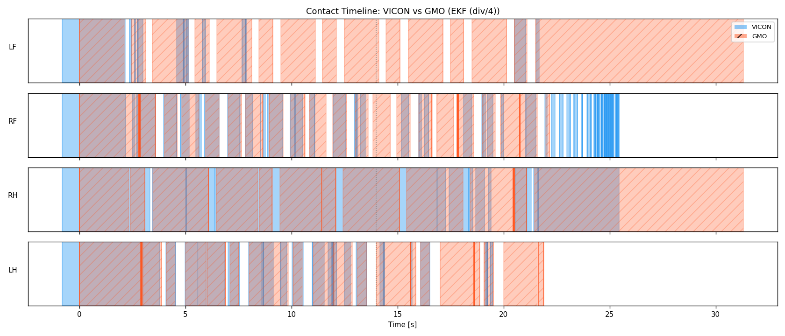
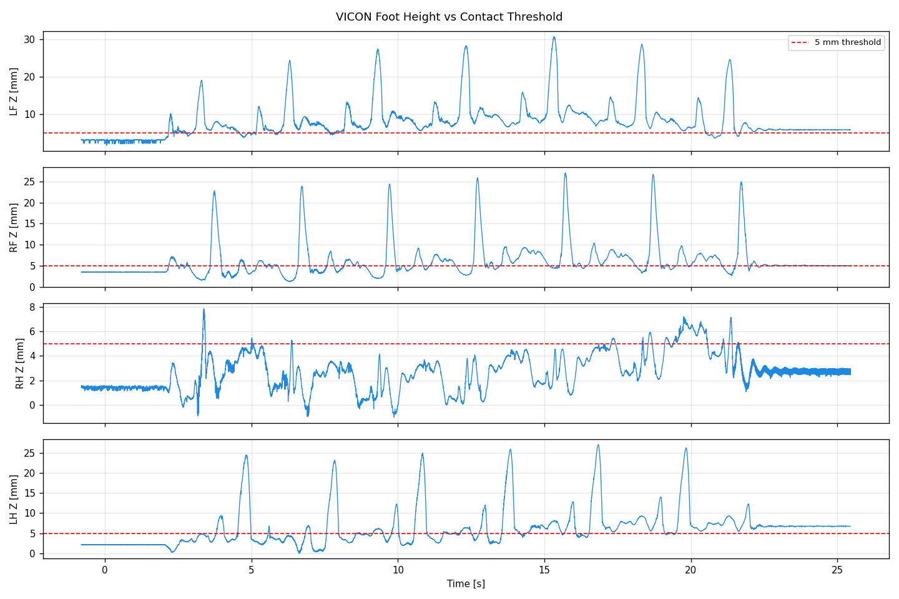
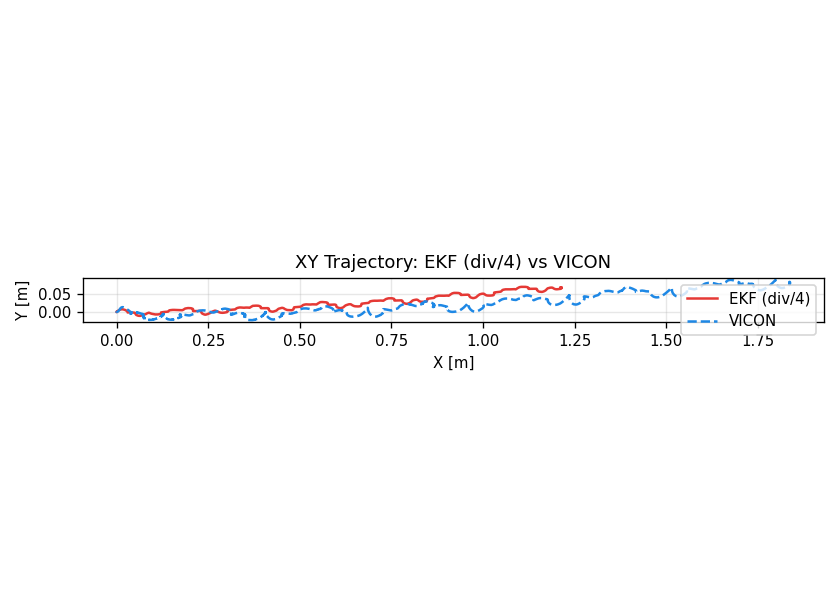
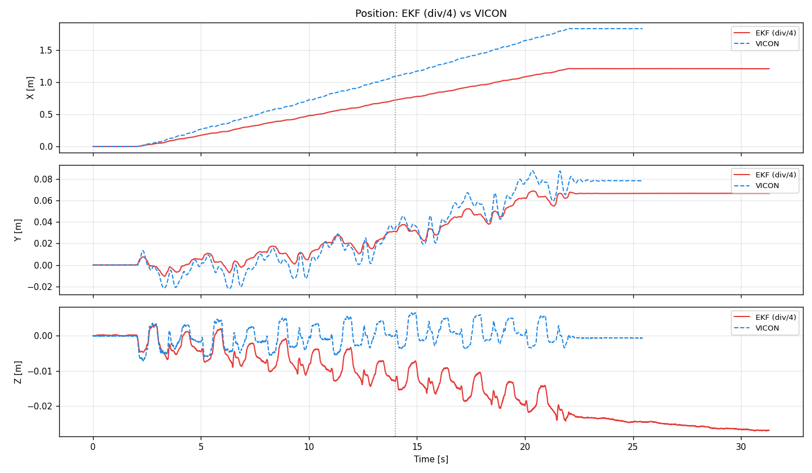
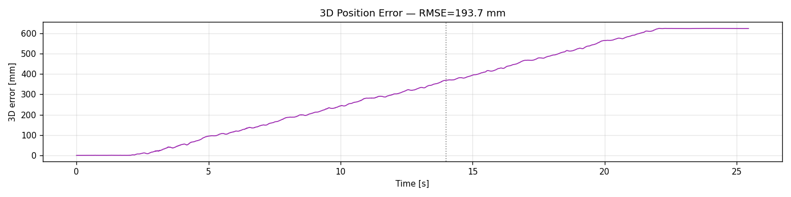
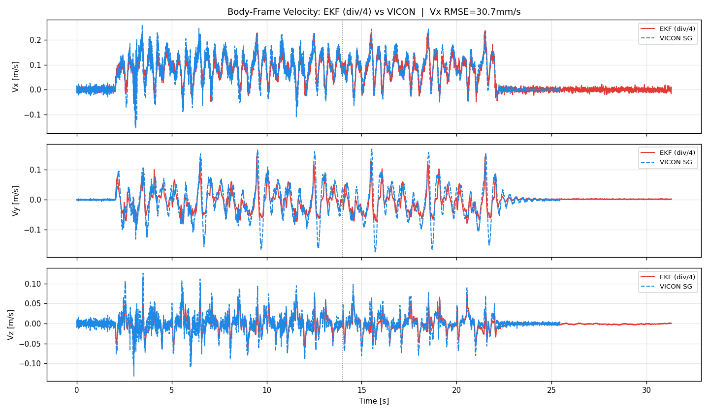
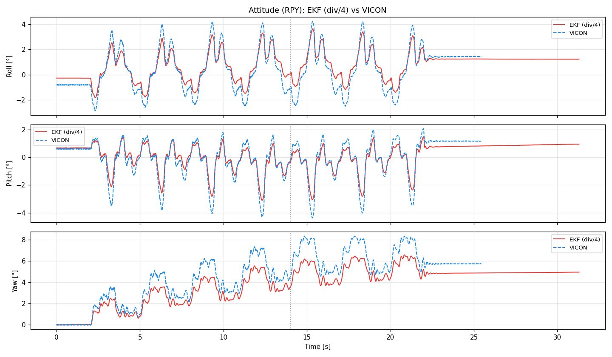
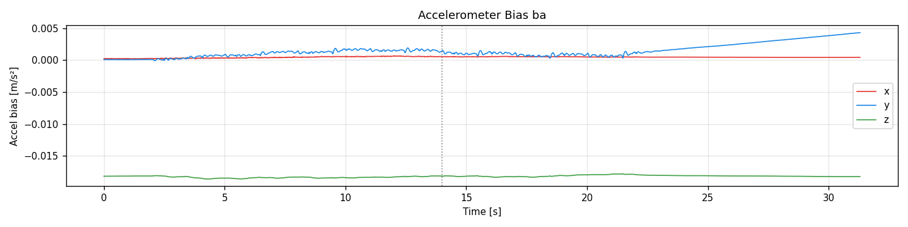
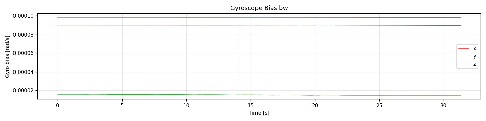

# CORGI Experiment Analysis Report

**Date:** 2026-05-11
**Experiment:** `walk_2m_01_div4`
**Bag (replay output):** `replay_div4_20260511_233348`
**Bag (replay input):** `leg_odom20260507_161231`
**VICON CSV:** `walk_2m_01.csv`
**步行階段:** t = 0 – 14 s
**Analysis script:** `analyze.py`
**演算法修改:** `theta_d` / `beta_d` 除數：2 → 4（對照原始 bag replay）
**接觸閾值 (CONTACT_THRESHOLD_M):** 5 mm

---

## System Architecture

```
/imu_raw ─┐
/motor/state ──┤──► corgi_leg_odom (div/4) ──► /ekf
/trigger ──────┘
/gmo/contact_state
```

---

## 1. 觸地偵測（Contact Detection）

觸地閾值：**5 mm**。




| 腿 | Stance ratio | 平均 stance [ms] | Precision | Recall | Latency [ms] |
|-----|-------------|-----------------|-----------|--------|--------------|
| LF (G1) | 23.5% | 87 | 0.28 | 0.97 | 3.0 |
| RF (G2) | 60.9% | 230 | 0.75 | 0.94 | -0.7 |
| RH (G3) | 98.9% | 2307 | 1.00 | 0.89 | 13.0 |
| LH (G4) | 73.4% | 312 | 0.88 | 0.95 | 23.7 |

GMO Recall 平均 0.94。

---

## 2. Inner EKF 分析

### 2.1 位置





| Metric | Value |
|--------|-------|
| RMSE X | 0.193 m |
| RMSE Y | 0.007 m |
| RMSE Z | 0.006 m |
| RMSE 3D | 0.194 m |
| Max 3D error | 0.369 m |
| Final EKF | (1.212, 0.067) m |
| Final VICON | (1.837, 0.078) m |

### 2.2 速度



| Metric | Value |
|--------|-------|
| RMSE vx | 0.0307 m/s |
| RMSE vy | 0.0325 m/s |
| RMSE vz | 0.0159 m/s |
| Peak Vx (VICON) | 0.26 m/s |

### 2.3 姿態（RPY）



| Metric | Value |
|--------|-------|
| RMSE roll | 0.60° |
| RMSE pitch | 0.43° |
| RMSE yaw | 0.97° |
| Final yaw EKF | 3.5° |
| Final yaw VICON | 4.5° |

### 2.4 加速度計偏差（ba）



| Axis | Initial [m/s²] | SS [m/s²] | Std [m/s²] |
|------|---------------|-----------|------------|
| x | 0.0002 | 0.0004 | 0.00000 |
| y | 0.0001 | 0.0042 | 0.00009 |
| z | -0.0182 | -0.0182 | 0.00000 |

### 2.5 陀螺儀偏差（bw）



| Axis | Initial [rad/s] | SS [rad/s] | Std [rad/s] |
|------|----------------|------------|-------------|
| x | 0.00009 | 0.00009 | 0.000000 |
| y | 0.00010 | 0.00010 | 0.000000 |
| z | 0.00002 | 0.00001 | 0.000000 |

---

## 3. 總結

| Component | Value |
|-----------|-------|
| Inner EKF pos 3D RMSE | 0.194 m |
| Inner EKF Vx RMSE | 0.0307 m/s |
| Inner EKF yaw RMSE | 0.97° |
| Contact recall（平均） | 0.94 |

*由 analyze.py 自動產生（2026-05-11）。分析時間軌跡窗口：0.00 – 25.45 s，EKF 7744 msgs。*
