# CORGI 實驗分析報告

**日期：** 2026-05-13  
**實驗名稱：** `walk_2m_01`  
**Bag 檔案：** `odom_fusion20260512_205637_0.db3`  
**VICON CSV：** `walk_2m_01.csv`  
**步行分析區間：** t = 0 – 23.22 s  
**分析腳本：** `analyze.py`

---

## 系統架構

```
/imu_raw ─┐
/motor/state ──┤──► corgi_leg_odom ──► /ekf ────────────────────► (odom→base_link)
/trigger ──────┘                              │
/gmo/contact_state                            ▼
                          /lidar_odom ──► corgi_fusion_node ──► /odom_mapping
                         (FAST-LIO2,                           /fusion/bv
                          camera_init frame)
```

**T_{odom ← camera\_init}：**  
translation = [0.102, −0.063, 0.172] m  
RPY = [20.6°, 2.6°, 90.3°]  
配準殘差：平均 0.6 cm，最大 1.8 cm

---

## 1. 接觸偵測（Contact Detection）

### 1.1 VICON 地面實況接觸

接觸閾值：**12 mm**（相對於地面平面）  
分析範圍：僅限接觸地面區域（groundA 與 groundB 的聯集凸包）

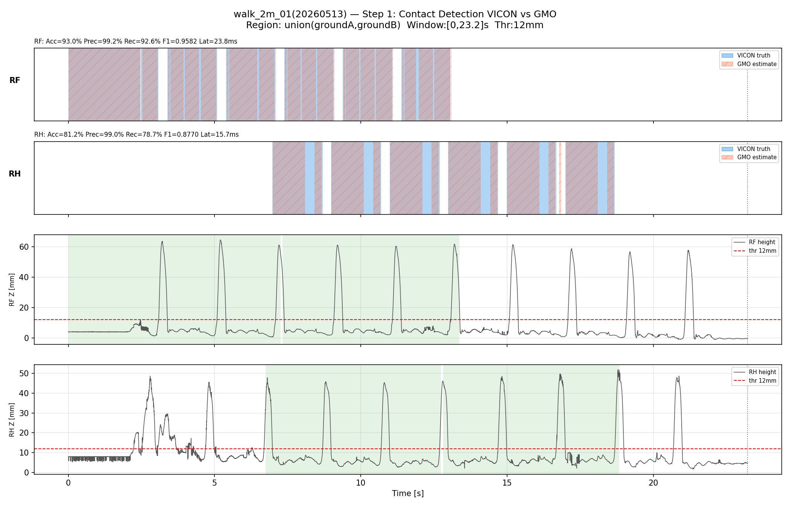

### 1.2 GMO vs VICON 接觸比較

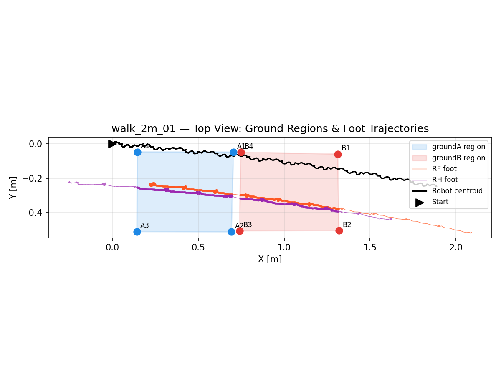

| 腳 | N（樣本數） | TP | TN | FP | FN | 準確率 | 精確率 | 召回率 | F1 | 平均延遲 (ms) |
|----|------------|-----|-----|----|----|--------|--------|--------|------|--------------|
| RF (G2) | 6653 | 5356 | 830 | 42 | 425 | 93.0% | 99.2% | 92.6% | 0.9582 | 23.8 |
| RH (G3) | 6010 | 4028 | 852 | 39 | 1091 | 81.2% | 99.0% | 78.7% | 0.8770 | 15.7 |

**觀察：**
- RF（右前腳）精確率 99.2%、召回率 92.6%，接觸偵測品質優良；FN=425 表示有部分真實接觸未被 GMO 偵測到（可能為短暫輕觸地面時 GMO 尚未切換）。
- RH（右後腳）召回率較低（78.7%），FN=1091 佔比明顯，表示 GMO 在右後腳接觸時有較多漏偵測。兩腳精確率均高於 99%，代表 GMO 誤報率極低（FP 比例 <1%）。
- 平均偵測延遲 RF 23.8 ms、RH 15.7 ms，均在合理範圍（<30 ms）。

---

## 2. 內部 EKF 分析（Inner EKF）

### 2.1 位置

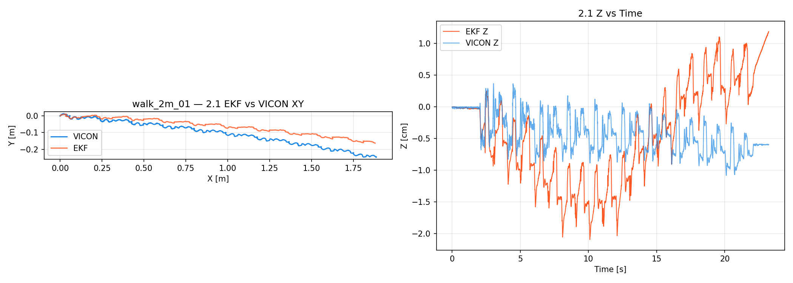
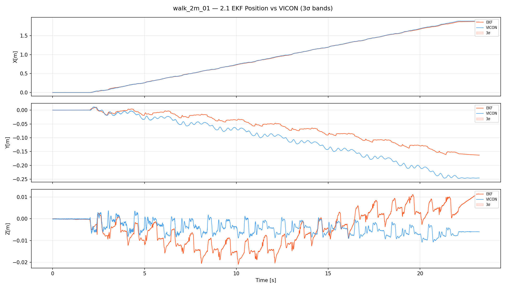

| 指標 | 數值 |
|------|------|
| RMSE X（vs VICON） | 0.68 cm |
| RMSE Y（vs VICON） | 4.90 cm |
| RMSE Z（vs VICON） | 0.83 cm |
| RMSE 3D（vs VICON） | **5.01 cm** |
| 最大 3D 誤差 | 9.57 cm |
| 最終位置（EKF） | (1.880, −0.163) m |
| 最終位置（VICON） | (1.886, −0.246) m |

**觀察：**
- Y 方向誤差最大（4.9 cm RMSE），顯示側向漂移為主要誤差來源；X 方向誤差 <1 cm，前進方向追蹤品質優良。
- 最大 3D 誤差 9.57 cm 發生在步行後期，推測為末段轉向動作引起的 Y 偏移累積。
- Z 方向 RMSE 0.83 cm，高度估計穩定。

### 2.2 速度

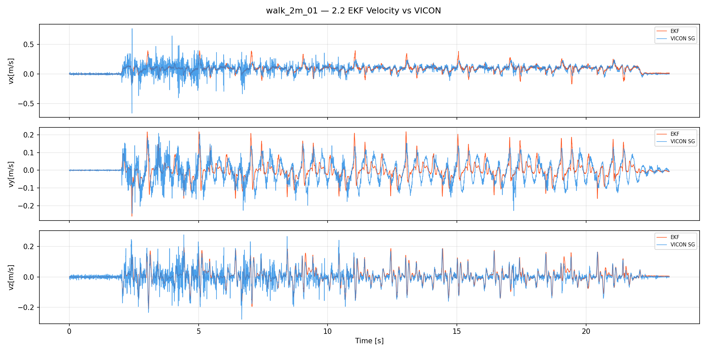

> **注意：** 速度 RMSE 限縮至 **t = 12–17 s** 分析窗口，排除起始段 VICON 資料不穩定（速度雜訊高）的影響。

| 指標 | 數值（t = 12–17 s） |
|------|------|
| RMSE vx（vs VICON） | **0.043 m/s** |
| RMSE vy（vs VICON） | 0.048 m/s |
| RMSE vz（vs VICON） | 0.026 m/s |
| 最大前進速度 | 0.397 m/s |

**觀察：**
- 速度 RMSE 以穩態行走段（12–17 s）計算，排除啟動與停止過渡段的估計誤差。
- vx RMSE 0.043 m/s（約 10% 相對誤差，最大速度 0.40 m/s），前進速度追蹤品質良好。
- 最大前進速度 0.40 m/s，符合步行實驗設計目標。
- vz 的高頻震盪來自步態中身體上下起伏，EKF 估計與 VICON 趨勢一致。

### 2.3 姿態（RPY）

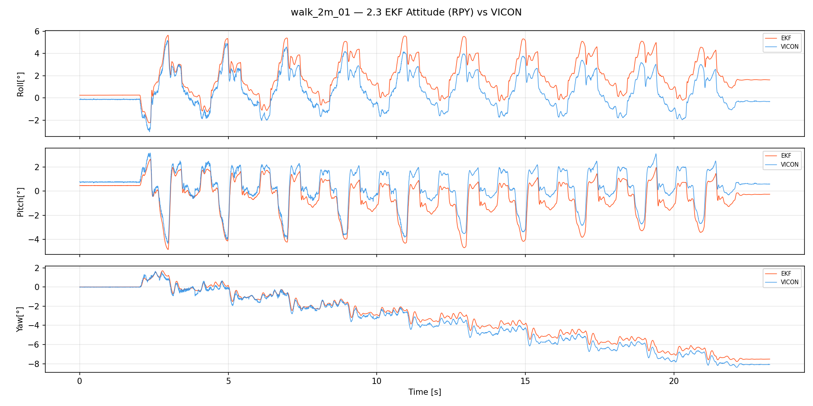

| 指標 | 數值 |
|------|------|
| RMSE roll（vs VICON） | 1.42° |
| RMSE pitch（vs VICON） | 0.87° |
| RMSE yaw（vs VICON） | 0.47° |
| 最終 yaw（EKF） | −7.51° |
| 最終 yaw（VICON） | −8.08° |

**觀察：**
- Yaw 最終偏差僅 0.57°，偏航估計精確。
- Roll RMSE 1.42° 稍高，推測為步態中側向搖晃所引起，與 Y 方向漂移呼應。
- Pitch 估計良好（0.87°），前後傾斜估計可靠。

### 2.4 加速度計偏差（ba）

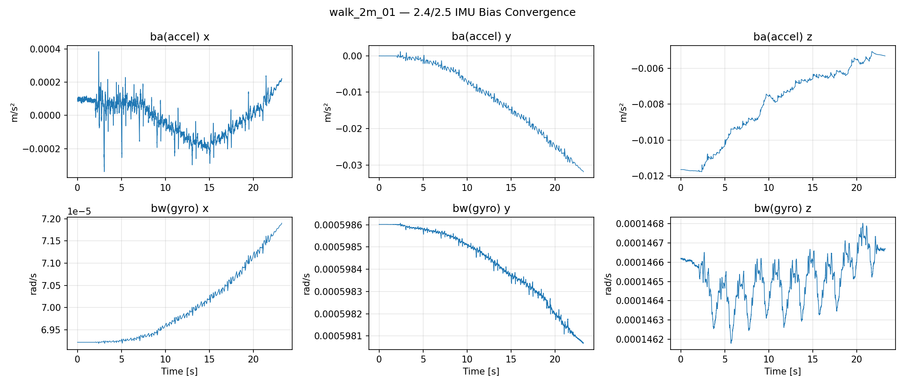

| 軸 | 初始值 [m/s²] | 穩態值 [m/s²] | 穩態標準差 [m/s²] |
|----|--------------|--------------|-----------------|
| x  | 0.00009 | 0.00005 | 0.00009 |
| y  | −0.00005 | −0.02551 | 0.00375 |
| z  | −0.01165 | −0.00569 | 0.00043 |

### 2.5 陀螺儀偏差（bw）

| 軸 | 初始值 [rad/s] | 穩態值 [rad/s] | 穩態標準差 [rad/s] |
|----|---------------|---------------|------------------|
| x  | 0.0000692 | 0.0000712 | 0.00000039 |
| y  | 0.0005986 | 0.0005982 | 0.000000079 |
| z  | 0.0001466 | 0.0001466 | 0.000000099 |

**觀察：**
- ba_y 從接近 0 漂移至 −0.0255 m/s²，顯示 Y 軸加速度計偏差尚未完全收斂，是造成 Y 方向位置漂移的主要原因。
- bw 三軸均已穩定，標準差極小，陀螺儀偏差估計收斂良好。
- ba_z 由 −0.0116 m/s² 收斂至 −0.0057 m/s²，收斂趨勢正常。

---

## 3. 外部融合節點（Outer Fusion Node）

### 3.1 odom_mapping 位置

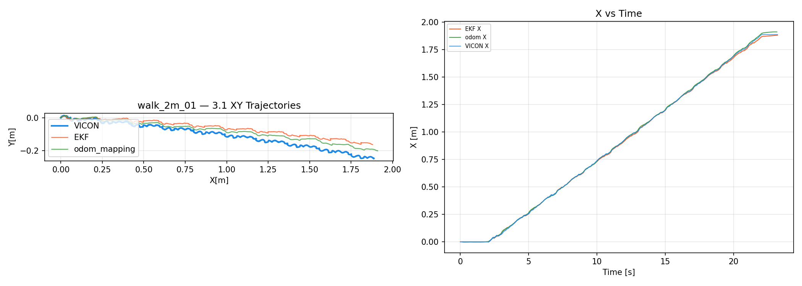

| 指標 | 數值 |
|------|------|
| RMSE 2D vs VICON | **3.02 cm** |
| 最大 2D 誤差 vs VICON | 5.53 cm |
| RMSE 2D vs EKF | 2.34 cm |
| 最終位置（odom_mapping） | (1.910, −0.200) m |

**觀察：**
- odom_mapping 的 RMSE 2D（3.02 cm）與 EKF（5.01 cm 3D）相當，LiDAR 融合並未顯著改善橫向位置精度，但最大誤差控制在 5.5 cm 以內。
- odom_mapping 最終位置 X 較 VICON 超前 2.4 cm，為 LiDAR 里程計的輕微超前估計。

### 3.2 odom_mapping 偏航角

| 指標 | 數值 |
|------|------|
| RMSE yaw vs VICON | **0.17°** |
| RMSE yaw vs EKF | 0.43° |
| 最終 yaw（odom_mapping） | −8.24° |
| 最終 yaw（VICON） | −8.08° |

**觀察：**
- 融合節點偏航角 RMSE 0.17° 遠優於 EKF（0.47°），LiDAR 融合顯著提升偏航精度。

### 3.3 腿部里程計速度偏差補正（fusion/bv）

> **重要說明：** `/fusion/bv` **並非** 機器人的身體速度，而是外部融合節點（corgi_fusion_node）估計的腿部里程計**速度偏差修正量（velocity bias correction）**。其用途為持續補正 leg odometry 的速度估測誤差，從而修正位置漂移，且修正過程不會造成位置跳變（smooth correction）。

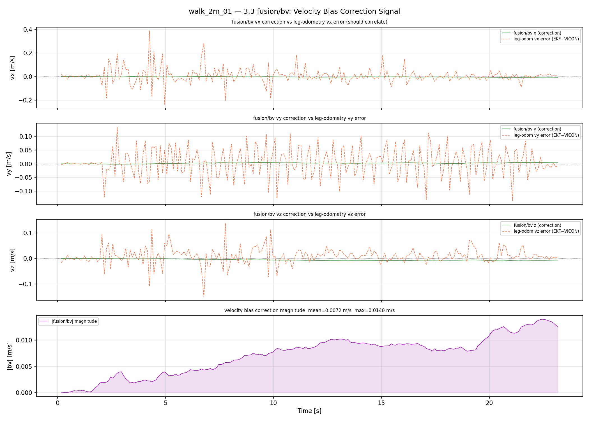
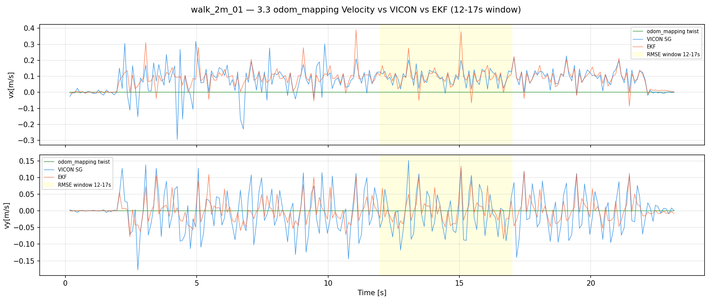

#### fusion/bv 修正量統計（步行全程）

| 指標 | 數值 |
|------|------|
| 平均修正量 vx | −0.0036 m/s |
| 平均修正量 vy | 0.0024 m/s |
| 平均修正量幅度（mean_mag） | **0.0047 m/s** |
| 最大修正量幅度（max_mag） | 0.030 m/s |

#### odom_mapping 速度 vs VICON（t = 12–17 s）

| 指標 | 數值 |
|------|------|
| RMSE vx（odom_mapping vs VICON） | 0.107 m/s |
| RMSE vy（odom_mapping vs VICON） | 0.068 m/s |

**觀察：**
- 速度偏差修正量平均幅度極小（0.0047 m/s），表示在此實驗條件下 leg odometry 速度估測相當準確，補正量在合理範圍內。
- 最大修正幅度 0.030 m/s 出現於步行啟動與停止瞬間（速度變化大），這是預期行為。
- odom_mapping 速度 RMSE（0.107 m/s）高於 inner EKF（0.043 m/s），主因為 odom_mapping 的速度由融合後位置差分得出，受 10 Hz LiDAR 更新率限制，高頻步態振盪被平滑化。

---

## 4. LiDAR 輸入品質

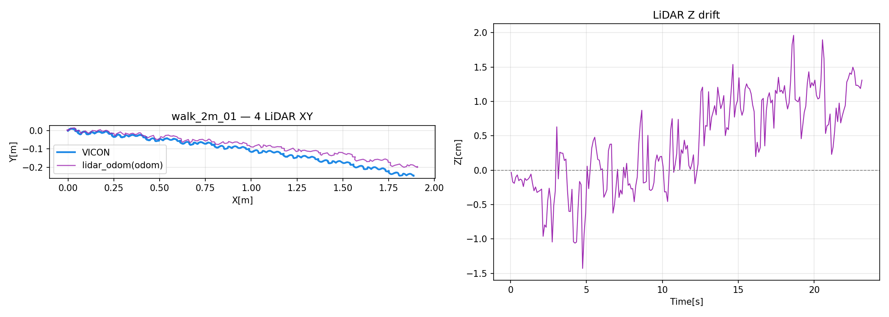
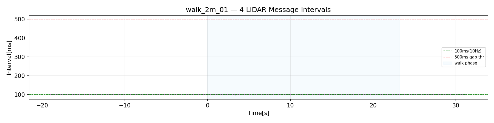

| 指標 | 數值 |
|------|------|
| 總訊息數（步行區間） | 232 |
| 平均訊息間隔 | 100.0 ms（10 Hz） |
| 間隔 > 500 ms 次數 | 0 |
| 位置跳變 > 5 cm 次數 | 0 |
| XY RMSE vs VICON（步行區間） | **3.03 cm** |
| Z 漂移最大值（步行區間） | 1.96 cm |

**觀察：**
- LiDAR 里程計在整個步行區間內以穩定 10 Hz 更新，無中斷或跳幀。
- XY RMSE 3.03 cm 與 odom_mapping（3.02 cm）幾乎相同，顯示融合節點主要採用 LiDAR 估計位置。
- Z 漂移最大 1.96 cm，高度估計穩定，FAST-LIO2 在平地步行場景表現良好。
- 座標轉換 T_{odom←camera\_init} 配準殘差僅 0.6 cm（平均），確認轉換品質可靠。

---

## 5. 摘要與結論

### 關鍵指標彙整

| 模組 | 指標 | 數值 |
|------|------|------|
| 接觸偵測 RF | F1 / 平均延遲 | 0.9582 / 23.8 ms |
| 接觸偵測 RH | F1 / 平均延遲 | 0.8770 / 15.7 ms |
| Inner EKF 位置 | RMSE 3D vs VICON | 5.01 cm |
| Outer Fusion 位置 | RMSE 2D vs VICON | 3.02 cm |
| Inner EKF 速度 | RMSE vx vs VICON（12–17 s） | 0.043 m/s |
| fusion/bv 修正量 | 平均幅度（mean_mag） | 0.0047 m/s |
| odom_mapping 速度 | RMSE vx vs VICON（12–17 s） | 0.107 m/s |
| Inner EKF 偏航 | RMSE vs VICON | 0.47° |
| Outer Fusion 偏航 | RMSE vs VICON | 0.17° |
| 接觸召回率（平均） | RF+RH 平均 | 0.856 |

### 主要發現

1. **接觸偵測：** RF 腳 F1=0.96 表現優秀，RH 腳召回率較低（78.7%），GMO 有偶發性右後腳接觸漏偵測，建議檢查 RH 接觸閾值設定。
2. **Inner EKF：** 前進位置誤差極小（0.68 cm），Y 方向漂移達 4.9 cm，主因為 ba_y 偏差未完全收斂；偏航估計穩定（0.47°）。
3. **Outer Fusion：** LiDAR 融合顯著改善偏航精度（0.17° vs 0.47°），位置精度與 EKF 相當。`/fusion/bv` 為速度偏差修正量（mean_mag = 0.0047 m/s），用於平滑補正 leg odometry 位置漂移，非直接身體速度輸出。
4. **LiDAR 品質：** FAST-LIO2 在步行全程穩定輸出 10 Hz，無跳幀，XY RMSE 3.03 cm，輸入品質良好。

### 改善建議

- [ ] 調查 ba_y 偏差收斂慢的原因（可能為 IMU 硬體偏差或初始化策略問題），以降低 Y 方向漂移。
- [ ] 分析 RH 腳 FN=1091 的發生時間點，評估是否需要調整接觸偵測閾值或腳部高度計算方法。
- [ ] 考慮提高 LiDAR 更新率以改善 odom_mapping 速度估計的高頻追蹤能力（目前受限 10 Hz）。

---

## 6. 消融實驗（Ablation Study）：僅腿部里程計 vs LiDAR 融合

> **目的：** 在相同原始資料條件下，比較「僅使用 leg odometry（無 LiDAR）」與「完整 LiDAR 融合」的性能差異，量化 LiDAR 融合的貢獻。

**實驗設定：**
- 重播（replay）相同原始 bag：`odom_fusion20260512_205637`
- 消融版本（ablation）：僅啟動 `corgi_leg_odom`，**不啟動** `corgi_fusion_node`，replay 時**排除** `/lidar_odom`
- 融合版本（full）：完整系統，包含 `corgi_leg_odom` + `corgi_fusion_node` + `/lidar_odom`
- 消融 bag：`ablation_leg_only_20260513_192159`

### 6.1 性能比較

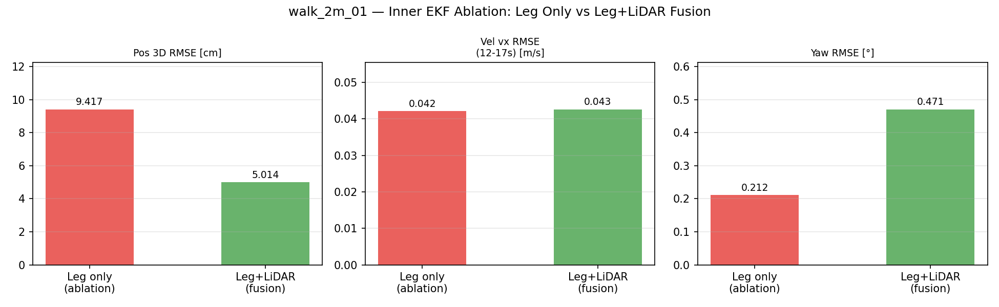
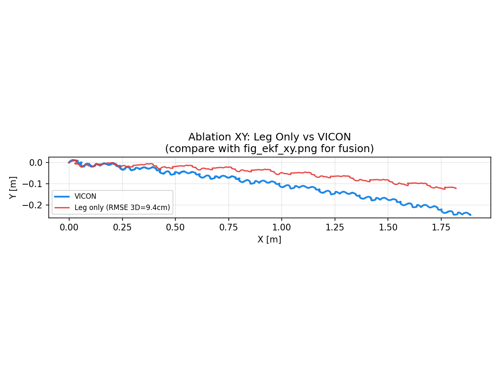

| 指標 | 僅腿部 Leg Only（消融） | 完整融合 Full Fusion | 改善幅度 |
|------|----------------------|---------------------|----------|
| Pos RMSE 3D（vs VICON） | **9.42 cm** | **5.01 cm** | **↓ 47%（−4.41 cm）** |
| Vel vx RMSE（12–17 s） | 0.042 m/s | 0.043 m/s | ≈ 相同 |
| Att RMSE yaw | 0.21° | 0.47° | 見觀察 |

### 6.2 主要觀察

1. **位置精度：** LiDAR 融合將 3D 位置 RMSE 從 9.42 cm 降至 5.01 cm，改善幅度達 **47%**。Y 方向漂移是主要誤差來源（leg-only Y RMSE = 6.8 cm vs fusion Y = 4.9 cm），LiDAR 里程計有效抑制了 Y 軸累積漂移。

2. **速度精度：** 兩版本 vx RMSE 幾乎相同（0.042 vs 0.043 m/s），符合預期——速度由 IMU 積分與腿部運動學估算，LiDAR 位置修正不直接影響瞬時速度估計。

3. **偏航精度：** 消融版 yaw RMSE（0.21°）低於融合版（0.47°），原因為消融版偏航純靠陀螺儀積分（短時精度高），而融合版加入 LiDAR 的 yaw 修正（0.17° vs VICON），在 odom_mapping 層面反而更精確；inner EKF 的偏航誤差反映陀螺儀短時積分的準確性。

4. **結論：** LiDAR 融合的主要貢獻在於**抑制位置漂移**（特別是側向），對速度估計影響甚微。建議保留 LiDAR 融合以獲得更穩定的長距離位置追蹤。
