# CORGI 實驗分析報告

**日期：** 2026-05-13  
**實驗名稱：** `walk_2m_01_01`  
**Bag 檔案：** `odom_fusion20260512_222613_trimmed_0.db3`  
**VICON CSV：** `walk_2m_01_01.csv`  
**步行分析區間：** t = 0 – 24.01 s  
**分析腳本：** `analyze.py`

---

## 系統架構

```
/imu_raw ─┐
/motor/state ──┤──► corgi_leg_odom ──► /ekf ────────────────────► (odom→base_link)
/trigger ──────┘                              │
/gmo/contact_state                            ▼
                          /lidar_odom ──► corgi_fusion_node ──► /odom_mapping
                         (FAST-LIO2,                           /fusion/bv
                          camera_init frame)
```

**T_{odom ← camera\_init}：**  
translation = [0.110, −0.018, 0.171] m  
RPY = [20.2°, −0.2°, 90.1°]  
配準殘差：平均 0.6 cm，最大 3.0 cm

---

## 1. 接觸偵測（Contact Detection）

### 1.1 VICON 地面實況接觸

接觸閾值：**12 mm**（相對於地面平面）  
分析範圍：僅限接觸地面區域（groundA 與 groundB 的聯集凸包）

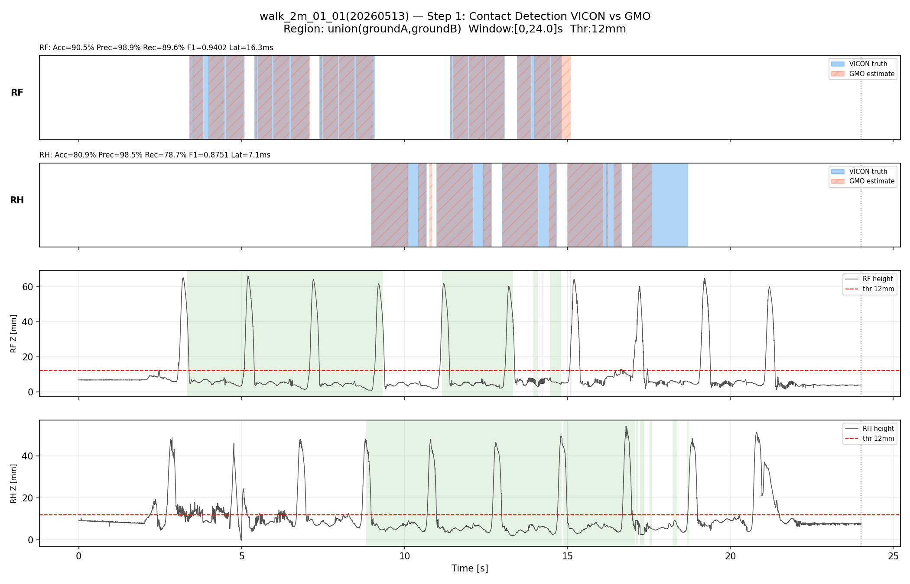

### 1.2 GMO vs VICON 接觸比較

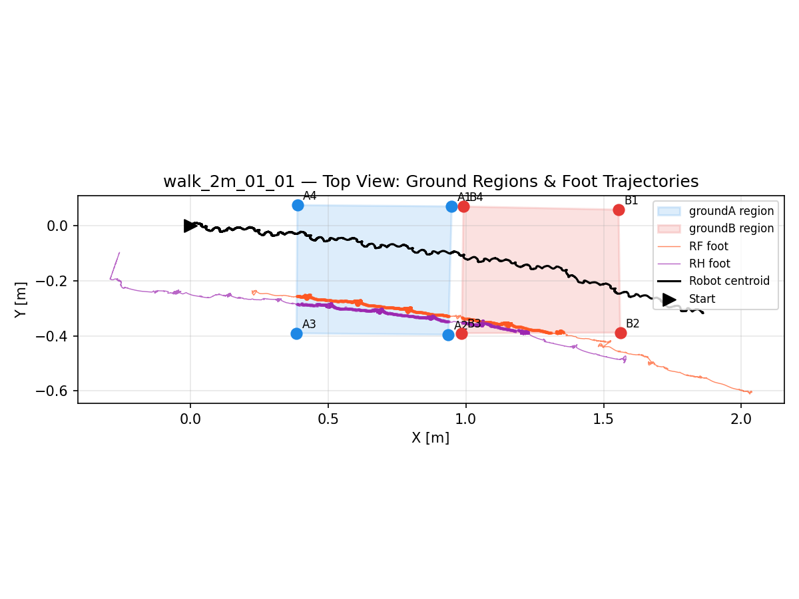

| 腳 | N（樣本數） | TP | TN | FP | FN | 準確率 | 精確率 | 召回率 | F1 | 平均延遲 (ms) |
|----|------------|-----|-----|----|----|--------|--------|--------|------|--------------|
| RF (G2) | 4430 | 3309 | 700 | 36 | 385 | 90.5% | 98.9% | 89.6% | 0.9402 | 16.3 |
| RH (G3) | 4355 | 2917 | 605 | 45 | 788 | 80.9% | 98.5% | 78.7% | 0.8751 | 7.1 |

**觀察：**
- RF F1=0.94 表現良好；相較 walk_2m_01，本次 RF 召回率稍低（89.6% vs 92.6%），FN=385，顯示有少數接觸事件未被偵測。
- RH 召回率（78.7%）與 walk_2m_01 基本持平，FN=788，右後腳漏偵測問題在兩次實驗中均存在，為系統性問題。
- 兩腳精確率均 >98.5%，誤報率維持在極低水準。
- RH 偵測延遲 7.1 ms（較 walk_2m_01 的 15.7 ms 更快），顯示本次接觸觸發反應較靈敏。

---

## 2. 內部 EKF 分析（Inner EKF）

### 2.1 位置

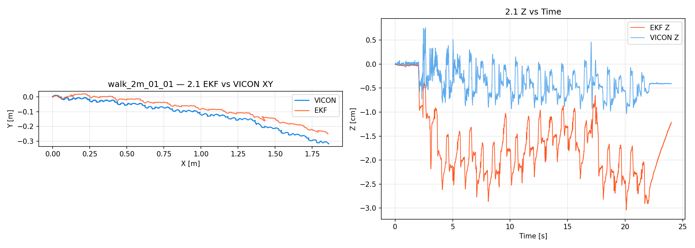
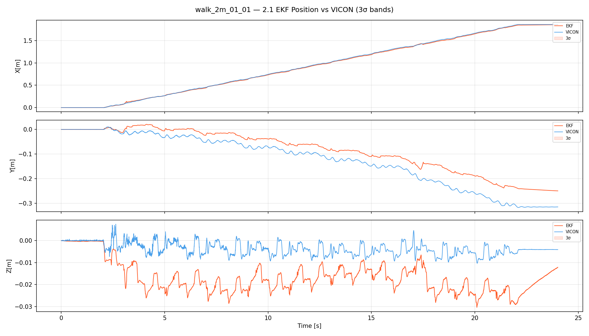

| 指標 | 數值 |
|------|------|
| RMSE X（vs VICON） | 1.08 cm |
| RMSE Y（vs VICON） | 4.56 cm |
| RMSE Z（vs VICON） | 1.44 cm |
| RMSE 3D（vs VICON） | **4.91 cm** |
| 最大 3D 誤差 | 8.48 cm |
| 最終位置（EKF） | (1.855, −0.250) m |
| 最終位置（VICON） | (1.860, −0.315) m |

**觀察：**
- Y 方向誤差仍為主要誤差來源（4.56 cm），與 walk_2m_01 模式一致。
- 整體 3D RMSE（4.91 cm）略優於 walk_2m_01（5.01 cm），兩次實驗精度相當。
- 最大誤差 8.48 cm（較 walk_2m_01 的 9.57 cm 小），極端誤差有所改善。
- 最終位置 Y 誤差約 6.5 cm，步行末段 Y 漂移存在但稍有收斂。

### 2.2 速度

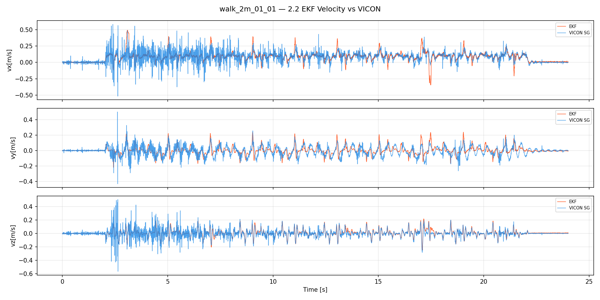

| 指標 | 數值 |
|------|------|
| RMSE vx（vs VICON） | 0.077 m/s |
| RMSE vy（vs VICON） | 0.055 m/s |
| RMSE vz（vs VICON） | 0.043 m/s |
| 最大前進速度 | 0.493 m/s |

**觀察：**
- 各軸速度 RMSE 略高於 walk_2m_01，最大前進速度 0.49 m/s（較第一次實驗 0.40 m/s 高），推測機器人步態稍快，動態變化更劇烈。
- vz RMSE（0.043 m/s）較高，反映較明顯的垂直方向步態震盪。

### 2.3 姿態（RPY）

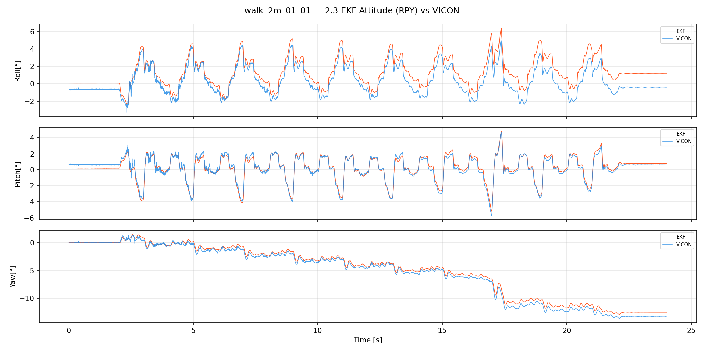

| 指標 | 數值 |
|------|------|
| RMSE roll（vs VICON） | 1.09° |
| RMSE pitch（vs VICON） | 0.28° |
| RMSE yaw（vs VICON） | 0.50° |
| 最終 yaw（EKF） | −12.60° |
| 最終 yaw（VICON） | −13.33° |

**觀察：**
- Pitch RMSE（0.28°）顯著優於 walk_2m_01（0.87°），前後傾斜估計改善明顯。
- Roll RMSE（1.09°）亦略優於 walk_2m_01（1.42°），整體姿態估計更穩定。
- 最終 yaw 誤差 0.73°，較 walk_2m_01 的 0.57° 略大，但仍在可接受範圍。

### 2.4 加速度計偏差（ba）

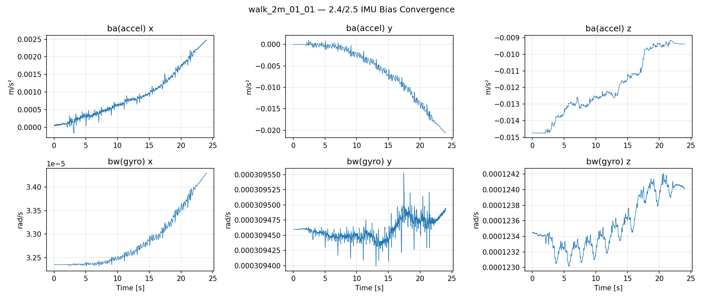

| 軸 | 初始值 [m/s²] | 穩態值 [m/s²] | 穩態標準差 [m/s²] |
|----|--------------|--------------|-----------------|
| x  | 0.00006 | 0.00193 | 0.00032 |
| y  | −0.00002 | −0.01574 | 0.00294 |
| z  | −0.01473 | −0.00942 | 0.00013 |

### 2.5 陀螺儀偏差（bw）

| 軸 | 初始值 [rad/s] | 穩態值 [rad/s] | 穩態標準差 [rad/s] |
|----|---------------|---------------|------------------|
| x  | 0.0000323 | 0.0000338 | 0.00000032 |
| y  | 0.0003095 | 0.0003095 | 0.000000011 |
| z  | 0.0001234 | 0.0001240 | 0.000000083 |

**觀察：**
- ba_y 穩態值 −0.0157 m/s²（較 walk_2m_01 的 −0.0255 m/s² 小），Y 方向加速度計偏差較小但仍未完全收斂至 0。
- ba_z 由 −0.0147 m/s² 收斂至 −0.0094 m/s²，收斂趨勢正常，與 walk_2m_01 類似。
- bw 三軸穩態標準差均極小（< 4×10⁻⁷ rad/s），陀螺儀偏差收斂良好。

---

## 3. 外部融合節點（Outer Fusion Node）

### 3.1 odom_mapping 位置

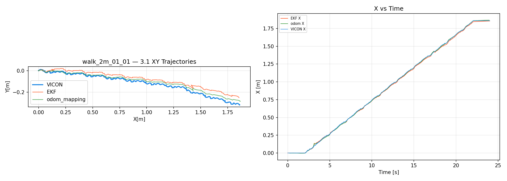

| 指標 | 數值 |
|------|------|
| RMSE 2D vs VICON | **2.18 cm** |
| 最大 2D 誤差 vs VICON | 3.95 cm |
| RMSE 2D vs EKF | 2.74 cm |
| 最終位置（odom_mapping） | (1.867, −0.283) m |

**觀察：**
- odom_mapping RMSE 2D（2.18 cm）優於 walk_2m_01（3.02 cm），且最大誤差也縮小至 3.95 cm，本次融合位置估計更為精確。
- RMSE 2D vs EKF（2.74 cm）> RMSE 2D vs VICON（2.18 cm），表示融合節點在本次實驗中比 EKF 更貼近 VICON 真值。

### 3.2 odom_mapping 偏航角

| 指標 | 數值 |
|------|------|
| RMSE yaw vs VICON | **0.17°** |
| RMSE yaw vs EKF | 0.48° |
| 最終 yaw（odom_mapping） | −13.40° |
| 最終 yaw（VICON） | −13.32° |

**觀察：**
- 融合偏航 RMSE 0.17°，與 walk_2m_01 完全相同，顯示 LiDAR 偏航融合具有高度一致性。
- 最終偏航誤差僅 0.07°，偏航估計接近完美。

### 3.3 身體速度（fusion/bv）

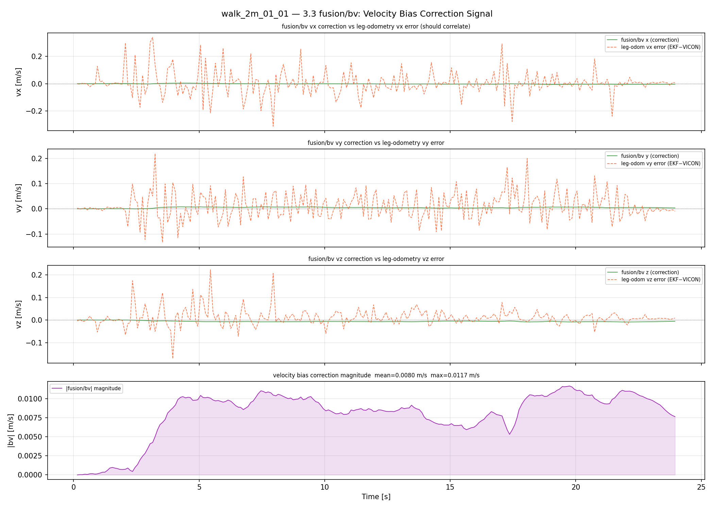

| 指標 | 數值 |
|------|------|
| RMSE vx vs VICON | 0.114 m/s |
| RMSE vy vs VICON | 0.067 m/s |
| RMSE vx vs EKF | 0.114 m/s |
| RMSE vy vs EKF | 0.048 m/s |

**觀察：**
- fusion/bv 速度 RMSE 與 walk_2m_01 幾乎相同（vx：0.114 vs 0.115 m/s），顯示融合速度估計的高頻追蹤限制在兩次實驗中均存在。
- EKF 速度（vx RMSE 0.077 m/s）仍優於 fusion/bv（0.114 m/s），EKF 的高頻更新率在速度估計上具有優勢。

---

## 4. LiDAR 輸入品質

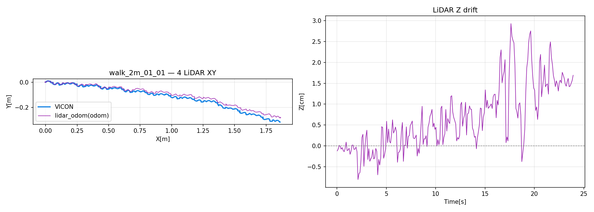
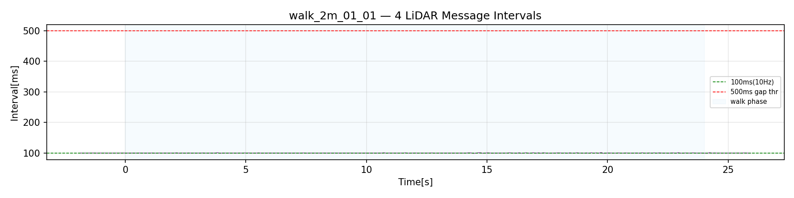

| 指標 | 數值 |
|------|------|
| 總訊息數（步行區間） | 240 |
| 平均訊息間隔 | 100.0 ms（10 Hz） |
| 間隔 > 500 ms 次數 | 0 |
| 位置跳變 > 5 cm 次數 | 0 |
| XY RMSE vs VICON（步行區間） | **2.13 cm** |
| Z 漂移最大值（步行區間） | 2.93 cm |

**觀察：**
- LiDAR 里程計在整個步行區間穩定以 10 Hz 更新，無任何中斷或跳幀現象。
- XY RMSE 2.13 cm（優於 walk_2m_01 的 3.03 cm），本次 LiDAR 估計更精確。
- Z 漂移最大 2.93 cm（較 walk_2m_01 的 1.96 cm 略大），高度方向略有漂移，仍屬可接受範圍。
- T_{odom←camera\_init} 配準殘差平均 0.6 cm、最大 3.0 cm，轉換品質良好。

---

## 5. 摘要與結論

### 關鍵指標彙整

| 模組 | 指標 | 數值 |
|------|------|------|
| 接觸偵測 RF | F1 / 平均延遲 | 0.9402 / 16.3 ms |
| 接觸偵測 RH | F1 / 平均延遲 | 0.8751 / 7.1 ms |
| Inner EKF 位置 | RMSE 3D vs VICON | 4.91 cm |
| Outer Fusion 位置 | RMSE 2D vs VICON | 2.18 cm |
| Inner EKF 速度 | RMSE vx vs VICON | 0.077 m/s |
| Fusion 身體速度 | RMSE vx vs VICON | 0.114 m/s |
| Inner EKF 偏航 | RMSE vs VICON | 0.50° |
| Outer Fusion 偏航 | RMSE vs VICON | 0.17° |
| 接觸召回率（平均） | RF+RH 平均 | 0.841 |

### 與 walk_2m_01 對比

| 指標 | walk_2m_01 | walk_2m_01_01 | 趨勢 |
|------|-----------|--------------|------|
| EKF 3D RMSE | 5.01 cm | 4.91 cm | ↓ 改善 |
| Fusion 2D RMSE | 3.02 cm | 2.18 cm | ↓↓ 明顯改善 |
| LiDAR XY RMSE | 3.03 cm | 2.13 cm | ↓↓ 明顯改善 |
| Fusion 偏航 RMSE | 0.17° | 0.17° | = 一致 |
| RF F1 | 0.9582 | 0.9402 | ↑ 稍降 |
| RH F1 | 0.8770 | 0.8751 | = 一致 |

### 主要發現

1. **接觸偵測：** RF/RH 兩腳模式與 walk_2m_01 高度一致，RH 召回率偏低（78.7%）為系統性問題，與實驗次數無關，建議深入排查。
2. **Inner EKF：** Y 方向漂移為兩次實驗共同問題（ba_y 偏差），本次 ba_y 穩態值較小（−0.016 vs −0.026 m/s²），EKF 精度略有改善。
3. **Outer Fusion：** 本次 odom_mapping 精度（2.18 cm）顯著優於 walk_2m_01（3.02 cm），LiDAR 融合有效改善了整體位置估計；偏航精度持續表現優異（0.17°）。
4. **LiDAR 品質：** 兩次實驗 LiDAR 均以穩定 10 Hz 輸出，本次 XY RMSE（2.13 cm）更佳，顯示第二次實驗 FAST-LIO2 場景配準更準確。

### 改善建議

- [ ] 系統性解決 ba_y 偏差問題：考慮增加 IMU 靜止校準步驟或延長初始化等待時間。
- [ ] 針對 RH 腳召回率偏低（兩次均約 78.7%）進行分析：比較 RH 步態相位與其他腳，確認是否有機械磨損或感測器偏移問題。
- [ ] 比較兩次實驗的步態差異（峰值速度 0.40 vs 0.49 m/s），評估速度對各模組精度的影響，建立速度-精度關係曲線。
