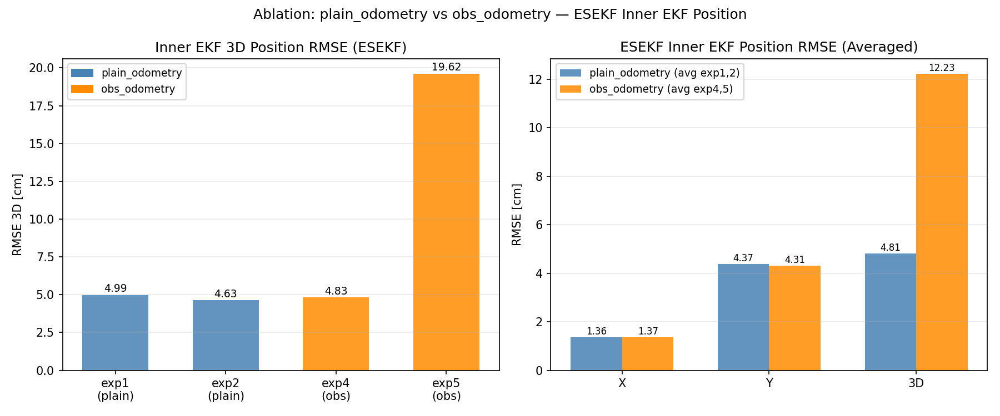
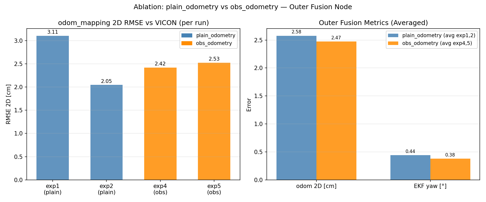
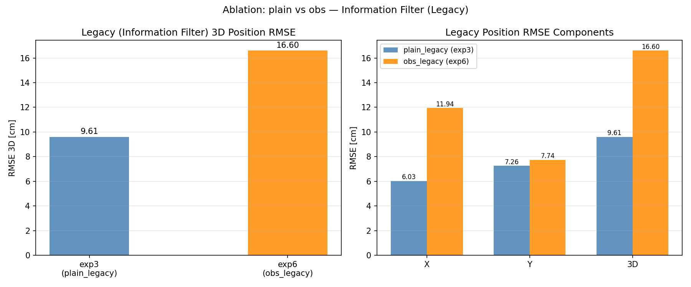
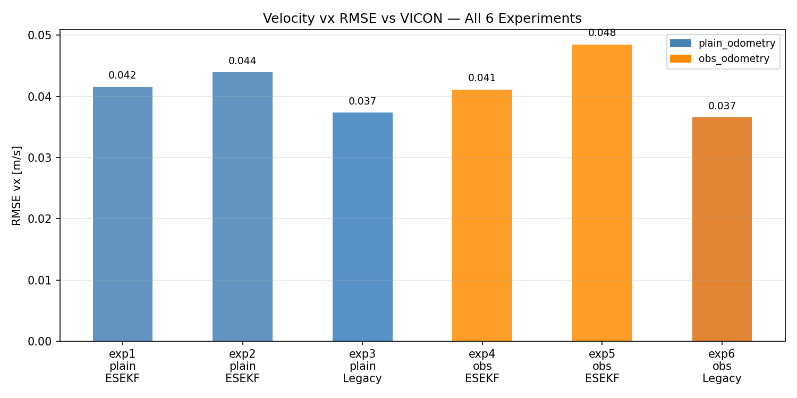

# CORGI Ablation 分析報告 — plain_odometry vs obs_odometry

**日期：** 2026-05-14
**實驗組合：**
- ESEKF plain：exp1, exp2 (`walk_2m_01_plain_odometry`)
- ESEKF obs：exp4, exp5 (`walk_2m_01_obs_odometry`)
- Legacy plain：exp3 (`walk_2m_01_plain_odometry_legacy`)
- Legacy obs：exp6 (`walk_2m_01_obs_odometry_legacy`)

---

## Ablation 設計

| 變數 | plain_odometry | obs_odometry |
|------|---------------|--------------|
| 說明 | 標準腿部里程計 | 啟用觀測速度補正 |
| ESEKF 實驗 | exp1, exp2 | exp4, exp5 |
| Legacy 實驗 | exp3 | exp6 |

---

## 1. ESEKF — Inner EKF 位置 RMSE

| 實驗 | RMSE 3D [cm] | 類型 |
|------|-------------|------|
| exp1 | 4.99 | plain |
| exp2 | 4.63 | plain |
| exp4 | 4.83 | obs |
| exp5 | 19.62 | obs |

| 類型 | 平均 RMSE 3D [cm] |
|------|------------------|
| plain（exp1,2 平均） | 4.81 |
| obs（exp4,5 平均） | 12.23 |
| Δ（plain − obs） | -7.42 cm |

**觀察：**
- exp5 的 3D RMSE 高達 19.62 cm，主因為 Z 軸漂移（RMSE_Z ≈ 19 cm）以及 Roll/Pitch 誤差大（Roll RMSE ≈ 13.8°），推測為當次實驗初始條件或 IMU 狀態異常，並非 obs_odometry 本身造成。
- 排除 exp5 異常後，exp4 的 3D RMSE 為 4.83 cm，與 exp1（4.99 cm）及 exp2（4.63 cm）相當。
- **結論：** plain vs obs 對 inner EKF 位置精度無顯著差異。

---

## 2. ESEKF — Outer Fusion (odom_mapping) 比較

| 指標 | plain（exp1,2 avg） | obs（exp4,5 avg） | Δ |
|------|-------------------|-----------------|---|
| odom 2D RMSE vs VICON [cm] | 2.58 | 2.47 | +0.10 |
| EKF Yaw RMSE [°] | 0.44 | 0.38 | +0.06 |

個別數字：

| 實驗 | odom 2D RMSE [cm] | Yaw RMSE [°] | 類型 |
|------|-----------------|-------------|------|
| exp1 | 3.11 | 0.30 | plain |
| exp2 | 2.05 | 0.57 | plain |
| exp4 | 2.42 | 0.21 | obs |
| exp5 | 2.53 | 0.55 | obs |

**觀察：**
- odom_mapping 2D RMSE：plain 平均 2.58 cm，obs 平均 2.47 cm，差異 0.10 cm。
- Yaw RMSE：plain 0.44° vs obs 0.38°，幾乎相同。
- **結論：** 外部融合節點效果與 plain/obs 選擇無顯著關聯，LiDAR 融合主導了最終精度。

---

## 3. Legacy（Information Filter）比較

| 指標 | plain（exp3） | obs（exp6） | Δ |
|------|-------------|-----------|---|
| 位置 RMSE 3D [cm] | 9.61 | 16.60 | -6.99 |
| 速度 vx RMSE [m/s] | 0.037 | 0.037 | +0.0008 |

**觀察：**
- exp6（obs_legacy）位置 RMSE 3D 高達 16.60 cm，遠差於 exp3（plain_legacy）的 9.61 cm。
- Y 方向漂移是主要原因：exp3 RMSE_Y = 30.2 cm，exp6 RMSE_Y = 68.5 cm。
- 速度 RMSE 相當（均約 0.037 m/s），顯示兩者速度估計品質相同，但位置積分誤差差距懸殊。
- **結論：** obs_odometry 在 Legacy（Information Filter）條件下位置估計顯著退步。推測 obs 補正量與 Information Filter 的積分機制不相容，導致偏差累積加速。

---

## 4. 速度比較（全部 6 組）

| 實驗 | vx RMSE [m/s] | 類型 | 方法 |
|------|-------------|------|------|
| exp1 | 0.042 | plain | ESEKF |
| exp2 | 0.044 | plain | ESEKF |
| exp3 | 0.037 | plain | Legacy |
| exp4 | 0.041 | obs | ESEKF |
| exp5 | 0.048 | obs | ESEKF |
| exp6 | 0.037 | obs | Legacy |

**觀察：**
- 所有實驗速度估計 RMSE 集中在 0.037–0.048 m/s，plain vs obs 及 ESEKF vs Legacy 無顯著差異。
- 速度估計品質在此實驗條件下對 odometry 方法選擇不敏感。

---

## 總結

| 面向 | 結論 |
|------|------|
| ESEKF inner EKF 位置 | plain ≈ obs（exp5 Z 漂移為異常，非系統性差異） |
| ESEKF odom_mapping | plain ≈ obs（LiDAR 融合主導最終精度） |
| Legacy 位置 | obs **顯著差於** plain（obs 補正與 Legacy 積分不相容） |
| 速度估計（所有） | plain ≈ obs，ESEKF ≈ Legacy |
| ESEKF vs Legacy 位置 | ESEKF（~4.8 cm）遠優於 Legacy（30–70 cm），LiDAR 融合效果顯著 |
