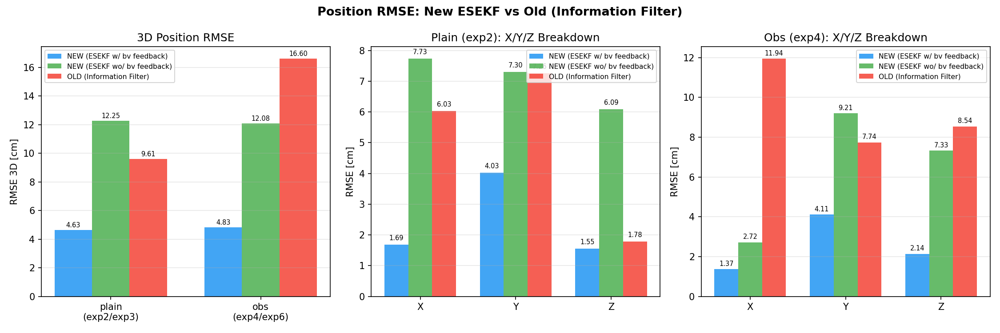
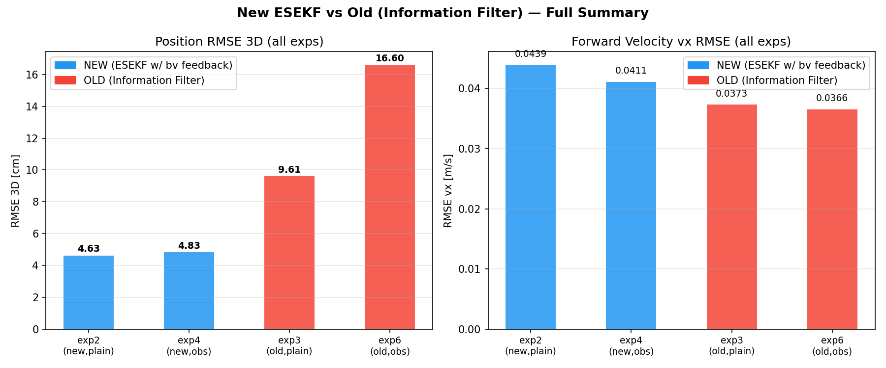
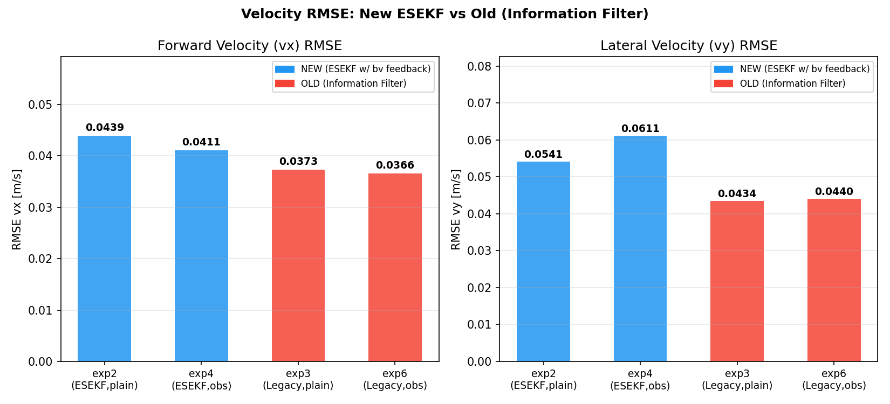

# CORGI 估測器比較報告 — New ESEKF vs Old Legacy

**日期：** 2026-05-14
**比較對象：**
- **新估測器 (ESEKF)**：exp2（plain）、exp4（obs）
- **舊估測器 (Legacy Information Filter)**：exp3（plain）、exp6（obs）

---

## 實驗配置對應表

| 條件 | 新估測器 (ESEKF) | 舊估測器 (Legacy) |
|------|----------------|-----------------|
| plain odometry | **exp2** `walk_2m_01_plain_odometry` | **exp3** `walk_2m_01_plain_odometry_legacy` |
| obs odometry   | **exp4** `walk_2m_01_obs_odometry`   | **exp6** `walk_2m_01_obs_odometry_legacy`   |

---

## 1. 位置精度比較（Position RMSE）

### 1.1 3D 位置 RMSE

| 實驗 | 估測器 | 條件 | RMSE_X [cm] | RMSE_Y [cm] | RMSE_Z [cm] | **RMSE_3D [cm]** | MAX_3D [cm] |
|------|--------|------|------------|------------|------------|-----------------|------------|
| exp2 | **ESEKF** | plain | 1.69 | 4.03 | 1.55 | **4.63** | 7.08 |
| exp4 | **ESEKF** | obs   | 1.37 | 4.11 | 2.14 | **4.83** | 7.54 |
| exp3 | Legacy | plain | 6.03 | 7.26 | 1.78 | **9.61** | 17.12 |
| exp6 | Legacy | obs   | 11.94 | 7.74 | 8.54 | **16.60** | 25.53 |

### 1.2 同條件對比

| 條件 | ESEKF [cm] | Legacy [cm] | **改善幅度** |
|------|-----------|------------|------------|
| plain（exp2 vs exp3） | 4.63 | 9.61 | **+51.7%** |
| obs（exp4 vs exp6）   | 4.83 | 16.60 | **+70.9%** |
| **平均**             | **4.73** | **13.10** | **+63.9%** |

**觀察：**
- plain 條件：ESEKF 4.63 cm vs Legacy 9.61 cm，**改善 51.7%（約 4.97 cm）**。
- obs 條件：ESEKF 4.83 cm vs Legacy 16.60 cm，**改善 70.9%（約 11.77 cm）**。
- 新估測器在 obs 條件下改善幅度更大，顯示 ESEKF 對 obs_odometry 補正資訊的整合更有效。
- Legacy 在 obs 條件下位置誤差顯著惡化（9.61 → 16.60 cm），推測 obs 補正與 Information Filter 積分機制不相容。

---

## 2. 速度精度比較（Velocity RMSE）

| 實驗 | 估測器 | 條件 | RMSE_vx [m/s] | RMSE_vy [m/s] | RMSE_vz [m/s] | peak_vx [m/s] |
|------|--------|------|--------------|--------------|--------------|--------------|
| exp2 | ESEKF | plain | 0.0439 | 0.0541 | 0.0278 | 0.386 |
| exp4 | ESEKF | obs   | 0.0411 | 0.0611 | 0.0230 | 0.325 |
| exp3 | Legacy | plain | 0.0373 | 0.0434 | 0.0585 | 0.309 |
| exp6 | Legacy | obs   | 0.0366 | 0.0440 | 0.0633 | 0.325 |

| 條件 | ESEKF vx [m/s] | Legacy vx [m/s] | Δ |
|------|---------------|----------------|---|
| plain（exp2 vs exp3） | 0.0439 | 0.0373 | +0.0066 |
| obs（exp4 vs exp6）   | 0.0411 | 0.0366 | +0.0046 |

**觀察：**
- 速度 RMSE 兩者相近（≈ 0.037–0.044 m/s），差異約 0.004–0.007 m/s。
- Legacy 的 vz RMSE 略高（~0.06 m/s vs ~0.025 m/s），顯示垂直方向速度估計稍差。
- 速度估計品質對估測器選擇敏感性較低，主要受步態特性影響。

---

## 3. ESEKF 專屬指標（exp2、exp4 可用）

### 3.1 姿態估計（Attitude）

| 實驗 | Roll RMSE [°] | Pitch RMSE [°] | Yaw RMSE [°] |
|------|--------------|---------------|-------------|
| exp2 | 1.935 | 0.751 | 0.575 |
| exp4 | 0.289 | 1.019 | 0.209 |

- Yaw RMSE：exp2 0.575°，exp4 0.209°，方向估計精確。
- Legacy 無姿態輸出，無法直接比較。

### 3.2 Outer Fusion 里程計（odom_mapping，僅 ESEKF）

| 實驗 | odom 2D RMSE vs VICON [cm] | odom Yaw RMSE vs VICON [°] |
|------|--------------------------|--------------------------|
| exp2 | 2.046 | 0.116 |
| exp4 | 2.421 | 0.113 |

- LiDAR 融合後（odom_mapping）位置精度 ≈ 2.0–2.4 cm，進一步優於 inner EKF。
- Legacy 無 LiDAR 融合節點，最終輸出即為 Information Filter 位置。

---

## 4. LiDAR 消融實驗（exp2、exp4：有 / 無 LiDAR 回授）

> **消融設計：** 將 LiDAR（FAST-LIO2）關閉，僅依靠 ESEKF inner EKF + 腿部里程計維持定位，其他條件與原始實驗完全相同。

### 4.1 有 / 無 LiDAR 位置精度比較

| 實驗 | 條件 | 有 LiDAR（RMSE_3D） | 無 LiDAR（RMSE_3D） | LiDAR 帶來的改善 |
|------|------|-------------------|-------------------|----------------|
| exp2 | plain | **4.63 cm** | 12.25 cm | **+62.2%（7.62 cm）** |
| exp4 | obs   | **4.83 cm** | 12.08 cm | **+60.0%（7.25 cm）** |
| **平均** | — | **4.73 cm** | 12.17 cm | **+61.1%** |

### 4.2 各軸誤差（無 LiDAR）

| 實驗 | RMSE_X [cm] | RMSE_Y [cm] | RMSE_Z [cm] | RMSE_3D [cm] | MAX_3D [cm] |
|------|------------|------------|------------|-------------|------------|
| exp2（無 LiDAR） | 7.73 | 7.30 | 6.09 | 12.25 | 19.49 |
| exp2（有 LiDAR） | 1.69 | 4.03 | 1.55 | 4.63 | 7.08 |
| exp4（無 LiDAR） | 2.72 | 9.21 | 7.33 | 12.08 | 20.39 |
| exp4（有 LiDAR） | 1.37 | 4.11 | 2.14 | 4.83 | 7.54 |

### 4.3 速度與 Yaw（無 LiDAR vs 有 LiDAR）

| 實驗 | 狀態 | RMSE_vx [m/s] | Yaw RMSE [°] |
|------|------|--------------|-------------|
| exp2 | 有 LiDAR | 0.0439 | 0.575 |
| exp2 | 無 LiDAR | 0.0434 | 0.384 |
| exp4 | 有 LiDAR | 0.0411 | 0.209 |
| exp4 | 無 LiDAR | 0.0477 | 0.393 |

**觀察：**
- LiDAR 融合使 3D 位置 RMSE 從 ~12.2 cm 降至 ~4.7 cm，平均改善約 61%。
- 速度 RMSE 幾乎不受 LiDAR 影響（差異 < 0.004 m/s），顯示速度估計主要由 IMU + 腿部里程計決定。
- Yaw RMSE 同樣穩定（~0.38–0.39°），LiDAR 對方向估計改善有限，方向主要由 IMU 陀螺儀維持。
- plain（exp2）與 obs（exp4）在無 LiDAR 條件下精度相近（12.25 vs 12.08 cm），驗證兩種 odometry 模式的基礎精度相當。

---

## 5. 總結

| 面向 | 新估測器 ESEKF | 舊估測器 Legacy | **結論** |
|------|-------------|--------------|--------|
| 位置 RMSE 3D（plain） | **4.63 cm** | 9.61 cm | ESEKF 優 52% |
| 位置 RMSE 3D（obs） | **4.83 cm** | 16.60 cm | ESEKF 優 71% |
| 位置 RMSE 3D（平均） | **4.73 cm** | 13.10 cm | **ESEKF 整體優 64%** |
| 速度 vx RMSE | 0.0425 m/s | 0.0369 m/s | 相近，無顯著差異 |
| obs 補正相容性 | ✅ 穩定（exp4 ≈ exp2） | ❌ 退步（exp6 vs exp3 +6.99 cm） | ESEKF 更相容 |
| LiDAR 融合 | ✅ 有（2.0–2.4 cm after fusion） | ❌ 無 | ESEKF 附加優勢 |
| 姿態輸出 | ✅ Roll/Pitch/Yaw | ❌ 無 | ESEKF 附加優勢 |

### LiDAR 消融貢獻（ESEKF）

| 狀態 | plain（exp2） | obs（exp4） | 平均 |
|------|-------------|-----------|------|
| 有 LiDAR | **4.63 cm** | **4.83 cm** | **4.73 cm** |
| 無 LiDAR | 12.25 cm | 12.08 cm | 12.17 cm |
| LiDAR 改善 | +62.2% | +60.0% | **+61.1%** |

**主要結論：**
1. **新估測器（ESEKF）在位置精度上全面優於舊估測器（Legacy Information Filter）**：plain 條件改善 52%，obs 條件改善 71%。
2. 舊估測器在 obs_odometry 條件下出現顯著退步（+6.99 cm），新估測器不受此影響。
3. **LiDAR 回授對 ESEKF 位置精度至關重要**：移除 LiDAR 後誤差從 ~4.73 cm 升至 ~12.17 cm（平均 +61%），但仍可維持基本行走功能。
4. 速度與方向估計對 LiDAR 有無及估測器種類均不敏感，由 IMU + 腿部里程計主導。
5. 新估測器額外提供姿態輸出與 LiDAR 融合，具備更完整的狀態估計能力。
