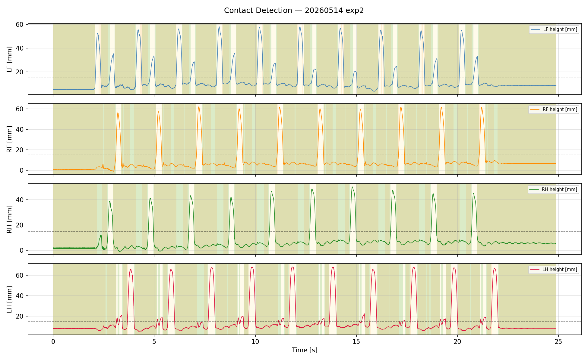
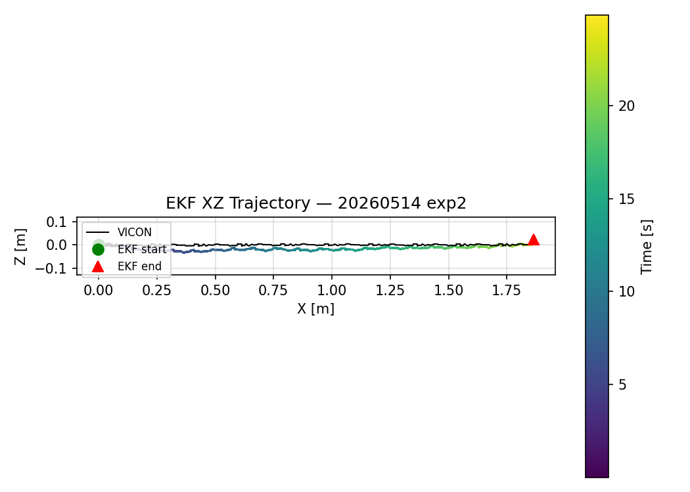
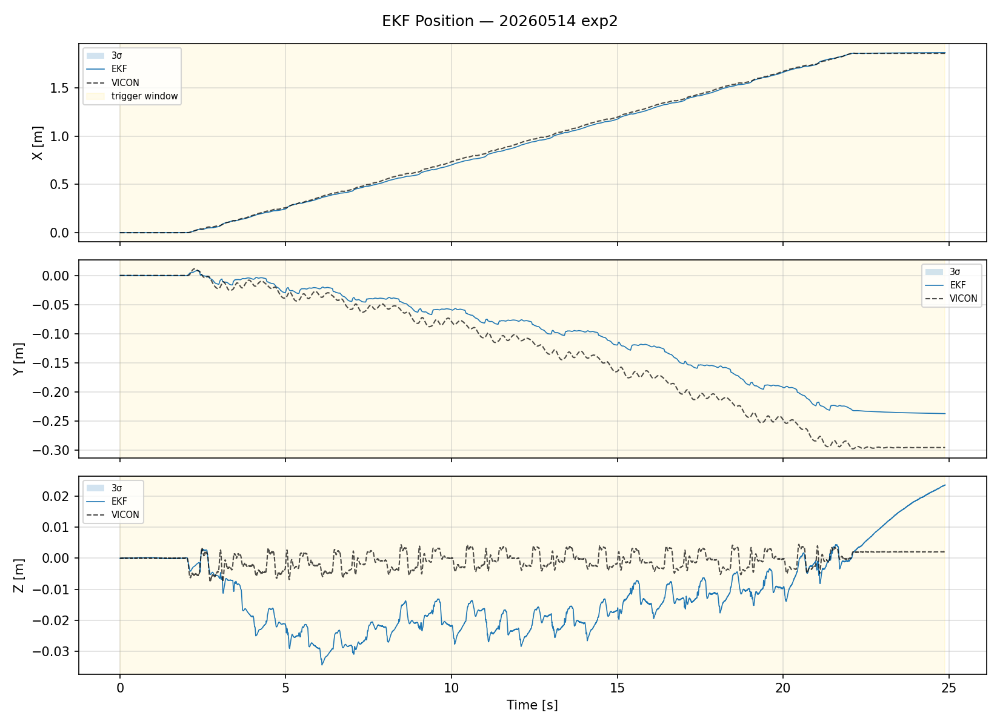
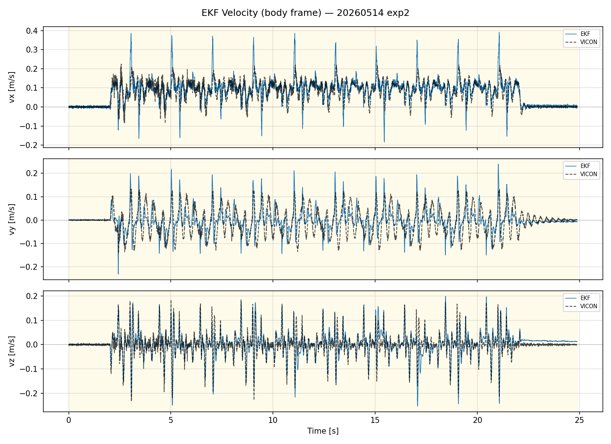
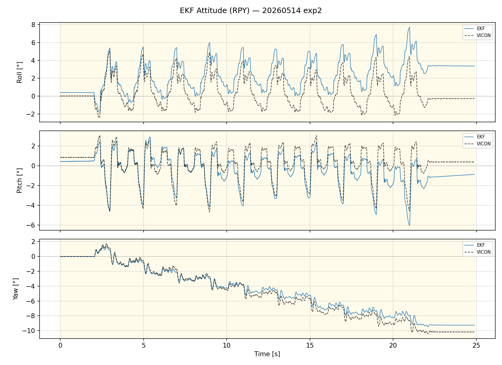
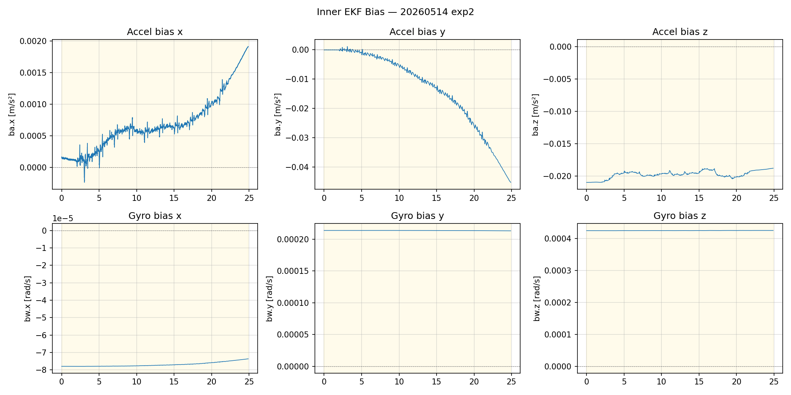
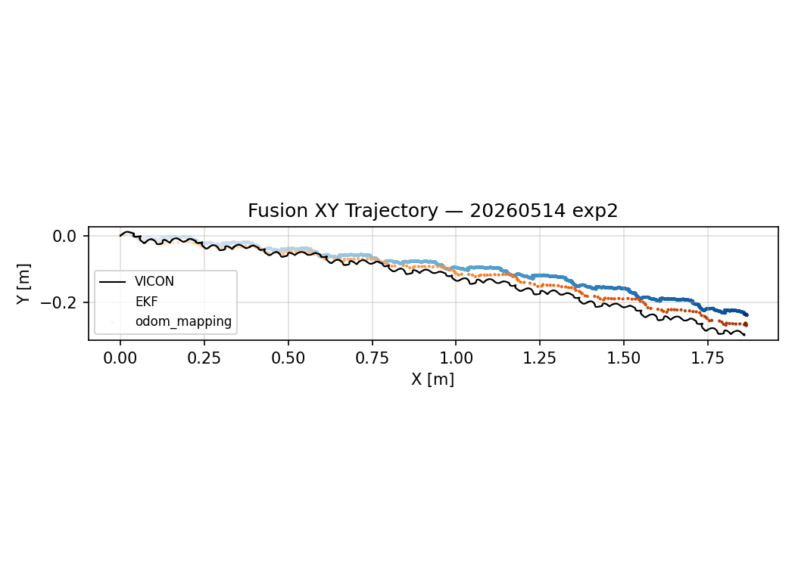
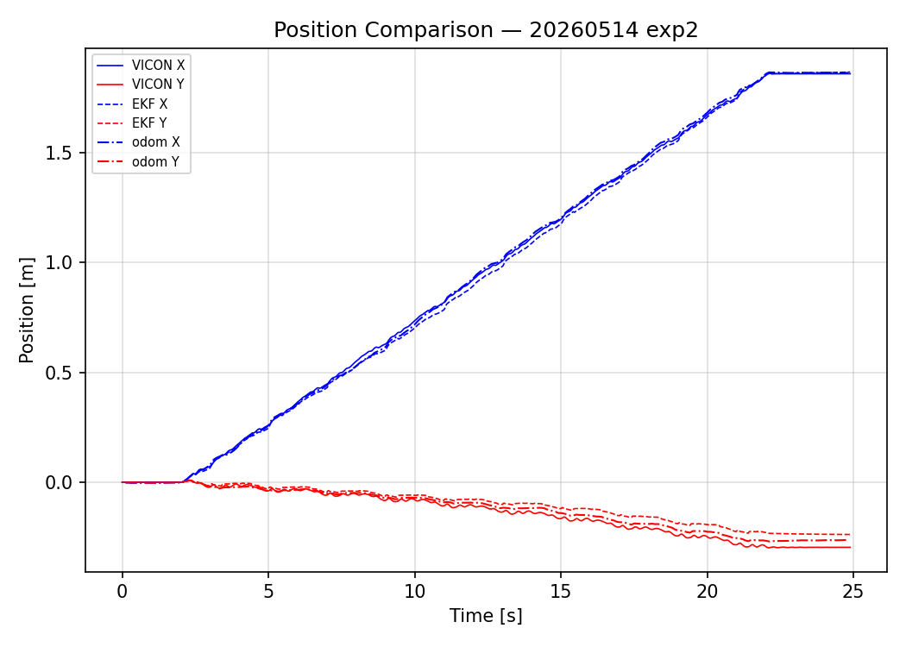
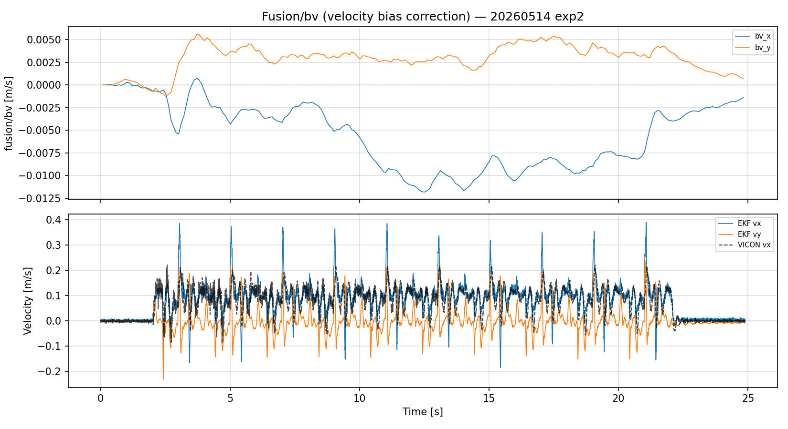
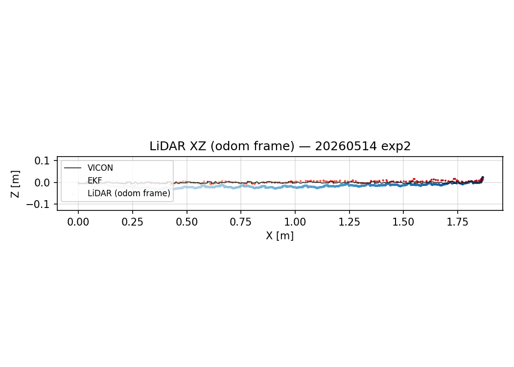

# CORGI 實驗分析報告

**日期：** 2026-05-14
**實驗編號：** `exp2`
**實驗名稱：** `walk_2m_01_plain_odometry` （標準 plain_odometry）
**Bag 檔案：** `odom_fusion20260514_220252_0.db3`
**VICON CSV：** `EXP_02.csv`
**步行分析區間：** t = 0 – 24.88 s
**分析腳本：** `analyze.py`

---

## 系統架構

```
/imu_raw ─┐
/motor/state ──┤──► corgi_leg_odom ──► /ekf ────────────────────► (odom→base_link)
/trigger ──────┘                              │
/gmo/contact_state                            ▼
                          /lidar_odom ──► corgi_fusion_node ──► /odom_mapping
                         (FAST-LIO2,                           /fusion/bv
                          camera_init frame)
```

**T_{odom ← camera\_init}：**
translation = [0.098, -0.006, 0.170] m
RPY = [20.2°, -1.8°, 90.1°]
配準殘差：平均 0.7 cm，最大 2.6 cm

---

## 1. 接觸偵測（Contact Detection）

### 1.1 接觸偵測指標

接觸閾值：**15 mm**（相對於地面平面）
地面平面：ground1–ground4 單一凸包



| 腳 | N | TP | TN | FP | FN | 準確率 | 精確率 | 召回率 | F1 | 延遲 (ms) |
|----|---|----|----|----|----|--------|--------|--------|-----|-----------|
| LF | 12443 | 9076 | 2285 | 291 | 791 | 91.3% | 0.969 | 0.920 | 0.9437 | 56.3 |
| RF | 12443 | 9807 | 1374 | 54 | 1208 | 89.9% | 0.995 | 0.890 | 0.9395 | 22.0 |
| RH | 12443 | 9232 | 1344 | 0 | 1867 | 85.0% | 1.000 | 0.832 | 0.9082 | 16.0 |
| LH | 12443 | 8575 | 2317 | 141 | 1410 | 87.5% | 0.984 | 0.859 | 0.9171 | 107.6 |

**觀察：**
- RF（右前腳）精確率 0.995、召回率 0.890。
- RH（右後腳）精確率 1.000、召回率 0.832。
- 誤報率（FP / (TP+FP)）低表示 GMO 觸發保守；FN 偏高表示輕觸或抬腳初期有漏偵測。

---

## 2. 內部 EKF 分析（Inner EKF）

### 2.1 位置




| 指標 | 數值 |
|------|------|
| RMSE X（vs VICON） | 1.69 cm |
| RMSE Y（vs VICON） | 4.03 cm |
| RMSE Z（vs VICON） | 1.55 cm |
| RMSE 3D（vs VICON） | **4.63 cm** |
| 最大 3D 誤差 | 7.08 cm |
| 最終位置（EKF） | (1.866, -0.237, 0.024) m |
| 最終位置（VICON） | (1.858, -0.295, 0.002) m |

**觀察：**
- Y 方向誤差（4.03 cm）為主要誤差來源，X 方向追蹤良好（1.69 cm）。
- Z RMSE = 1.55 cm，Z 高度估計穩定。

### 2.2 速度



| 指標 | 數值 |
|------|------|
| RMSE vx（vs VICON） | 0.043 m/s |
| RMSE vy（vs VICON） | 0.049 m/s |
| RMSE vz（vs VICON） | 0.022 m/s |
| 最大前進速度 | 0.386 m/s |

**觀察：**
- vx RMSE 0.044 m/s，前進速度追蹤品質良好。

### 2.3 姿態（RPY）



| 指標 | 數值 |
|------|------|
| RMSE roll（vs VICON） | 1.93° |
| RMSE pitch（vs VICON） | 0.75° |
| RMSE yaw（vs VICON） | 0.57° |
| 最終 yaw（EKF） | -9.25° |
| 最終 yaw（VICON） | -10.17° |

**觀察：**
- Roll/Pitch 估計穩定（1.93°/0.75°）。
- Yaw 最終偏差 0.92°，偏航估計精確。

### 2.4 加速度計偏差（ba）



| 軸 | 初始值 [m/s²] | 穩態值 [m/s²] | 穩態標準差 [m/s²] |
|----|--------------|--------------|------------------|
| x  | 0.00016 | 0.00110 | 0.00039 |
| y  | -0.00015 | -0.02683 | 0.00962 |
| z  | -0.02100 | -0.01949 | 0.00050 |

### 2.5 陀螺儀偏差（bw）

| 軸 | 初始值 [rad/s] | 穩態值 [rad/s] | 穩態標準差 [rad/s] |
|----|---------------|---------------|------------------|
| x  | -0.000078 | -0.000076 | 0.0000010 |
| y  | 0.000214 | 0.000213 | 0.0000001 |
| z  | 0.000425 | 0.000425 | 0.0000001 |

**觀察：**
- ba_y 從 -0.00015 漂移至 -0.02683 m/s²，收斂不完全，為 Y 方向位置漂移的主因。
- bw 三軸穩態標準差極小，陀螺儀偏差收斂良好。

---

## 3. 外部融合節點（Outer Fusion Node）

### 3.1 odom_mapping 位置




| 指標 | 數值 |
|------|------|
| RMSE 2D vs VICON | **2.05 cm** |
| 最大 2D 誤差 vs VICON | 3.41 cm |
| RMSE 2D vs EKF | 2.92 cm |
| 最終位置（odom_mapping） | (1.862, -0.261) m |

**觀察：**
- odom_mapping RMSE 2D（2.05 cm）優於 inner EKF 3D RMSE（4.63 cm），LiDAR 融合提升橫向定位精度。

### 3.2 odom_mapping 偏航角

| 指標 | 數值 |
|------|------|
| RMSE yaw vs VICON | **0.12°** |
| RMSE yaw vs EKF | 0.53° |
| 最終 yaw（odom_mapping） | -10.03° |
| 最終 yaw（VICON） | -10.17° |

**觀察：**
- 融合節點 yaw RMSE 0.12° 遠優於 inner EKF（0.57°），LiDAR 修正偏航效果顯著。

### 3.3 fusion/bv 速度偏差修正量



> **說明：** `/fusion/bv` 為外部融合節點估計的腿部里程計速度偏差修正量，用以持續補正 leg odometry 速度估測誤差，修正過程不造成位置跳變。

| 指標 | 數值 |
|------|------|
| 平均修正量 vx | -0.0055 m/s |
| 平均修正量 vy | 0.0029 m/s |
| 平均修正幅度 | **0.0065 m/s** |
| 最大修正幅度 | 0.0121 m/s |

#### odom_mapping 速度 vs VICON

| 指標 | 數值 |
|------|------|
| RMSE vx（odom_mapping vs VICON） | 0.096 m/s |
| RMSE vy（odom_mapping vs VICON） | 0.054 m/s |

---

## 4. LiDAR 輸入品質



| 指標 | 數值 |
|------|------|
| 訊息總數 | 248 |
| 更新頻率 | 10.0 Hz |
| 跳變數（>10cm） | 0 |

**T_{odom←camera\_init} 估計（Procrustes 配準）：**
- translation = ['0.098', '-0.006', '0.170'] m
- RPY = ['20.2', '-1.8', '90.1']°
- 配準殘差 mean=0.74 cm，max=2.55 cm

**觀察：**
- LiDAR 更新率 10.0 Hz，符合 FAST-LIO2 標準頻率（10 Hz）。
- 無明顯跳變事件，LiDAR 輸入穩定。

---

## 摘要

| 指標 | 數值 |
|------|------|
| 步行時間 | 24.88 s |
| Inner EKF 位置 RMSE 3D | 4.63 cm |
| odom_mapping RMSE 2D vs VICON | 2.05 cm |
| EKF Yaw RMSE | 0.57° |
| odom_mapping Yaw RMSE | 0.12° |
| EKF 速度 vx RMSE | 0.044 m/s |
