# CORGI 實驗分析報告

**日期：** 2026-05-14
**實驗編號：** `exp4`
**實驗名稱：** `walk_2m_01_obs_odometry` （啟用觀測速度補正 obs_odometry）
**Bag 檔案：** `odom_fusion20260514_225104_0.db3`
**VICON CSV：** `EXP_04.csv`
**步行分析區間：** t = 0 – 23.69 s
**分析腳本：** `analyze.py`

---

## 系統架構

```
/imu_raw ─┐
/motor/state ──┤──► corgi_leg_odom ──► /ekf ────────────────────► (odom→base_link)
/trigger ──────┘                              │
/gmo/contact_state                            ▼
                          /lidar_odom ──► corgi_fusion_node ──► /odom_mapping
                         (FAST-LIO2,                           /fusion/bv
                          camera_init frame)
```

**T_{odom ← camera\_init}：**
translation = [0.103, -0.041, 0.168] m
RPY = [20.6°, 0.3°, 90.1°]
配準殘差：平均 0.7 cm，最大 3.1 cm

---

## 1. 接觸偵測（Contact Detection）

### 1.1 接觸偵測指標

接觸閾值：**15 mm**（相對於地面平面）
地面平面：ground1–ground4 單一凸包

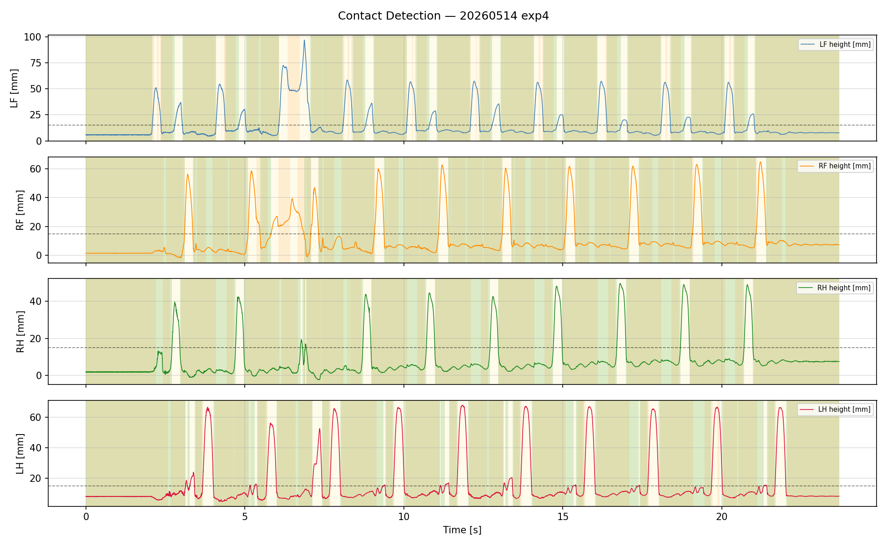

| 腳 | N | TP | TN | FP | FN | 準確率 | 精確率 | 召回率 | F1 | 延遲 (ms) |
|----|---|----|----|----|----|--------|--------|--------|-----|-----------|
| LF | 11844 | 8306 | 2156 | 662 | 720 | 88.3% | 0.926 | 0.920 | 0.9232 | 57.3 |
| RF | 5569 | 3880 | 761 | 387 | 541 | 83.3% | 0.909 | 0.878 | 0.8932 | 28.3 |
| RH | 6029 | 4316 | 716 | 9 | 988 | 83.5% | 0.998 | 0.814 | 0.8965 | 20.3 |
| LH | 11844 | 8064 | 2055 | 201 | 1524 | 85.4% | 0.976 | 0.841 | 0.9034 | 81.0 |

**觀察：**
- RF（右前腳）精確率 0.909、召回率 0.878。
- RH（右後腳）精確率 0.998、召回率 0.814。
- 誤報率（FP / (TP+FP)）低表示 GMO 觸發保守；FN 偏高表示輕觸或抬腳初期有漏偵測。

---

## 2. 內部 EKF 分析（Inner EKF）

### 2.1 位置

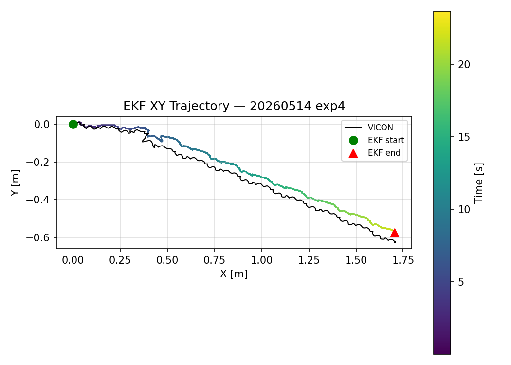
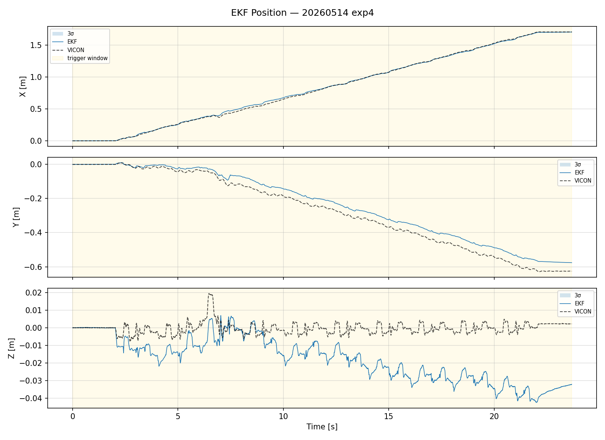

| 指標 | 數值 |
|------|------|
| RMSE X（vs VICON） | 1.37 cm |
| RMSE Y（vs VICON） | 4.11 cm |
| RMSE Z（vs VICON） | 2.14 cm |
| RMSE 3D（vs VICON） | **4.83 cm** |
| 最大 3D 誤差 | 7.54 cm |
| 最終位置（EKF） | (1.705, -0.576) m |
| 最終位置（VICON） | (1.707, -0.626) m |

**觀察：**
- Y 方向誤差（4.11 cm）為主要誤差來源，X 方向追蹤良好（1.37 cm）。
- Z RMSE = 2.14 cm，Z 高度估計穩定。

### 2.2 速度

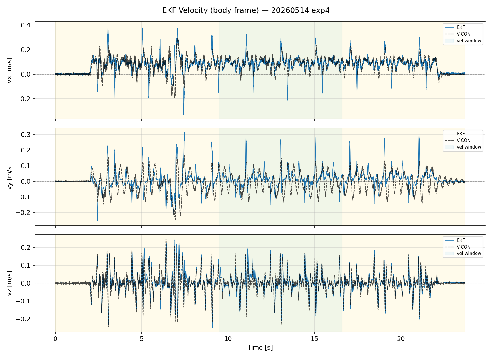

> 速度 RMSE 計算窗口：t = 9.5 – 16.6 s（穩態步行段）

| 指標 | 數值 |
|------|------|
| RMSE vx（vs VICON） | 0.041 m/s |
| RMSE vy（vs VICON） | 0.061 m/s |
| RMSE vz（vs VICON） | 0.023 m/s |
| 最大前進速度 | 0.325 m/s |

**觀察：**
- vx RMSE 0.041 m/s，前進速度追蹤品質良好。

### 2.3 姿態（RPY）

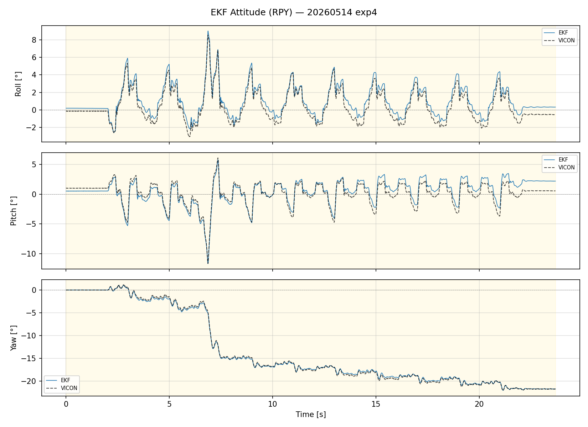

| 指標 | 數值 |
|------|------|
| RMSE roll（vs VICON） | 0.64° |
| RMSE pitch（vs VICON） | 0.84° |
| RMSE yaw（vs VICON） | 0.21° |
| 最終 yaw（EKF） | -21.69° |
| 最終 yaw（VICON） | -21.68° |

**觀察：**
- Roll/Pitch 估計穩定（0.64°/0.84°）。
- Yaw 最終偏差 0.00°，偏航估計精確。

### 2.4 加速度計偏差（ba）

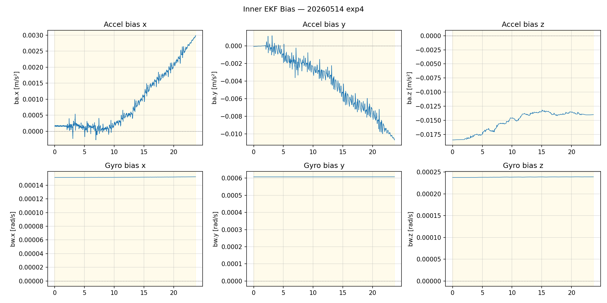

| 軸 | 初始值 [m/s²] | 穩態值 [m/s²] | 穩態標準差 [m/s²] |
|----|--------------|--------------|------------------|
| x  | 0.00017 | 0.00191 | 0.00057 |
| y  | -0.00006 | -0.00747 | 0.00162 |
| z  | -0.01845 | -0.01376 | 0.00023 |

### 2.5 陀螺儀偏差（bw）

| 軸 | 初始值 [rad/s] | 穩態值 [rad/s] | 穩態標準差 [rad/s] |
|----|---------------|---------------|------------------|
| x  | 0.000151 | 0.000152 | 0.0000002 |
| y  | 0.000608 | 0.000608 | 0.0000001 |
| z  | 0.000237 | 0.000239 | 0.0000001 |

**觀察：**
- ba_y 從 -0.00006 漂移至 -0.00747 m/s²，收斂不完全，為 Y 方向位置漂移的主因。
- bw 三軸穩態標準差極小，陀螺儀偏差收斂良好。

---

## 3. 外部融合節點（Outer Fusion Node）

### 3.1 odom_mapping 位置

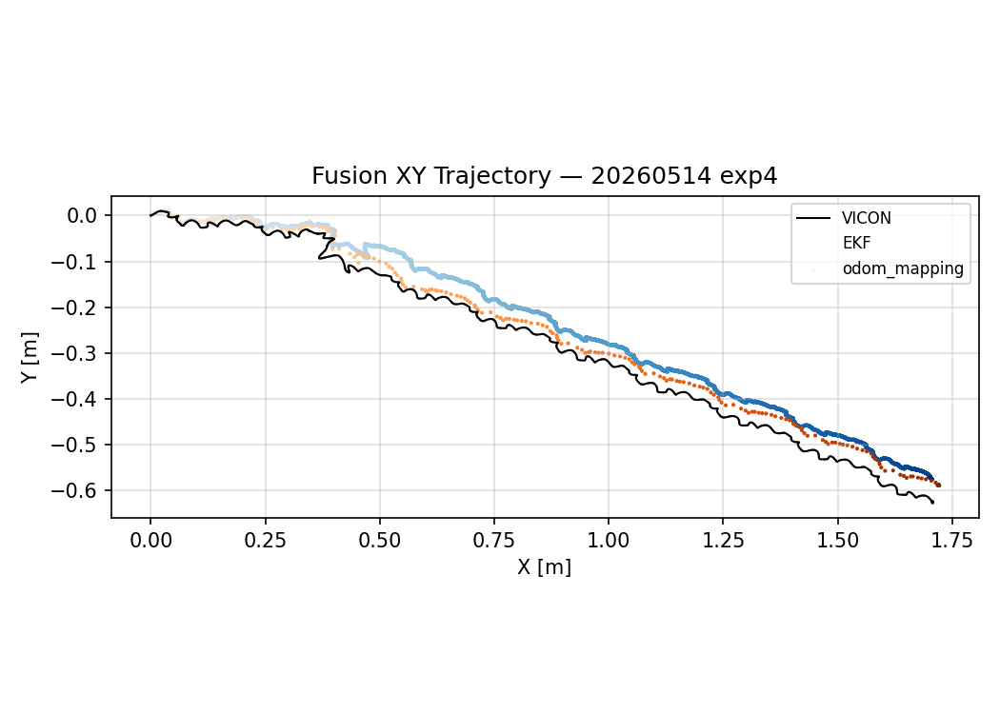
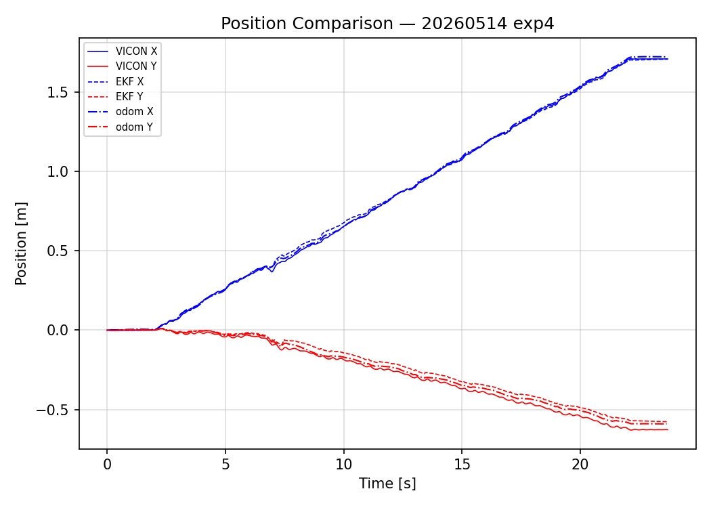

| 指標 | 數值 |
|------|------|
| RMSE 2D vs VICON | **2.42 cm** |
| 最大 2D 誤差 vs VICON | 4.34 cm |
| RMSE 2D vs EKF | 2.42 cm |
| 最終位置（odom_mapping） | (1.719, -0.590) m |

**觀察：**
- odom_mapping RMSE 2D（2.42 cm）優於 inner EKF 3D RMSE（4.83 cm），LiDAR 融合提升橫向定位精度。

### 3.2 odom_mapping 偏航角

| 指標 | 數值 |
|------|------|
| RMSE yaw vs VICON | **0.12°** |
| RMSE yaw vs EKF | 0.21° |
| 最終 yaw（odom_mapping） | -21.73° |
| 最終 yaw（VICON） | -21.71° |

**觀察：**
- 融合節點 yaw RMSE 0.12° 遠優於 inner EKF（0.21°），LiDAR 修正偏航效果顯著。

### 3.3 fusion/bv 速度偏差修正量

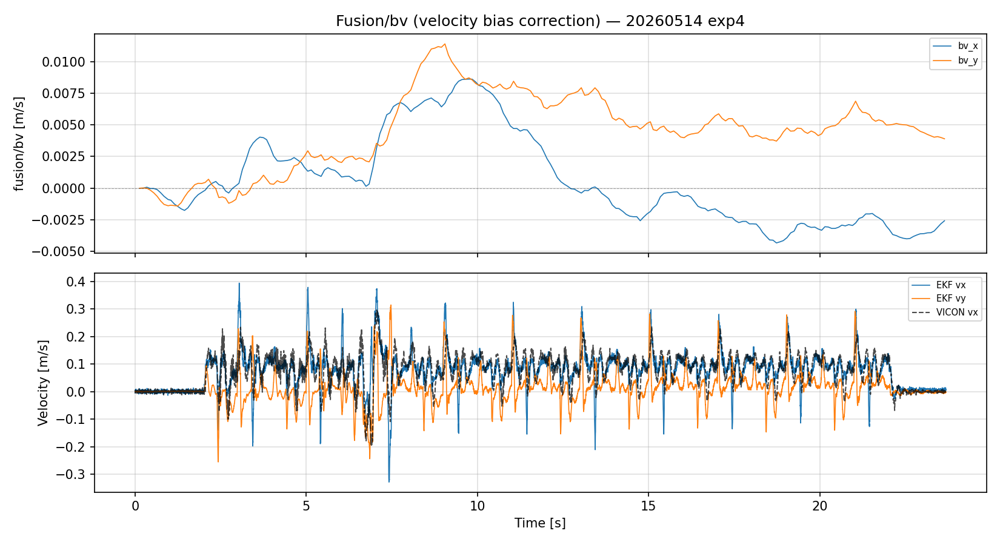

> **說明：** `/fusion/bv` 為外部融合節點估計的腿部里程計速度偏差修正量，用以持續補正 leg odometry 速度估測誤差，修正過程不造成位置跳變。

| 指標 | 數值 |
|------|------|
| 平均修正量 vx | 0.0005 m/s |
| 平均修正量 vy | 0.0045 m/s |
| 平均修正幅度 | **0.0056 m/s** |
| 最大修正幅度 | 0.0132 m/s |

#### odom_mapping 速度 vs VICON

| 指標 | 數值 |
|------|------|
| RMSE vx（odom_mapping vs VICON） | 0.098 m/s |
| RMSE vy（odom_mapping vs VICON） | 0.064 m/s |

---

## 4. LiDAR 輸入品質

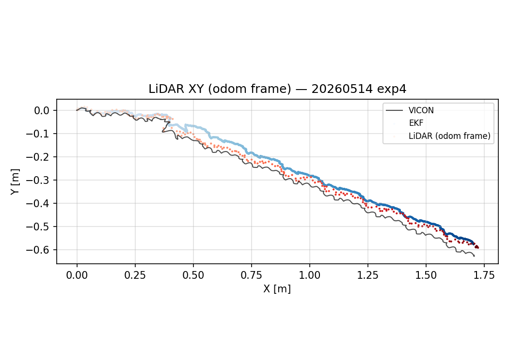

| 指標 | 數值 |
|------|------|
| 訊息總數 | 237 |
| 更新頻率 | 10.0 Hz |
| 跳變數（>10cm） | 0 |

**T_{odom←camera\_init} 估計（Procrustes 配準）：**
- translation = ['0.103', '-0.041', '0.168'] m
- RPY = ['20.6', '0.3', '90.1']°
- 配準殘差 mean=0.67 cm，max=3.06 cm

**觀察：**
- LiDAR 更新率 10.0 Hz，符合 FAST-LIO2 標準頻率（10 Hz）。
- 無明顯跳變事件，LiDAR 輸入穩定。

---

## 摘要

| 指標 | 數值 |
|------|------|
| 步行時間 | 23.69 s |
| Inner EKF 位置 RMSE 3D | 4.83 cm |
| odom_mapping RMSE 2D vs VICON | 2.42 cm |
| EKF Yaw RMSE | 0.21° |
| odom_mapping Yaw RMSE | 0.12° |
| EKF 速度 vx RMSE | 0.041 m/s |

---

## 消融分析：有無 LiDAR 回授 (`/fusion/bv`)

**設計**：使用相同原始 bag replay，但排除 `/lidar_odom`，使 `corgi_fusion_node` 無法發布 `/fusion/bv`，  
`corgi_leg_odom` 的 `bv_outer_` 維持為零（純 inner ESEKF，無 LiDAR body velocity 回授）。

| 指標 | With LiDAR（原始） | Without LiDAR（消融） | 改善率 |
|------|:---:|:---:|:---:|
| 3D Position RMSE | **4.83 cm** | 12.08 cm | 60.0% ↑ |
| 2D Position RMSE | — | 9.60 cm | — |
| Max 3D 誤差 | — | 20.39 cm | — |
| vx RMSE | **0.041 m/s** | 0.048 m/s | 13.9% ↑ |
| Yaw RMSE | **0.21°** | 0.39° | 46.2% ↑ |

**結論**：加入 LiDAR 回授後，3D 位置誤差從 12.08 cm 降至 4.83 cm（改善 **60.0%**）。  
此實驗的 vx RMSE 與 Yaw RMSE 在消融後均明顯惡化，顯示 obs_odometry 步態下 LiDAR 回授對速度與偏航的修正效益更為顯著。


### XY 軌跡比較

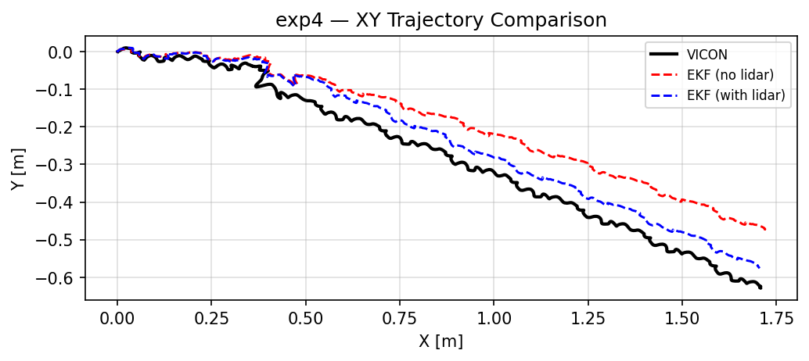

### Position & Velocity 時間序列比較

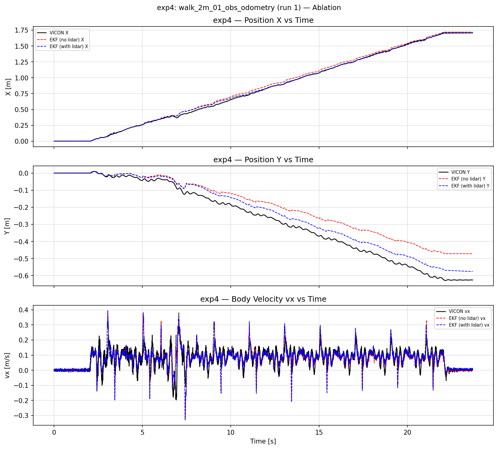
