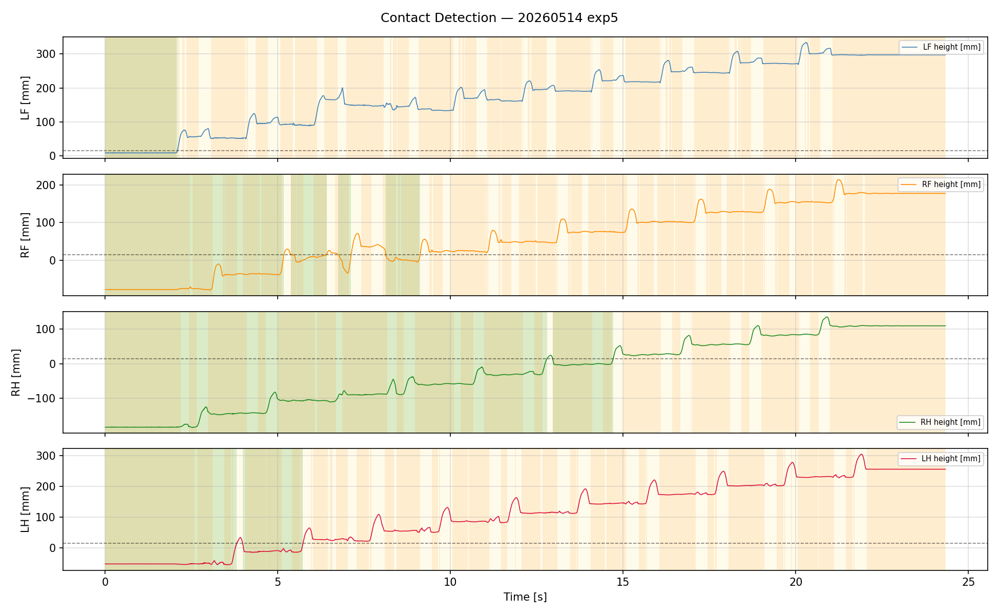
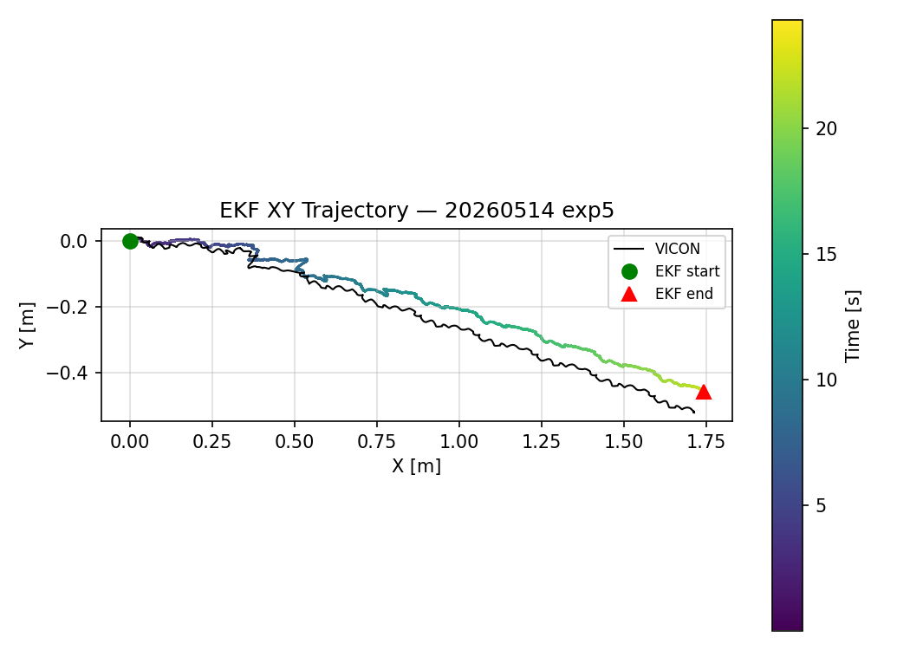
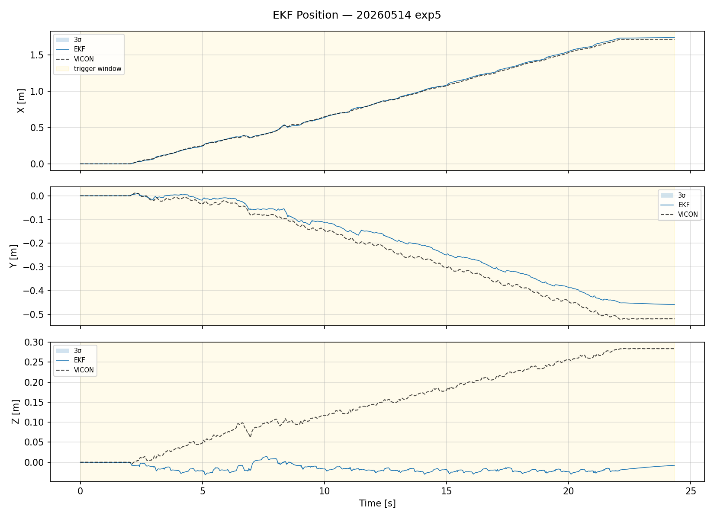
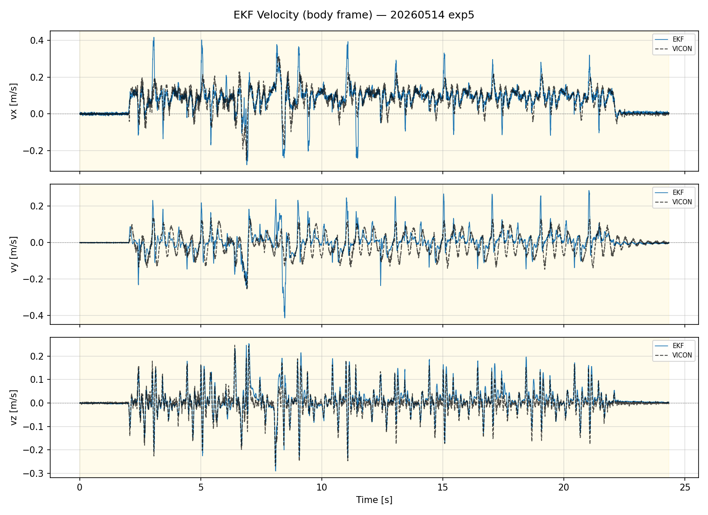
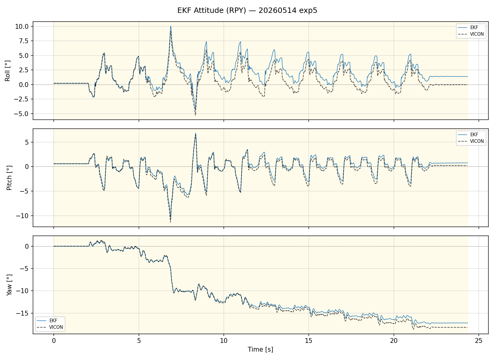
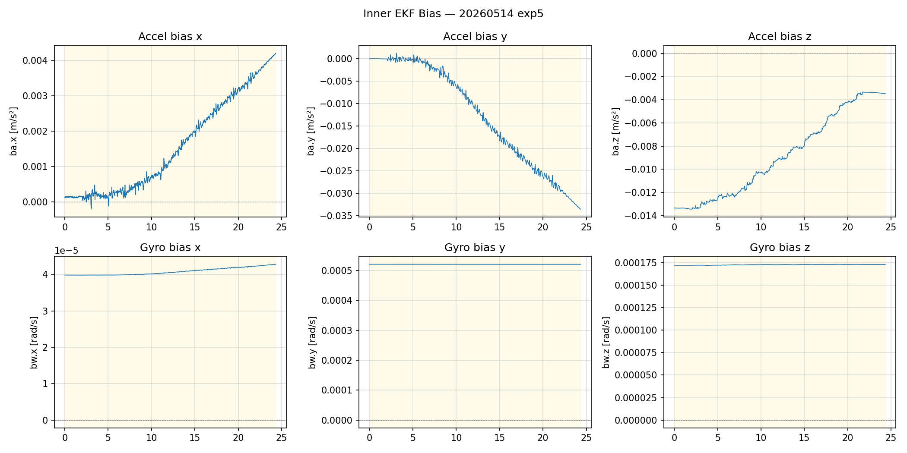
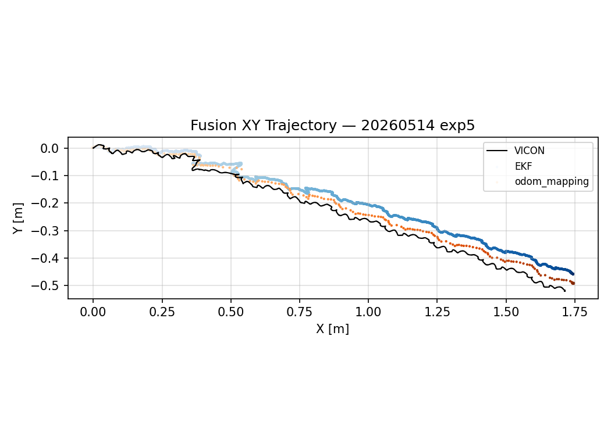
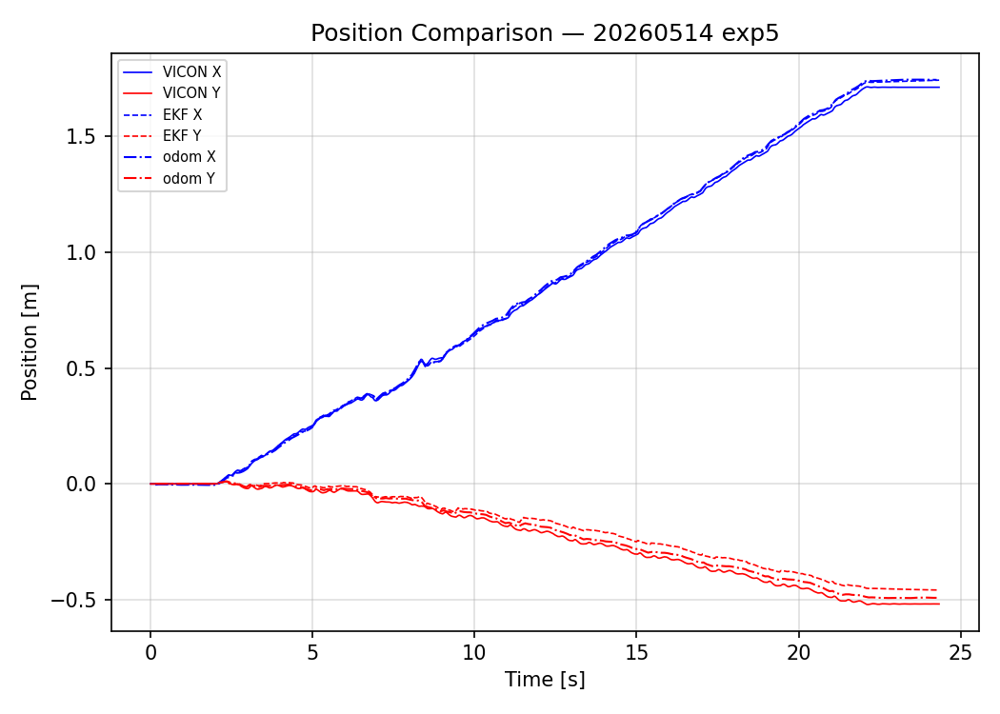
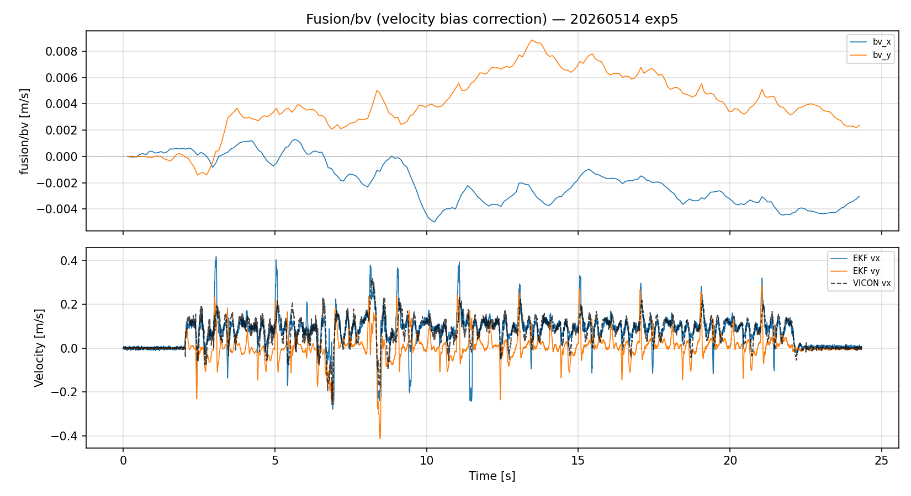
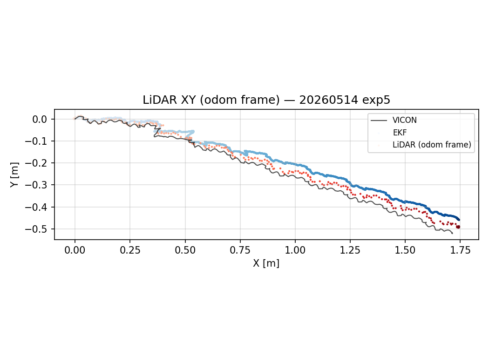

# CORGI 實驗分析報告

**日期：** 2026-05-14
**實驗編號：** `exp5`
**實驗名稱：** `walk_2m_01_obs_odometry` （啟用觀測速度補正 obs_odometry）
**Bag 檔案：** `odom_fusion20260514_230340_0.db3`
**VICON CSV：** `EXP_05_z_corrected.csv`
**步行分析區間：** t = 0 – 24.34 s
**分析腳本：** `analyze.py`

---

## 系統架構

```
/imu_raw ─┐
/motor/state ──┤──► corgi_leg_odom ──► /ekf ────────────────────► (odom→base_link)
/trigger ──────┘                              │
/gmo/contact_state                            ▼
                          /lidar_odom ──► corgi_fusion_node ──► /odom_mapping
                         (FAST-LIO2,                           /fusion/bv
                          camera_init frame)
```

**T_{odom ← camera\_init}：**
translation = [0.098, -0.044, 0.164] m
RPY = [20.3°, -0.7°, 90.5°]
配準殘差：平均 0.6 cm，最大 2.0 cm

---

## 1. 接觸偵測（Contact Detection）

### 1.1 接觸偵測指標

接觸閾值：**15 mm**（相對於地面平面）
地面平面：ground1–ground4 單一凸包



| 腳 | N | TP | TN | FP | FN | 準確率 | 精確率 | 召回率 | F1 | 延遲 (ms) |
|----|---|----|----|----|----|--------|--------|--------|-----|-----------|
| LF | 36 | 9 | 0 | 16 | 11 | 25.0% | 0.360 | 0.450 | 0.4000 | 0.0 |
| RF | 1068 | 1051 | 0 | 0 | 17 | 98.4% | 1.000 | 0.984 | 0.9920 | 8.0 |
| RH | 2094 | 1542 | 0 | 0 | 552 | 73.6% | 1.000 | 0.736 | 0.8482 | 240.0 |
| LH | 10 | 0 | 10 | 0 | 0 | 100.0% | nan | nan | nan | nan |

**觀察：**
- RF（右前腳）精確率 1.000、召回率 0.984。
- RH（右後腳）精確率 1.000、召回率 0.736。
- 誤報率（FP / (TP+FP)）低表示 GMO 觸發保守；FN 偏高表示輕觸或抬腳初期有漏偵測。

---

## 2. 內部 EKF 分析（Inner EKF）

### 2.1 位置




| 指標 | 數值 |
|------|------|
| RMSE X（vs VICON） | 1.36 cm |
| RMSE Y（vs VICON） | 4.51 cm |
| RMSE Z（vs VICON） | 19.05 cm |
| RMSE 3D（vs VICON） | **19.62 cm** |
| 最大 3D 誤差 | 31.20 cm |
| 最終位置（EKF） | (1.743, -0.458) m |
| 最終位置（VICON） | (1.713, -0.519) m |

**觀察：**
- Y 方向誤差（4.51 cm）為主要誤差來源，X 方向追蹤良好（1.36 cm）。
- Z RMSE = 19.05 cm，Z 軸漂移顯著，推測與重力估計誤差有關。

### 2.2 速度



> 速度 RMSE 計算窗口：t = 9.7 – 17.0 s（穩態步行段）

| 指標 | 數值 |
|------|------|
| RMSE vx（vs VICON） | 0.048 m/s |
| RMSE vy（vs VICON） | 0.055 m/s |
| RMSE vz（vs VICON） | 0.022 m/s |
| 最大前進速度 | 0.394 m/s |

**觀察：**
- vx RMSE 0.048 m/s，前進速度追蹤品質良好。

### 2.3 姿態（RPY）



| 指標 | 數值 |
|------|------|
| RMSE roll（vs VICON） | 1.28° |
| RMSE pitch（vs VICON） | 0.48° |
| RMSE yaw（vs VICON） | 0.55° |
| 最終 yaw（EKF） | -17.21° |
| 最終 yaw（VICON） | -18.21° |

**觀察：**
- Roll/Pitch 估計穩定（1.28°/0.48°）。
- Yaw 最終偏差 1.00°，偏航估計精確。

### 2.4 加速度計偏差（ba）



| 軸 | 初始值 [m/s²] | 穩態值 [m/s²] | 穩態標準差 [m/s²] |
|----|--------------|--------------|------------------|
| x  | 0.00014 | 0.00305 | 0.00065 |
| y  | -0.00005 | -0.02507 | 0.00478 |
| z  | -0.01334 | -0.00496 | 0.00153 |

### 2.5 陀螺儀偏差（bw）

| 軸 | 初始值 [rad/s] | 穩態值 [rad/s] | 穩態標準差 [rad/s] |
|----|---------------|---------------|------------------|
| x  | 0.000040 | 0.000042 | 0.0000005 |
| y  | 0.000520 | 0.000520 | 0.0000000 |
| z  | 0.000172 | 0.000173 | 0.0000001 |

**觀察：**
- ba_y 從 -0.00005 漂移至 -0.02507 m/s²，收斂不完全，為 Y 方向位置漂移的主因。
- bw 三軸穩態標準差極小，陀螺儀偏差收斂良好。

---

## 3. 外部融合節點（Outer Fusion Node）

### 3.1 odom_mapping 位置




| 指標 | 數值 |
|------|------|
| RMSE 2D vs VICON | **2.53 cm** |
| 最大 2D 誤差 vs VICON | 4.30 cm |
| RMSE 2D vs EKF | 2.70 cm |
| 最終位置（odom_mapping） | (1.745, -0.492) m |

**觀察：**
- odom_mapping RMSE 2D（2.53 cm）優於 inner EKF 3D RMSE（19.62 cm），LiDAR 融合提升橫向定位精度。

### 3.2 odom_mapping 偏航角

| 指標 | 數值 |
|------|------|
| RMSE yaw vs VICON | **0.09°** |
| RMSE yaw vs EKF | 0.54° |
| 最終 yaw（odom_mapping） | -18.15° |
| 最終 yaw（VICON） | -18.20° |

**觀察：**
- 融合節點 yaw RMSE 0.09° 遠優於 inner EKF（0.55°），LiDAR 修正偏航效果顯著。

### 3.3 fusion/bv 速度偏差修正量



> **說明：** `/fusion/bv` 為外部融合節點估計的腿部里程計速度偏差修正量，用以持續補正 leg odometry 速度估測誤差，修正過程不造成位置跳變。

| 指標 | 數值 |
|------|------|
| 平均修正量 vx | -0.0019 m/s |
| 平均修正量 vy | 0.0040 m/s |
| 平均修正幅度 | **0.0048 m/s** |
| 最大修正幅度 | 0.0092 m/s |

#### odom_mapping 速度 vs VICON

| 指標 | 數值 |
|------|------|
| RMSE vx（odom_mapping vs VICON） | 0.098 m/s |
| RMSE vy（odom_mapping vs VICON） | 0.059 m/s |

---

## 4. LiDAR 輸入品質



| 指標 | 數值 |
|------|------|
| 訊息總數 | 243 |
| 更新頻率 | 10.0 Hz |
| 跳變數（>10cm） | 0 |

**T_{odom←camera\_init} 估計（Procrustes 配準）：**
- translation = ['0.098', '-0.044', '0.164'] m
- RPY = ['20.3', '-0.7', '90.5']°
- 配準殘差 mean=0.61 cm，max=1.97 cm

**觀察：**
- LiDAR 更新率 10.0 Hz，符合 FAST-LIO2 標準頻率（10 Hz）。
- 無明顯跳變事件，LiDAR 輸入穩定。

---

## 摘要

| 指標 | 數值 |
|------|------|
| 步行時間 | 24.34 s |
| Inner EKF 位置 RMSE 3D | 19.62 cm |
| odom_mapping RMSE 2D vs VICON | 2.53 cm |
| EKF Yaw RMSE | 0.55° |
| odom_mapping Yaw RMSE | 0.09° |
| EKF 速度 vx RMSE | 0.048 m/s |
