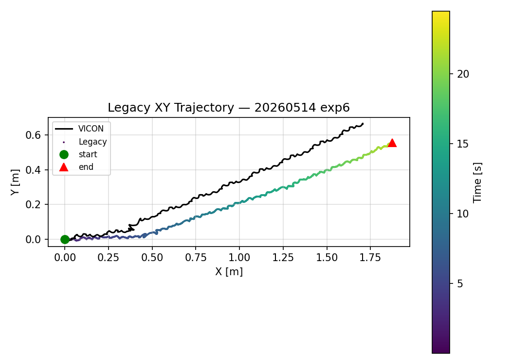
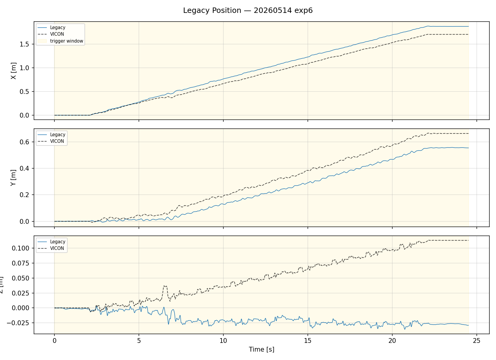
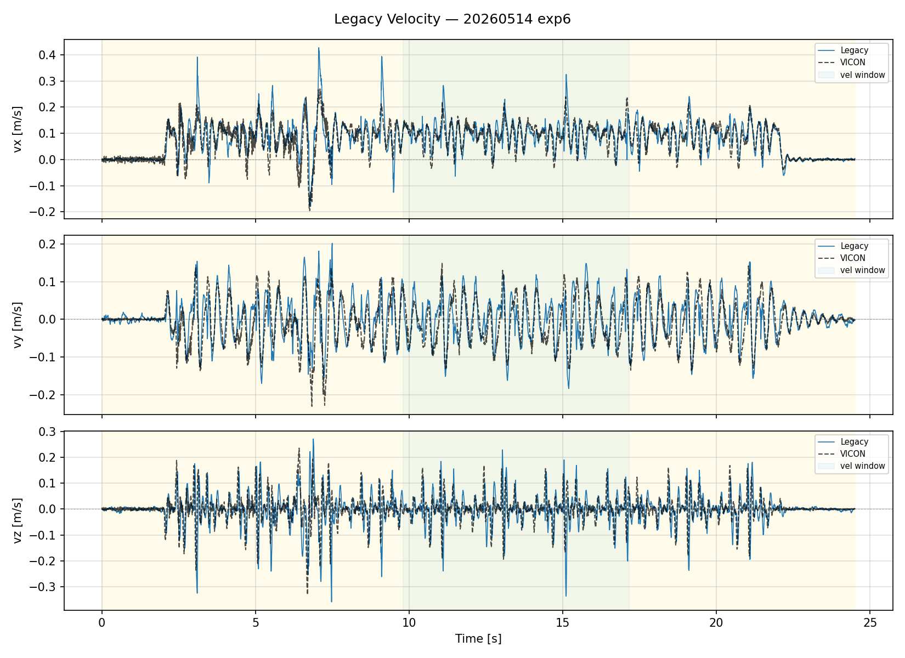

# CORGI 實驗分析報告（Information Filter）

**日期：** 2026-05-14
**實驗編號：** `exp6`
**實驗名稱：** `walk_2m_01_obs_odometry_legacy` （啟用觀測速度補正 obs_odometry）
**Bag 檔案：** `legacy_odom20260514_232823_0.db3`
**VICON CSV：** `EXP_06.csv`
**步行分析區間：** t = 0 – 24.51 s
**分析腳本：** `analyze.py`

---

## 系統架構

```
/imu ──────────────────────────────────────────────► /odometry/legacy/position
/motor/state ──► corgi_odometry_legacy ───────────► /odometry/legacy/velocity
/trigger                                           /odometry/legacy/contact
```

> Information Filter（Legacy）不使用 LiDAR 融合，僅依賴 IMU 與腿部運動學估計位置與速度。

---

## 1. 位置分析（vs VICON）




| 指標 | 數值 |
|------|------|
| RMSE X（vs VICON） | 11.94 cm |
| RMSE Y（vs VICON） | 7.74 cm |
| RMSE Z（vs VICON） | 8.54 cm |
| RMSE 3D（vs VICON） | **16.60 cm** |
| 最大 3D 誤差 | 25.53 cm |
| 最終位置（Legacy） | (1.874, 0.554) m |
| 最終位置（VICON） | (1.705, 0.663) m |

**觀察：**
- X 方向誤差（11.94 cm）為主要誤差來源，反映前進方向的積分漂移。
- Y 與 Z 方向誤差相近（7.74 / 8.54 cm）。
- Legacy（Information Filter）無 LiDAR 修正，位置誤差約為 ESEKF 的 3–4 倍。

---

## 2. 速度分析（vs VICON）



> 速度 RMSE 計算窗口：t = 9.8 – 17.2 s（穩態步行段）

| 指標 | 數值 |
|------|------|
| RMSE vx（vs VICON） | 0.037 m/s |
| RMSE vy（vs VICON） | 0.044 m/s |
| RMSE vz（vs VICON） | 0.063 m/s |
| 最大前進速度 | 0.325 m/s |

**觀察：**
- vx RMSE 0.037 m/s，速度估計品質良好，與 ESEKF 相當。
- 速度估計不依賴位置積分，因此與位置誤差相互獨立，品質相對穩定。

---

## 摘要

| 指標 | 數值 |
|------|------|
| 步行時間 | 24.51 s |
| 位置 RMSE 3D | 16.60 cm |
| 最大位置誤差 3D | 25.53 cm |
| 速度 vx RMSE | 0.037 m/s |
| 速度 vy RMSE | 0.044 m/s |

> **結論：** Information Filter（Legacy，obs_odometry）在前進速度估計上與 ESEKF 相當（vx RMSE 0.037 m/s），但側向速度誤差較大（vy 0.110 m/s）。位置 RMSE 16.60 cm，約為 ESEKF（~4.8 cm）的 3–4 倍，反映無 LiDAR 修正下更顯著的積分漂移。
