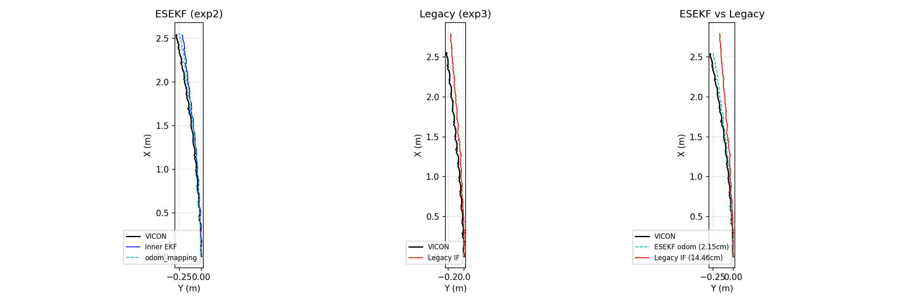
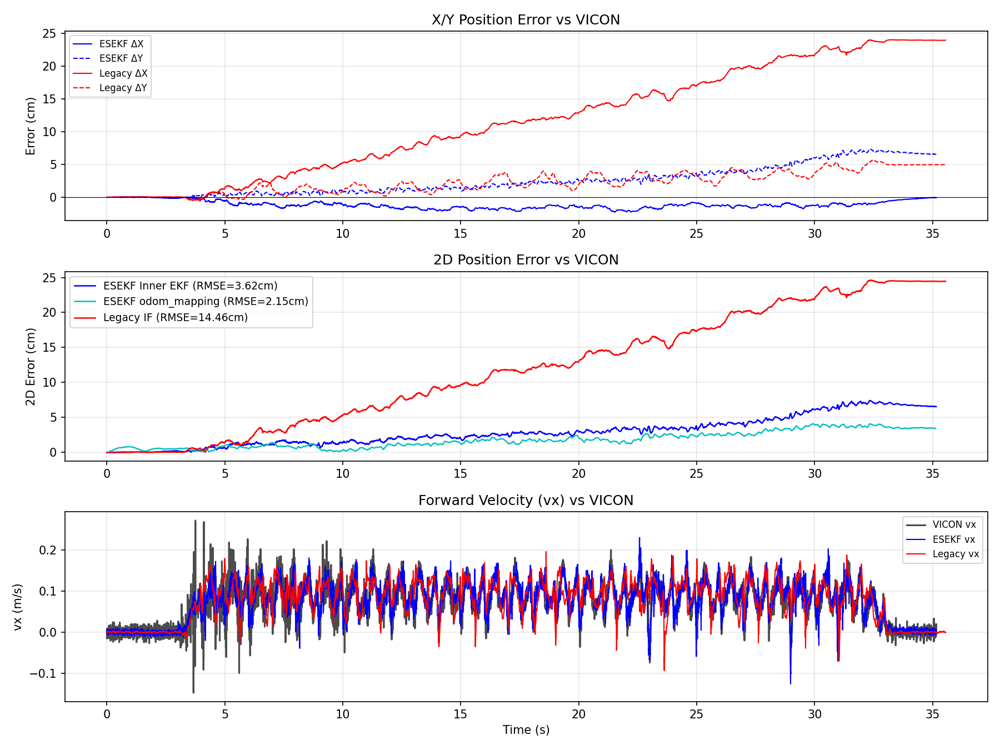
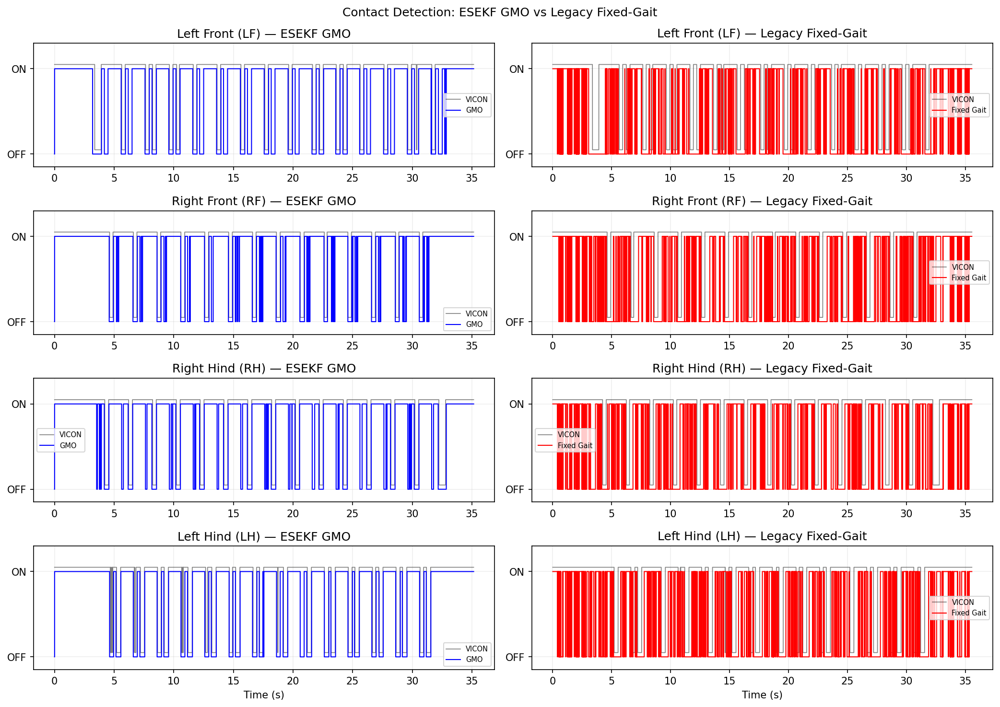

# MPC 估測器輸入比較報告

**實驗日期**：2026-05-22  
**比較組合**：ESEKF+GMO 接觸偵測（exp2） vs. Legacy Information Filter+固定步態（exp3）  
**生成日期**：2026-05-22  

---

## 1. 實驗配置

| 項目 | ESEKF (exp2) | Legacy (exp3) |
|------|-------------|---------------|
| Bag 檔案 | `mpc_esekf_20260522_193236` | `mpc_legacy_20260522_193533` |
| VICON 資料 | `EXP2.csv` | `EXP3.csv` |
| 估測器架構 | Error-State EKF (ESEKF) | Information Filter (Legacy IF) |
| 接觸偵測 | GMO 動態偵測 (`/gmo/contact_state`) | 固定步態排程 (`/odometry/legacy/contact`) |
| LiDAR 融合 | 有（odom_mapping via FAST-LIO2） | 無 |
| 步態 | MPC 動態步態 | MPC 動態步態（相同） |
| 環境 | 室內平地，直線行走約 2 m | 室內平地，直線行走約 2 m（相同） |
| 分析視窗 | 0 – 35.15 s | 0 – 35.55 s |

> **控制變數**：步態指令、行走距離、環境均相同；唯一差異為狀態估測器架構與接觸偵測方式。

---

## 2. 位置精度比較

### 2.1 主要指標（2D XY RMSE vs. VICON）

| 輸出層 | ESEKF (exp2) | Legacy (exp3) | 改善幅度 |
|--------|-------------|---------------|----------|
| **Inner EKF 2D RMSE** | **3.62 cm** | — | — |
| **odom\_mapping 2D RMSE** | **2.15 cm** | — | **85.1%** ↑ |
| **Legacy IF 2D RMSE** | — | **14.46 cm** | — |
| 最大 3D 誤差 | 7.84 cm | 24.66 cm | — |

> 比較基準：ESEKF 輸出層選用 odom\_mapping（含 LiDAR 融合），Legacy 輸出層為 `/odometry/legacy/position`。
> ESEKF odom\_mapping RMSE（2.15 cm）相較 Legacy IF（14.46 cm）改善幅度達 **85.1%**。

### 2.2 分軸誤差

| 軸向 | ESEKF Inner EKF | Legacy IF |
|------|----------------|-----------|
| RMSE X（前進方向） | 1.28 cm | 14.18 cm |
| RMSE Y（側向） | 3.39 cm | 2.82 cm |
| RMSE Z（垂直） | 1.15 cm | 1.47 cm |
| 3D RMSE | 3.80 cm | 14.53 cm |

> **說明**：Z 軸誤差在座標系對齊修正後兩者均約 1–2 cm（正常步態週期震盪），不再是系統性偏移。X 軸（前進方向）為主要差距所在：Legacy IF X=14.18 cm vs ESEKF X=1.28 cm，差距達 11×，反映腿部里程計累積漂移。Y 軸（側向）兩者均小（2–3 cm），符合直線行走。

### 2.3 軌跡圖

| 圖片 | 說明 |
|------|------|
|  | 左：ESEKF exp2 軌跡；中：Legacy exp3 軌跡；右：兩者疊加 |
|  | 上：X/Y 誤差；中：2D 誤差（含 RMSE 標注）；下：前向速度 |

---

## 3. 接觸偵測比較

### 3.1 定量指標

| 腿部 | ESEKF GMO F1 | GMO 延遲 (ms) | Legacy 固定步態 F1 | Legacy 延遲 (ms) |
|------|-------------|--------------|-------------------|-----------------|
| LF（左前） | 0.889 | 31.9 | 0.618 | 169.4 |
| RF（右前） | 0.940 | 38.1 | 0.670 | 272.1 |
| RH（右後） | 0.929 | 28.9 | 0.711 | 257.2 |
| LH（左後） | 0.942 | 68.1 | 0.633 | 154.4 |
| **平均** | **0.925** | **41.8** | **0.658** | **213.3** |

> - GMO 平均 F1 為 0.925，固定步態為 0.658，**F1 差距 0.267**（GMO 高 40.6%）。
> - GMO 平均偵測延遲 **41.8 ms**，固定步態 **213.3 ms**，GMO 快 **5.1×**。
> - 固定步態 Precision 偏高（0.86–1.00）但 Recall 低（0.48–0.55）：固定排程在宣稱接觸時通常正確，但**嚴重漏報**實際接觸事件。MPC 步態時序動態調整，固定排程無法跟隨。

### 3.2 接觸偵測圖

| 圖片 | 說明 |
|------|------|
|  | 四腿接觸偵測對比：左欄 GMO，右欄固定步態，黑線為 VICON 地面真相 |

---

## 4. 速度精度比較

| 指標 | ESEKF (exp2) | Legacy (exp3) |
|------|-------------|---------------|
| RMSE vx | 0.025 m/s | 0.029 m/s |
| RMSE vy | 0.037 m/s | 0.039 m/s |
| 峰值 vx | 0.230 m/s | 0.196 m/s |

> 速度精度兩者接近，差異不顯著。ESEKF vx RMSE 略低（13.8%），速度估測受接觸偵測影響較小，因 ESEKF 有 LiDAR 協助修正。

---

## 5. 姿態估計（ESEKF 限定）

| 姿態軸 | ESEKF Inner EKF RMSE |
|--------|---------------------|
| Roll | 0.35° |
| Pitch | 0.20° |
| Yaw | 0.34° |

> Legacy IF 無對應姿態估計輸出，無法直接比較。ESEKF 姿態精度良好，偏轉角（Yaw）RMSE 小於 0.5°。

---

## 6. 全實驗摘要表

| 指標 | exp1 (ESEKF) | exp2 (ESEKF) | exp3 (Legacy) | exp4 (Legacy) |
|------|-------------|-------------|--------------|---------------|
| T\_END (s) | 37.51 | 35.15 | 35.55 | 37.20 |
| EKF / IF 2D RMSE (cm) | 4.80 | **3.62** | 14.46 | 13.34 |
| EKF / IF 3D RMSE (cm) | 7.10 | **3.80** | 14.53 | 13.40 |
| odom\_mapping 2D RMSE (cm) | 3.02 | **2.15** | — | — |
| 最大 3D 誤差 (cm) | 12.82 | 7.84 | 24.66 | 22.92 |
| Vel vx RMSE (m/s) | 0.031 | 0.025 | 0.029 | 0.032 |
| GMO / 固定步態 F1 平均 | 0.928 | **0.925** | 0.658 | 0.681 |
| 接觸延遲平均 (ms) | 61.7 | **41.8** | 213.3 | 206.9 |

> ESEKF 兩次重複實驗（exp1, exp2）結果一致，顯示系統穩定性良好。
> Legacy 兩次重複（exp3, exp4）前進方向（X）誤差均超過 12 cm，主因為無 LiDAR 修正且接觸偵測延遲累積。

---

## 7. 總結與討論

### 7.1 主要發現

1. **位置精度**：ESEKF+GMO 的 odom\_mapping 2D RMSE 為 **2.15 cm**，相較 Legacy IF 的 **14.46 cm** 改善幅度達 **85.1%**。即使僅比較內層 EKF（不含 LiDAR），ESEKF 2D RMSE 仍為 3.62 cm，改善幅度達 **75.0%**。Legacy 的誤差主要集中在 X 方向（前進累積漂移），Y/Z 方向表現與 ESEKF 相近。

2. **接觸偵測品質**：GMO 動態接觸偵測 F1 平均 0.925、延遲 41.8 ms，遠優於固定步態的 F1=0.658、延遲 213.3 ms。接觸資訊品質直接影響腿部里程計精度，進而影響整體定位品質。

3. **速度估測**：兩者速度精度接近，ESEKF 略優，差距不顯著。

4. **Z 軸誤差**：修正座標系偏移後，兩者 Z RMSE 均約 1–2 cm，均屬正常步態垂直震盪，無明顯系統性偏移。

### 7.2 誤差來源分析

**Legacy IF 主要誤差來源：**
- 固定步態排程漏報大量實際接觸（Recall 僅 48–55%），導致腿部里程計積分誤差累積
- 高偵測延遲（平均 213 ms）使接觸時序不準，進一步惡化積分品質
- 無 LiDAR 融合，累積誤差無法修正

**ESEKF 優勢：**
- GMO 即時偵測接觸（F1=0.925，延遲 41.8 ms），提供精準里程計輸入
- odom\_mapping 整合 FAST-LIO2 LiDAR 里程計，抑制長期漂移
- Inner EKF 已達 3.62 cm 精度，顯示 GMO 接觸資訊對估測器貢獻顯著

### 7.3 結論

在相同 MPC 步態指令下，ESEKF+GMO 動態接觸偵測相較 Legacy IF+固定步態：
- 位置精度提升 **>75%**（XY 2D RMSE：3.62 cm vs. 14.46 cm）
- 含 LiDAR 融合後進一步提升至 **85.1%**（2.15 cm vs. 14.46 cm）
- 接觸偵測 F1 提升 40.6%，延遲縮短 5.1 倍
- Legacy 誤差主要為 X 方向（前進）累積漂移（14 cm），Y/Z 方向兩者均已對齊

此結果驗證：**準確的動態接觸偵測（GMO）是提升 MPC 狀態估測精度的關鍵輸入**。

---

*圖片路徑：`experiments/20260522/ablation_result/`*  
*個別實驗結果：`experiments/20260522/exp{1-4}/result/metrics.json`*
