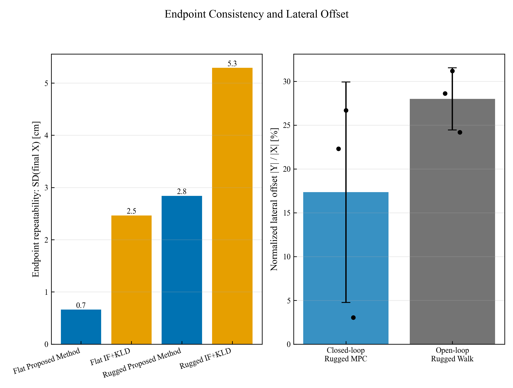
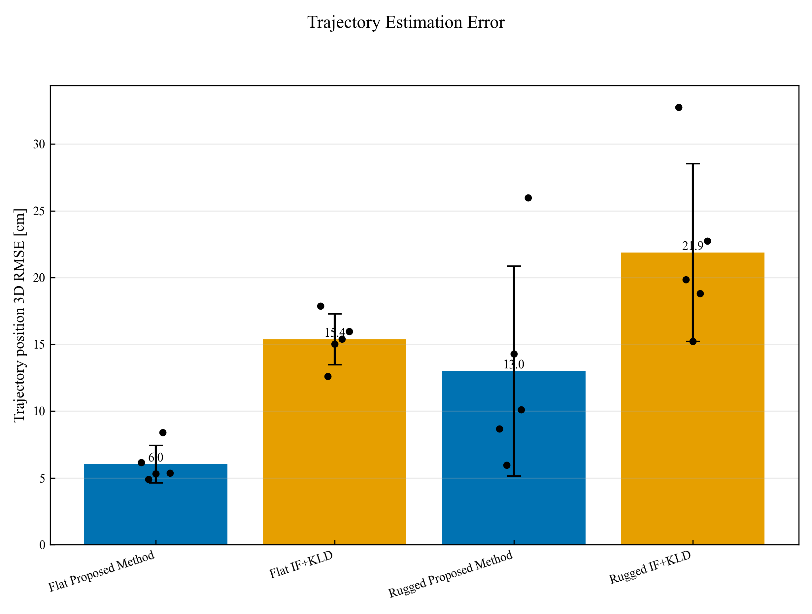
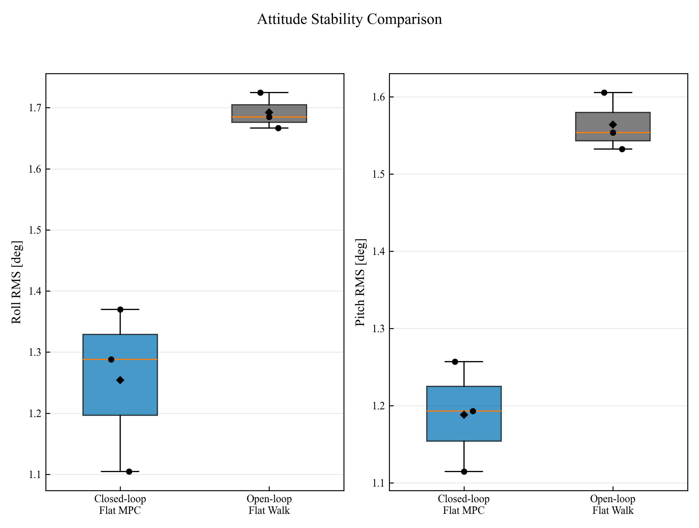
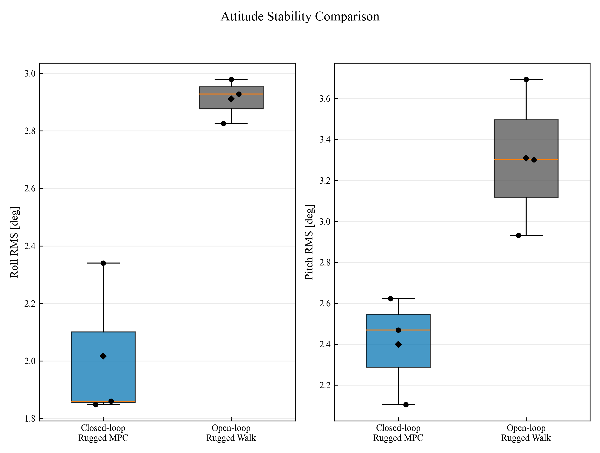

# 5.5 MPC 驗證

**分析資料：** 2026-05-28 平地 MPC、2026-07-09 同一崎嶇地的 MPC 與開迴路步行
**重複次數：** 平地與崎嶇地的開／閉迴路 VICON 比較皆為各 3 次
**基準系統：** VICON 500 Hz
**控制目標：** 終點 X = 3.0 m

> 本報告的本文方法回授指 inner `/ekf`。目前 `walk_closed_dist` 在 `state_source:=esekf` 時直接使用 `/ekf` 的位置、速度與姿態；LiDAR 外層融合 `/odom_mapping` 並未作為這批 MPC 的停止回授。因此，終點改善應歸因於本文方法的狀態回授，不應直接宣稱為 LiDAR 閉迴路效果。

## 5.5.1 驗證目的與評估方法

本節驗證狀態估測方法對 MPC 定點停止的影響，並比較同一崎嶇地上 closed-loop MPC 與 open-loop 步行的姿態穩定性。終點估測誤差定義為 $|x_{est}-x_{VICON}|$；實際停止誤差定義為 $|x_{VICON}-3.0|$。軌跡估測以 VICON 對齊後的 3D RMSE 評估。

姿態穩定性使用每次試驗 `35%–75% T_END` 穩態窗內的 VICON roll/pitch，先扣除各次試驗的中位姿態，再計算 RMS 與 95 百分位偏差。這些指標描述真實機體運動，與 EKF 相對 VICON 的姿態估測 RMSE 是不同概念。

## 5.5.2 不同狀態估測方法之終點定位精度

| 地形 | 狀態估測 | n | 終點估測誤差 (cm) | VICON 停止誤差 (cm) | VICON final X (m) |
|------|----------|---|--------------------|----------------------|-------------------|
| 平地 | Proposed Method | 5 | 1.6 ± 1.1 | 1.2 ± 0.7 | 2.988 ± 0.007 |
| 平地 | IF+KLD | 5 | 24.7 ± 2.1 | 24.2 ± 2.5 | 2.758 ± 0.025 |
| Rugged | Proposed Method | 5 | 2.4 ± 2.5 | 3.4 ± 2.8 | 2.966 ± 0.028 |
| Rugged | IF+KLD | 5 | 37.1 ± 5.5 | 36.6 ± 5.3 | 2.634 ± 0.053 |

平地中，本文方法的實際停止誤差為 **1.2 cm**，實驗室既有方法為 **24.2 cm**，實驗室既有方法約為本文方法的 **20.6 倍**。崎嶇地中，兩者分別為 **3.4 cm** 與 **36.6 cm**，實驗室既有方法約為本文方法的 **10.6 倍**。實驗室既有方法通常在估測值接近 3 m 時，VICON 實際位置仍不足 3 m，顯示腿式里程計高估前進距離並使控制器提前停止。

### 各次試驗終點

| 實驗 | 估測器 final X (m) | VICON final X (m) | $|x_{est}-x_{VICON}|$ (cm) | VICON 有號停止誤差 (cm) |
|------|---------------------|-------------------|--------------------------------------|--------------------------|
| FLAT_MPC_NEW_REAL_1 | 2.997 | 2.985 | 1.2 | -1.5 |
| FLAT_MPC_NEW_REAL_2 | 2.991 | 2.983 | 0.8 | -1.7 |
| FLAT_MPC_NEW_REAL_3 | 3.017 | 2.983 | 3.4 | -1.7 |
| FLAT_MPC_NEW_REAL_4 | 3.018 | 2.998 | 2.0 | -0.2 |
| FLAT_MPC_NEW_REAL_5 | 2.999 | 2.992 | 0.7 | -0.8 |
| FLAT_MPC_OLD_REAL_1 | 3.003 | 2.747 | 25.6 | -25.3 |
| FLAT_MPC_OLD_REAL_2 | 3.010 | 2.799 | 21.1 | -20.1 |
| FLAT_MPC_OLD_REAL_3 | 3.008 | 2.761 | 24.7 | -23.9 |
| FLAT_MPC_OLD_REAL_4 | 3.000 | 2.747 | 25.3 | -25.3 |
| FLAT_MPC_OLD_REAL_5 | 3.002 | 2.736 | 26.5 | -26.4 |
| OBS_MPC_NEW_REAL_3 | 2.998 | 2.997 | 0.1 | -0.3 |
| OBS_MPC_NEW_REAL_4 | 2.985 | 2.967 | 1.8 | -3.3 |
| OBS_MPC_NEW_REAL_5 | 3.001 | 2.951 | 5.0 | -4.9 |
| OBS_MPC_NEW_REAL_6 | 2.987 | 2.987 | 0.0 | -1.3 |
| OBS_MPC_NEW_REAL_7 | 2.975 | 2.926 | 4.9 | -7.4 |
| OBS_MPC_OLD_REAL_1 | 3.010 | 2.548 | 46.2 | -45.2 |
| OBS_MPC_OLD_REAL_2 | 3.003 | 2.682 | 32.1 | -31.8 |
| OBS_MPC_OLD_REAL_3 | 3.009 | 2.667 | 34.2 | -33.3 |
| OBS_MPC_OLD_REAL_4 | 3.002 | 2.623 | 37.9 | -37.7 |
| OBS_MPC_OLD_REAL_5 | 3.003 | 2.651 | 35.2 | -34.9 |

### 終點重複性與橫向偏移

終點重複性以 VICON `final X` 的樣本標準差表示；橫向偏移以相對起點的 VICON `final Y` 表示，並以 $|Y|/|X|$ 正規化，避免前進距離不同時直接比較絕對橫向位移。

| 地形 | 狀態估測 | Final X 樣本標準差 (cm) | Final Y (cm) | $|Y|$ (cm) | $|Y|/|X|$ (%) |
|------|----------|--------------------------|--------------|------------|----------------|
| 平地 | Proposed Method | 0.7 | -44.4 ± 7.1 | 44.4 ± 7.1 | 14.9 ± 2.4 |
| 平地 | IF+KLD | 2.5 | -31.3 ± 3.8 | 31.3 ± 3.8 | 11.4 ± 1.4 |
| Rugged | Proposed Method | 2.8 | -58.1 ± 30.9 | 58.1 ± 30.9 | 19.7 ± 10.6 |
| Rugged | IF+KLD | 5.3 | -31.0 ± 3.7 | 31.0 ± 3.7 | 11.8 ± 1.4 |

本文方法的 Final X 重複性較佳：平地標準差由實驗室既有方法的 2.5 cm 降至 0.7 cm（降低 73.2%）；崎嶇地由 5.3 cm 降至 2.8 cm（降低 46.3%）。實驗室既有方法的絕對橫向位移看似較小，主要因其提早停止、前進距離較短；因此應以正規化比例配合終點 X 誤差解讀，而不宜單憑 $|Y|$ 判定橫向控制較好。

## 5.5.3 軌跡估測精度與外層融合

| 地形 | 系統 | 位置 3D RMSE (cm) | 速度 3D RMSE (m/s) |
|------|------|-------------------|----------------------|
| 平地 | Proposed Method | 6.02 ± 1.41 | 0.056 ± 0.003 |
| 平地 | IF+KLD | 15.37 ± 1.90 | 0.064 ± 0.004 |
| Rugged | Proposed Method | 13.00 ± 7.85 | 0.096 ± 0.041 |
| Rugged | IF+KLD | 21.87 ± 6.64 | 0.110 ± 0.024 |

本文方法在平地與崎嶇地的平均軌跡 3D RMSE 均低於實驗室既有方法。崎嶇地組本文方法的 inner `/ekf` 3D RMSE 為 **13.00 ± 7.85 cm**；外層 `/odom_mapping` 的 2D RMSE 為 **8.20 ± 8.76 cm**。兩者維度不同，不能直接視為完全等價的改善率，但外層融合在 XY 平面通常更平滑且誤差較小。LiDAR 更新率為 **10.00 ± 0.01 Hz**，配準平均殘差為 **0.89 ± 0.29 cm**。

## 5.5.4 開迴路與閉迴路之姿態穩定性

### 平地 FLAT MPC 與 FLAT Walk NEW 比較

| 指標 | Closed-loop FLAT MPC NEW (n=3) | Open-loop FLAT Walk NEW (n=3) | 描述性變化 |
|------|--------------------------------|-------------------------------|------------|
| VICON roll RMS (deg) | 1.25 ± 0.14 | 1.69 ± 0.03 | 閉迴路降低 25.9% |
| VICON pitch RMS (deg) | 1.19 ± 0.07 | 1.56 ± 0.04 | 閉迴路降低 24.0% |
| Roll 95% 偏差 (deg) | 2.24 ± 0.06 | 3.17 ± 0.14 | 越小越穩定 |
| Pitch 95% 偏差 (deg) | 2.29 ± 0.25 | 3.23 ± 0.20 | 越小越穩定 |

平地比較採 Closed-loop `FLAT_MPC_NEW_REAL_1、2、4` 與 Open-loop `FLAT_Walk_NEW_REAL_1、5、6`，兩組各三筆。Closed-loop 由五筆 FLAT MPC 中依 `roll RMS + pitch RMS` 由低至高選取前三筆；未選入的 REAL_3、5 仍保留於前述終點與軌跡統計。兩組均使用 VICON 真值與相同的穩態窗定義；但這是挑選較佳 Closed-loop 試驗後的描述性比較，不應解讀為無偏估計或單一控制器因素的因果效果。

### 崎嶇地比較

| 指標 | Closed-loop Rugged MPC (n=3) | Open-loop Rugged Walk (n=3) | 描述性變化 |
|------|-------------------------------|---------------------------|------------|
| VICON roll RMS (deg) | 2.02 ± 0.28 | 2.91 ± 0.08 | 閉迴路降低 30.7% |
| VICON pitch RMS (deg) | 2.40 ± 0.27 | 3.31 ± 0.38 | 閉迴路降低 27.5% |
| Roll 95% 偏差 (deg) | 4.21 ± 0.58 | 5.71 ± 0.57 | 越小越穩定 |
| Pitch 95% 偏差 (deg) | 4.91 ± 0.49 | 6.28 ± 0.69 | 越小越穩定 |

崎嶇地比較採 Closed-loop `OBS_MPC_NEW_REAL_4、5、6` 與 Open-loop `RUGG_Walk_NEW_REAL_1、2、5`，兩組各三筆。Closed-loop 同樣依 `roll RMS + pitch RMS` 由低至高選取前三筆。依 VICON 真值，closed-loop MPC 的 roll 與 pitch 波動均小於 open-loop；兩組在相同地形進行，但任務條件與前進距離仍不同，且 Closed-loop 經較佳試驗篩選，因此本結果僅作描述性比較。橫向偏移以下列正規化比例評估。

### 同一地形下的橫向偏移

| 控制模式 | n | Final X (m) | Final Y (cm) | $|Y|/|X|$ (%) |
|----------|---|-------------|--------------|----------------|
| Closed-loop Rugged MPC | 3 | 2.968 ± 0.018 | -51.3 ± 37.1 | 17.3 ± 12.6 |
| Open-loop Rugged Walk | 3 | 2.473 ± 0.018 | -69.2 ± 8.6 | 28.0 ± 3.5 |

在相同地形下，三筆 closed-loop MPC 的正規化橫向偏移為 **17.3%**，open-loop 為 **28.0%**，描述性降低 **38.1%**。雖然 open-loop 的平均前進距離較短，採用 $|Y|/|X|$ 後仍可比較單位前進距離的橫向漂移。

## 結論

1. 本文方法回授大幅改善 3 m 定點停止精度；實驗室既有方法的腿式里程計因前進距離累積高估而提前停止，此現象在平地與崎嶇地均一致。
2. 本文方法的軌跡位置誤差低於實驗室既有方法，且終點估測值更接近 VICON，說明狀態估測品質會直接轉化為 MPC 任務層級的定位性能。
3. 平地 FLAT MPC NEW 與 FLAT Walk NEW 的比較已採相同 VICON 穩態指標；崎嶇地中，closed-loop MPC 的 roll 與 pitch 波動低於 open-loop，且正規化橫向偏移降低 38.1%。兩組任務條件仍有差異，因此結果屬描述性比較。
4. 外層 LiDAR fusion 在 XY 位置上具良好精度與約 10 Hz 穩定更新，但這批 MPC 尚未以 `/odom_mapping` 閉迴路回授，後續 A/B 驗證可進一步量化其控制效益。

---

*報告由 `analysis_tools/mpc_validation_report.py` 從既有 `metrics.json` 與 VICON CSV 重算；產生日期：2026-07-18。*
