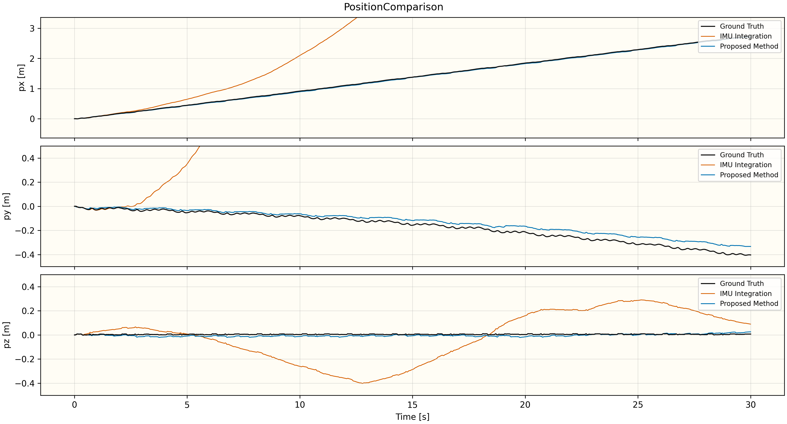
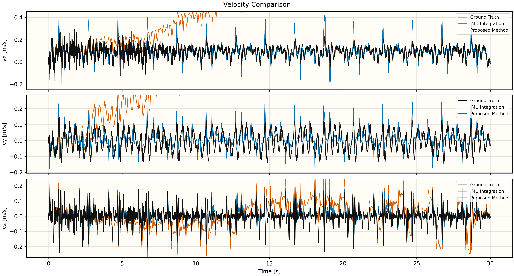
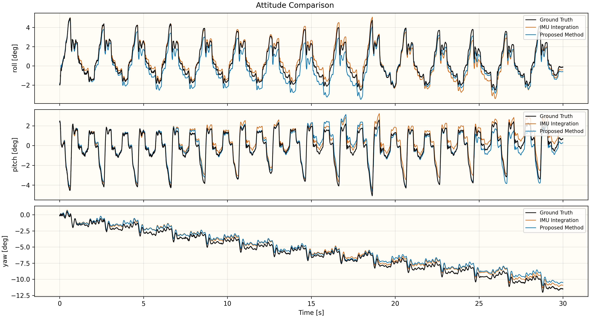
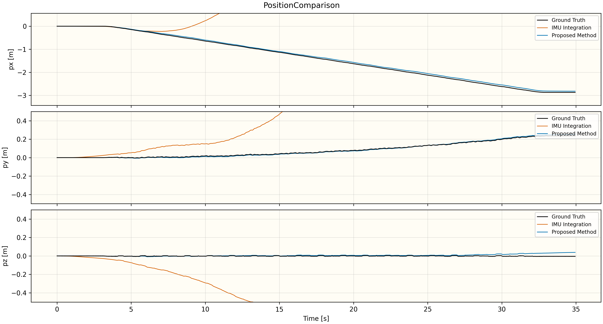
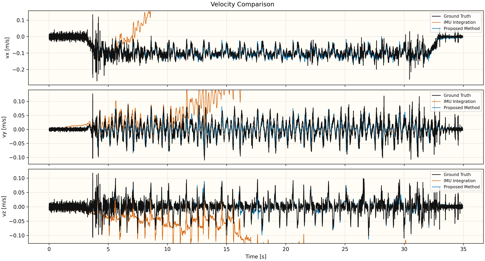
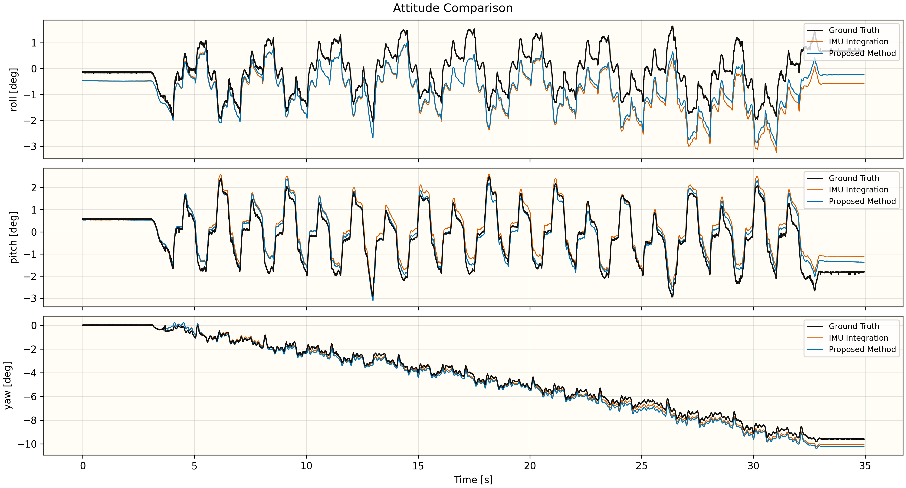

# 5.3 平地實驗

## 5.3.1 資料選取與分析方法

本節僅重新彙整既有 `metrics.json` 中的狀態估測結果，不重新執行節點、不 replay bag，亦不分析觸地狀態。為使 NEW 與 OLD 的樣本數一致，四組皆只納入三筆試驗。NEW Walk 採 REAL_1、REAL_5、REAL_6，OLD Walk 採 REAL_1、REAL_2、REAL_3；NEW WLW 採 REAL_4、REAL_5、REAL_2，OLD WLW 採 REAL_1、REAL_2、REAL_3。其餘 trial 全部排除於分組平均值、標準差與結論之外。

### 納入與排除清單

| 組別 | 納入統計 | 排除統計 |
|---|---|---|
| NEW Walk | FLAT_Walk_NEW_REAL_1, FLAT_Walk_NEW_REAL_5, FLAT_Walk_NEW_REAL_6 | FLAT_Walk_NEW_REAL_3, FLAT_Walk_NEW_REAL_4 |
| OLD Walk | FLAT_Walk_OLD_REAL_1, FLAT_Walk_OLD_REAL_2, FLAT_Walk_OLD_REAL_3 | FLAT_Walk_OLD_REAL_4, FLAT_Walk_OLD_REAL_5 |
| NEW WLW | FLAT_WLW_NEW_REAL_2, FLAT_WLW_NEW_REAL_4, FLAT_WLW_NEW_REAL_5 | FLAT_WLW_NEW_REAL_1, FLAT_WLW_NEW_REAL_3 |
| OLD WLW | FLAT_WLW_OLD_REAL_1, FLAT_WLW_OLD_REAL_2, FLAT_WLW_OLD_REAL_3 | FLAT_WLW_OLD_REAL_4, FLAT_WLW_OLD_REAL_5 |
| 純 IMU Walk | FLAT_Walk_NEW_REAL_3, FLAT_Walk_NEW_REAL_5, FLAT_Walk_NEW_REAL_6 | FLAT_Walk_NEW_REAL_1、FLAT_Walk_NEW_REAL_2（保持無值） |
| 純 IMU WLW | FLAT_WLW_NEW_REAL_2, FLAT_WLW_NEW_REAL_4, FLAT_WLW_NEW_REAL_5 | — |

## 5.3.2 位置與速度估測結果

| 步態 | 方法 | n | 位置 RMSE X / Y / Z [m] | 位置 RMSE 3D [m] | 速度 RMSE vx / vy / vz [m/s] | 速度 RMSE 3D [m/s] |
|---|---|---:|---:|---:|---:|---:|
| Walk | NEW（ES-EKF） | 3 | 0.014 ± 0.004 / 0.072 ± 0.022 / 0.021 ± 0.013 | 0.078 ± 0.021 | 0.042 ± 0.005 / 0.053 ± 0.002 / 0.021 ± 0.003 | 0.071 ± 0.004 |
| Walk | OLD（Legacy） | 3 | 0.169 ± 0.005 / 0.194 ± 0.010 / 0.022 ± 0.004 | 0.258 ± 0.010 | 0.050 ± 0.001 / 0.062 ± 0.000 / 0.047 ± 0.001 | 0.093 ± 0.001 |
| Walk | 純 IMU 積分 | 3 | 10.580 ± 6.221 / 13.551 ± 10.865 / 3.913 ± 4.440 | 20.283 ± 5.070 | 0.847 ± 0.227 / 1.112 ± 0.843 / 0.323 ± 0.293 | 1.581 ± 0.430 |
| WLW | NEW（ES-EKF） | 3 | 0.045 ± 0.003 / 0.017 ± 0.011 / 0.017 ± 0.005 | 0.053 ± 0.002 | 0.018 ± 0.001 / 0.025 ± 0.001 / 0.012 ± 0.001 | 0.033 ± 0.001 |
| WLW | OLD（Legacy） | 3 | 0.027 ± 0.005 / 0.105 ± 0.015 / 0.004 ± 0.001 | 0.109 ± 0.016 | 0.026 ± 0.000 / 0.030 ± 0.000 / 0.026 ± 0.000 | 0.047 ± 0.000 |
| WLW | 純 IMU 積分 | 3 | 13.303 ± 9.543 / 2.598 ± 2.767 / 1.820 ± 0.420 | 13.994 ± 9.257 | 1.027 ± 0.829 / 0.298 ± 0.209 / 0.150 ± 0.022 | 1.104 ± 0.807 |

| 步態 | NEW 位置 RMSE 3D | OLD 位置 RMSE 3D | 位置降幅 | NEW 速度 RMSE 3D | OLD 速度 RMSE 3D | 速度降幅 |
|---|---:|---:|---:|---:|---:|---:|
| Walk | 0.078 ± 0.021 m | 0.258 ± 0.010 m | 70.0% | 0.071 ± 0.004 m/s | 0.093 ± 0.001 m/s | 24.1% |
| WLW | 0.053 ± 0.002 m | 0.109 ± 0.016 m | 51.6% | 0.033 ± 0.001 m/s | 0.047 ± 0.000 m/s | 30.2% |

Walk 三筆 NEW 的位置 3D RMSE 為 **0.078 ± 0.021 m**，相較三筆 OLD 的 **0.258 ± 0.010 m** 降低 **70.0%**；速度 3D RMSE 降低 **24.1%**。

WLW 三筆 NEW 的位置 3D RMSE 為 **0.053 ± 0.002 m**，相較三筆 OLD 的 **0.109 ± 0.016 m** 降低 **51.6%**；速度 3D RMSE 降低 **30.2%**。四組樣本數皆為三筆，但 NEW 與 OLD 的試驗編號並非一一配對，因此本節報告描述統計與改善比例，不進行配對顯著性檢定。

<!-- POSITION_COMPARISON_FIGURES_START -->

### 代表性位置時序比較

代表性試驗以 Proposed Method 的位置 3D RMSE 為選取標準，Walk 與 WLW 分別從各自納入比較的三組實驗中選出 RMSE 最低者。位置、速度與姿態皆以三列共用時間軸子圖呈現。位置與速度的顯示範圍僅由 Ground Truth 與 Proposed Method 決定，IMU Integration 僅疊加顯示，超出範圍的漂移不擴張座標軸。位置圖的 $p_y$ 與 $p_z$ 共用以 0 為中心的相同尺度；$p_x$ 顯示跨度則設為 Y/Z 跨度的整數倍，以保留前進方向較大的量級並便於比較。姿態角使用 deg。

#### Walk

Walk 選用 `FLAT_Walk_NEW_REAL_3`，Proposed Method 的位置 3D RMSE 為 **0.059 m**。位置圖的 X 顯示跨度為 Y/Z 的 **4 倍**；位置、速度與姿態圖均呈現 0–30 s。

Walk 的三軸速度以與位置相同的 0–30 s 時間窗呈現：

Walk 的三軸姿態以相同的 0–30 s 時間窗呈現：

#### WLW

WLW 選用 `FLAT_WLW_NEW_REAL_2`，Proposed Method 的位置 3D RMSE 為 **0.050 m**。位置圖的 X 顯示跨度為 Y/Z 的 **4 倍**；位置、速度與姿態圖均使用同一完整共同時間窗。

WLW 的三軸速度以與位置相同的共同時間窗呈現：

WLW 的三軸姿態以相同的共同時間窗呈現：

<!-- POSITION_COMPARISON_FIGURES_END -->

### 納入試驗之個別位置與速度結果

| Trial | 組別 | 位置 RMSE 3D [m] | 速度 RMSE 3D [m/s] |
|---|---|---:|---:|
| FLAT_Walk_NEW_REAL_1 | NEW_WALK | 0.065 | 0.075 |
| FLAT_Walk_NEW_REAL_5 | NEW_WALK | 0.102 | 0.070 |
| FLAT_Walk_NEW_REAL_6 | NEW_WALK | 0.067 | 0.067 |
| FLAT_Walk_OLD_REAL_1 | OLD_WALK | 0.270 | 0.093 |
| FLAT_Walk_OLD_REAL_2 | OLD_WALK | 0.251 | 0.094 |
| FLAT_Walk_OLD_REAL_3 | OLD_WALK | 0.254 | 0.092 |
| FLAT_WLW_NEW_REAL_2 | NEW_WLW | 0.050 | 0.034 |
| FLAT_WLW_NEW_REAL_4 | NEW_WLW | 0.055 | 0.032 |
| FLAT_WLW_NEW_REAL_5 | NEW_WLW | 0.052 | 0.033 |
| FLAT_WLW_OLD_REAL_1 | OLD_WLW | 0.127 | 0.047 |
| FLAT_WLW_OLD_REAL_2 | OLD_WLW | 0.099 | 0.047 |
| FLAT_WLW_OLD_REAL_3 | OLD_WLW | 0.100 | 0.047 |

### 純 IMU 積分資料與個別結果

純 IMU 積分為本節第三種直接比較方法。其 propagation 使用動態時間步長與梯形平均，但不使用腿部速度更新、ZUPT、GMO/contact、`/fusion/bv`、LiDAR 或 VICON 狀態校正。Walk 使用 REAL_3、REAL_5、REAL_6；WLW 使用 REAL_2、REAL_4、REAL_5。

`FLAT_Walk_NEW_REAL_1` 與 `FLAT_Walk_NEW_REAL_2` 保持無純 IMU值。Walk REAL_3 使用第二組 trigger ON/OFF；第一組僅 2.343 s，視為中止段，不納入分析。

| Trial | 方法 | 位置 RMSE 3D [m] | 速度 RMSE 3D [m/s] | 最終水平漂移 [m] |
|---|---|---:|---:|---:|
| FLAT_Walk_NEW_REAL_1 | 純 IMU 積分 | — | — | — |
| FLAT_Walk_NEW_REAL_2 | 純 IMU 積分 | — | — | — |
| FLAT_Walk_NEW_REAL_3 | 純 IMU 積分 | 22.014 | 1.472 | 56.44 |
| FLAT_Walk_NEW_REAL_5 | 純 IMU 積分 | 14.573 | 1.217 | 28.74 |
| FLAT_Walk_NEW_REAL_6 | 純 IMU 積分 | 24.261 | 2.055 | 58.37 |
| FLAT_WLW_NEW_REAL_2 | 純 IMU 積分 | 12.901 | 1.014 | 32.83 |
| FLAT_WLW_NEW_REAL_4 | 純 IMU 積分 | 23.749 | 1.952 | 61.37 |
| FLAT_WLW_NEW_REAL_5 | 純 IMU 積分 | 5.333 | 0.346 | 12.85 |

## 5.3.3 姿態估測結果

姿態 RMSE 比較 NEW（ES-EKF）與純 IMU 積分；OLD（Legacy）未估測姿態，故無 Roll、Pitch 與 Yaw 可供比較。

| 步態 | 方法 | n | Roll RMSE [deg] | Pitch RMSE [deg] | Yaw RMSE [deg] |
|---|---|---:|---:|---:|---:|
| Walk | NEW（ES-EKF） | 3 | 0.70 ± 0.22 | 0.82 ± 0.22 | 1.02 ± 0.62 |
| Walk | OLD（Legacy） | 3 | — | — | — |
| Walk | 純 IMU 積分 | 3 | 0.68 ± 0.45 | 0.67 ± 0.35 | 0.51 ± 0.05 |
| WLW | NEW（ES-EKF） | 3 | 0.33 ± 0.15 | 0.36 ± 0.17 | 0.43 ± 0.04 |
| WLW | OLD（Legacy） | 3 | — | — | — |
| WLW | 純 IMU 積分 | 3 | 0.65 ± 0.23 | 0.53 ± 0.39 | 0.41 ± 0.19 |

### NEW 個別試驗姿態結果

| Trial | 步態 | Roll RMSE [deg] | Pitch RMSE [deg] | Yaw RMSE [deg] |
|---|---|---:|---:|---:|
| FLAT_Walk_NEW_REAL_1 | Walk | 0.446 | 0.607 | 1.717 |
| FLAT_Walk_NEW_REAL_5 | Walk | 0.861 | 0.811 | 0.834 |
| FLAT_Walk_NEW_REAL_6 | Walk | 0.786 | 1.054 | 0.510 |
| FLAT_WLW_NEW_REAL_2 | WLW | 0.461 | 0.332 | 0.377 |
| FLAT_WLW_NEW_REAL_4 | WLW | 0.351 | 0.533 | 0.450 |
| FLAT_WLW_NEW_REAL_5 | WLW | 0.167 | 0.204 | 0.453 |

Walk NEW 的 Roll、Pitch 與 Yaw RMSE 分別為 **0.70 ± 0.22 deg**、**0.82 ± 0.22 deg** 與 **1.02 ± 0.62 deg**。WLW NEW 則分別為 **0.33 ± 0.15 deg**、**0.36 ± 0.17 deg** 與 **0.43 ± 0.04 deg**。

## 5.3.4 小結

平地實驗直接比較 NEW（ES-EKF）、OLD（Legacy）與純 IMU 積分。NEW 在 Walk 與 WLW 的位置與速度 RMSE 均低於 OLD；純 IMU 積分因缺少速度與位置觀測約束，誤差再明顯增加。純 IMU Walk 使用 REAL_3、5、6，WLW 使用 REAL_2、4、5；Walk REAL_1、REAL_2 保持無值。
