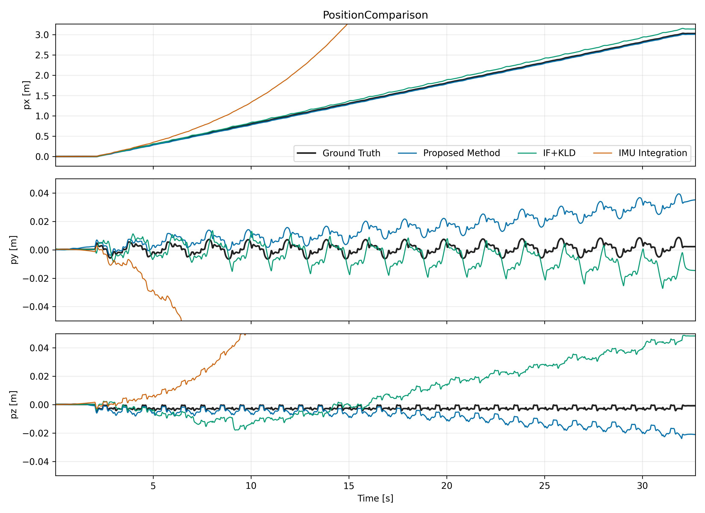
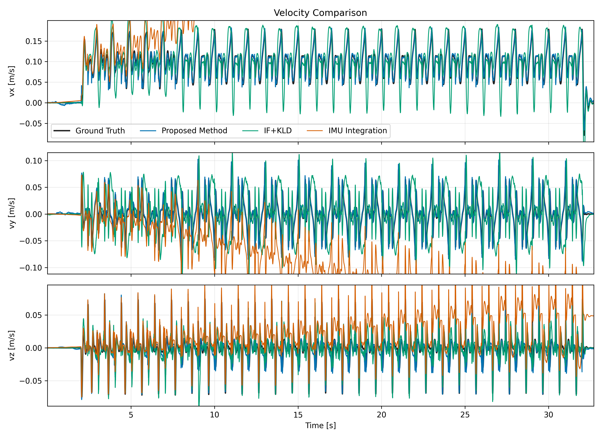
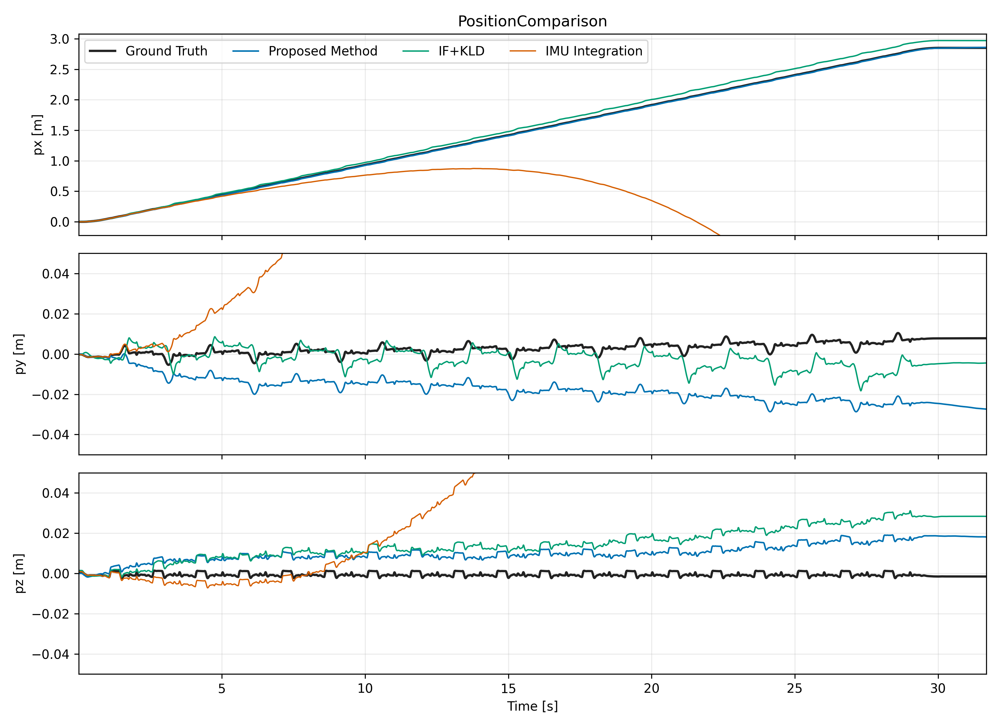
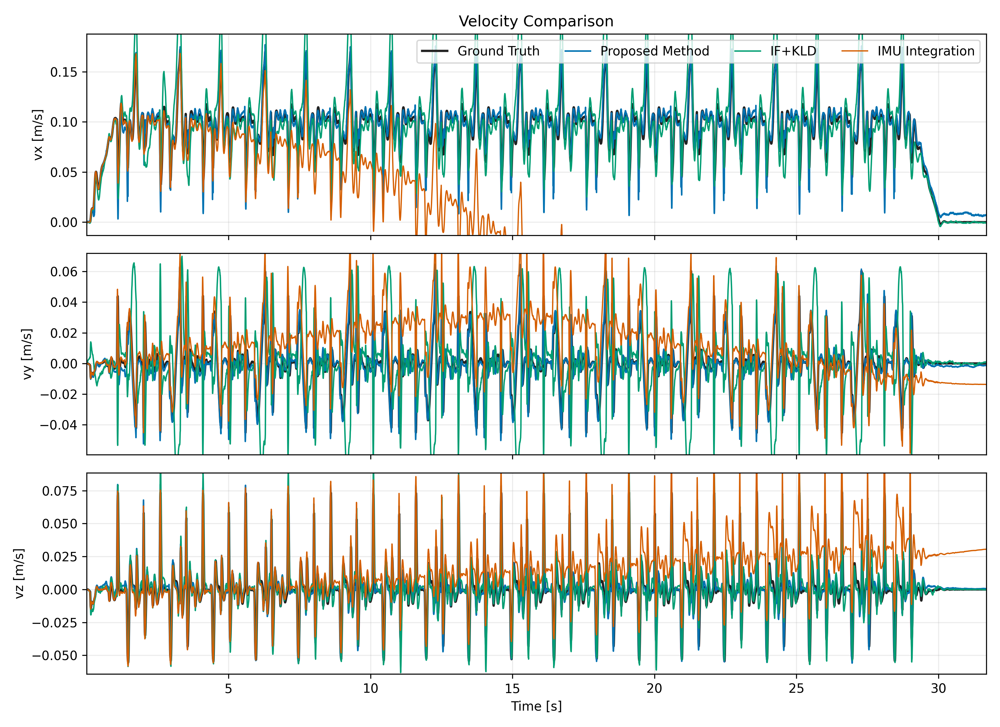
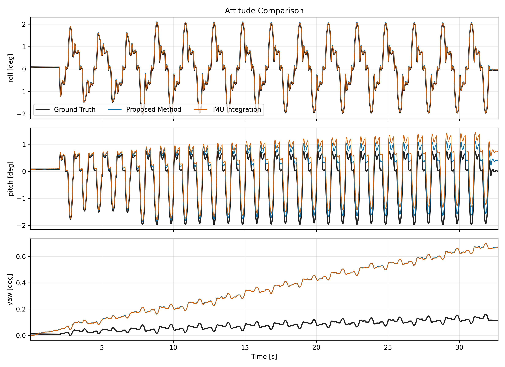
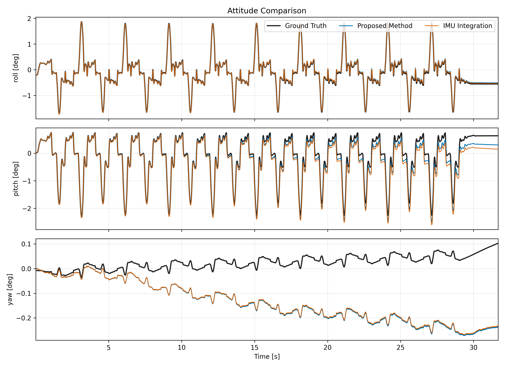

# 5.3 平地實驗（模擬）

## 5.3.1 資料選取與分析方法

本節分析平地 Walk 與 WLW 模擬資料。由於模擬可重現性高，每種步態僅採一組資料，因此所有表格皆呈現單次結果，不計算平均值、標準差或顯著性檢定。全篇位置、速度與 bias 使用 SI 制，姿態角使用 deg。

| 步態 | 原始資料 | 分析區間 [s] | 重複次數 |
|---|---|---:|---:|
| Walk | `FLAT_WALK_NEW_SIM/walk_openloop.db3` | 0.001–32.705 | 1 |
| WLW | `FLAT_WLW_NEW_SIM/FLAT_WLW_NEW_SIM_0.db3` | 0.001–31.687 | 1 |

Walk 目錄中的 `FLAT_WALK_NEW_SIM_0.db3` 為 0-byte 空檔，故排除；有效資料為同目錄的 `walk_openloop.db3`。Ground truth 使用 `/sim/position`、`/sim/body_velocity` 與 `/tf` 的 `odom → base_link`。位置以共同區間起始 1.0 s 的固定 offset 對齊，姿態同樣移除起始固定角度 offset；速度不做 offset 對齊。

Proposed Method 使用原 bag 的 `/ekf`。IMU Integration 將既有 `/imu_noisy` 與 `/motor/state` 重播至同一個 `corgi_leg_odom` prediction-only 模式，只執行 IMU propagation，不使用腿部速度更新、ZUPT、GMO/contact、LiDAR、`/fusion/bv` 或 ground truth 校正。輸入 IMU 為 1 kHz CX5 規格雜訊模型；節點名義 propagation 頻率為 500 Hz。

IF+KLD 使用 `corgi_odometry_legacy` 重播同一份原始 bag，輸入限定為 `/imu_noisy`、`/motor/state` 與 `/trigger`。其中加速度與角速度直接取自 bag 內已加入 CX5 雜訊的 `/imu_noisy`，僅依原驅動程式的座標定義移除重力；未重新產生雜訊，也未讀取 `/ekf`、`/odom_mapping`、`/fusion/bv` 或 ground truth。Legacy 輸出的 Y 軸與模擬座標定義相反，故在比較前對 IF+KLD 的位置與速度 Y 分量各乘以 −1；此為座標表示轉換，不改變估測器輸出或其 IF/KLD 計算。為排除 ROS callback 排程造成的 latest-sample 競態，重播時依 header sequence 與 timestamp 精確配對 IMU/馬達資料，並固定每 5 筆 1 kHz 輸入更新一次，使 IF+KLD 輸出為 200 Hz。位置採共同區間起始 1.0 s 固定平移對齊，速度不做 offset 校正。

## 5.3.2 位置與速度估測結果

| 步態 | 方法 | 位置 RMSE X / Y / Z [m] | 位置 RMSE 3D [m] | 速度 RMSE vx / vy / vz [m/s] | 速度 RMSE 3D [m/s] |
|---|---|---:|---:|---:|---:|
| Walk | Proposed Method（ES-EKF） | 0.023 / 0.017 / 0.008 | 0.029 | 0.007 / 0.006 / 0.009 | 0.013 |
| Walk | IF+KLD（Legacy） | 0.066 / 0.009 / 0.023 | 0.070 | 0.041 / 0.058 / 0.010 | 0.072 |
| Walk | IMU Integration | 8.688 / 1.239 / 0.283 | 8.780 | 0.963 / 0.107 / 0.031 | 0.970 |
| WLW | Proposed Method（ES-EKF） | 0.009 / 0.022 / 0.012 | 0.026 | 0.009 / 0.004 / 0.006 | 0.011 |
| WLW | IF+KLD（Legacy） | 0.077 / 0.008 / 0.018 | 0.079 | 0.021 / 0.036 / 0.005 | 0.042 |
| WLW | IMU Integration | 2.917 / 0.286 / 0.191 | 2.937 | 0.384 / 0.018 / 0.020 | 0.385 |

### 現有外部融合與 LiDAR 估測結果

下表沿用各模擬資料既有 `metrics.json` 的單次結果，作為完整估測鏈的補充；主比較為 Proposed Method、IF+KLD 與 IMU Integration。

| 步態 | `/odom_mapping` 位置 RMSE 3D [m] | `/fusion/bv` RMSE vx / vy / vz [m/s] | LiDAR 位置 RMSE 3D [m] |
|---|---:|---:|---:|
| Walk | 0.012 | 0.107 / 0.027 / 0.021 | 0.035 |
| WLW | 0.009 | 0.106 / 0.015 / 0.018 | 0.035 |

位置與速度圖的顯示範圍僅由 Ground Truth 與 Proposed Method 決定；IF+KLD 與 IMU Integration 僅疊加顯示，其超出範圍的漂移不會擴張座標軸。位置圖繪製時將四組曲線的 $p_z$ 一致減去 0.2 m，以調整高度顯示原點；此為共同視覺平移，不影響相對誤差與量化指標。$p_y$ 與平移後的 $p_z$ 使用以 0 為中心的相同尺度，$p_x$ 顯示跨度則設定為 Y/Z 跨度的整數倍。Walk 與 WLW 的 X/YZ 跨度比分別為 **35 倍**與 **33 倍**。

### Walk 位置與速度時序

### WLW 位置與速度時序

### IMU 積分漂移分析

| 步態 | 最終水平位置誤差 [m] | 最終速度誤差 X / Y / Z [m/s] | 水平等效殘差 [m/s²] | 等效重力傾角 [deg] |
|---|---:|---:|---:|---:|
| Walk | 23.387 | 2.150 / -0.165 / 0.049 | 0.0776 | 0.453 |
| WLW | 8.400 | -0.969 / -0.014 / 0.031 | 0.0345 | 0.202 |

IMU Integration 的位置誤差隨時間呈加速成長，而速度誤差近似線性累積，符合未受觀測約束的慣性積分特性。模擬輸入已包含 CX5 規格的白雜訊、初始 bias 與 bias random walk；靜態初始化只能估計初始平均 bias，後續微小的姿態與 bias 殘差仍會被一重與二重積分放大。

- Walk：純 IMU 輸出 16,327 筆，正時間差中位數 2.000 ms（約 500.0 Hz），重複時間戳 0 筆。
- WLW：純 IMU 輸出 15,828 筆，正時間差中位數 2.000 ms（約 500.0 Hz），重複時間戳 0 筆。

因此「1 kHz IMU」是輸入資料率；本實驗的 prediction-only 節點實際名義 propagation 為 500 Hz，不能描述為逐筆 1 kHz 積分。

## 5.3.3 姿態估測結果

| 步態 | 方法 | Roll RMSE [deg] | Pitch RMSE [deg] | Yaw RMSE [deg] |
|---|---|---:|---:|---:|
| Walk | Proposed Method（ES-EKF） | 0.052 | 0.246 | 0.321 |
| Walk | IMU Integration | 0.032 | 0.431 | 0.321 |
| WLW | Proposed Method（ES-EKF） | 0.034 | 0.156 | 0.193 |
| WLW | IMU Integration | 0.026 | 0.224 | 0.191 |

### Walk 姿態時序

### WLW 姿態時序

## 5.3.4 小結

Walk 單次模擬中，Proposed Method 的位置與速度 3D RMSE 分別為 **0.029 m** 與 **0.013 m/s**，IF+KLD 為 **0.070 m** 與 **0.072 m/s**；純 IMU 積分則為 **8.780 m** 與 **0.970 m/s**。

WLW 單次模擬中，Proposed Method 的位置與速度 3D RMSE 分別為 **0.026 m** 與 **0.011 m/s**，IF+KLD 為 **0.079 m** 與 **0.042 m/s**；純 IMU 積分則為 **2.937 m** 與 **0.385 m/s**。

模擬結果顯示，在相同 noisy IMU 與馬達輸入下，IF+KLD 能大幅抑制純慣性 propagation 的漂移，但兩種步態的位置與速度 RMSE 仍高於 Proposed Method；Proposed Method 透過腿部運動學速度觀測持續約束慣性狀態，因此能將位置與速度誤差維持在較低範圍。由於每種步態僅一組固定資料，本節僅報告案例結果，不將其解讀為跨隨機種子的統計分布。
