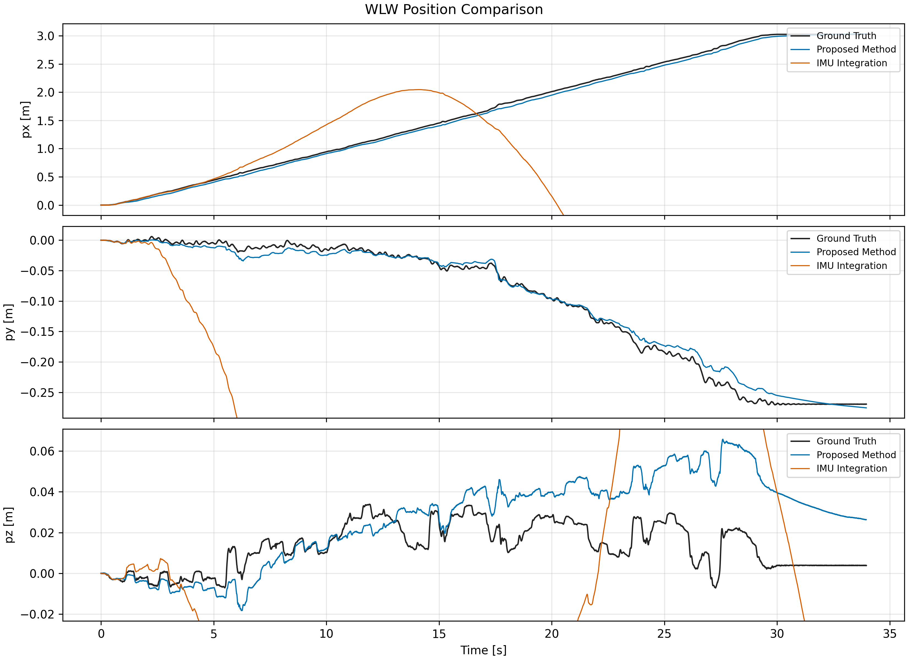
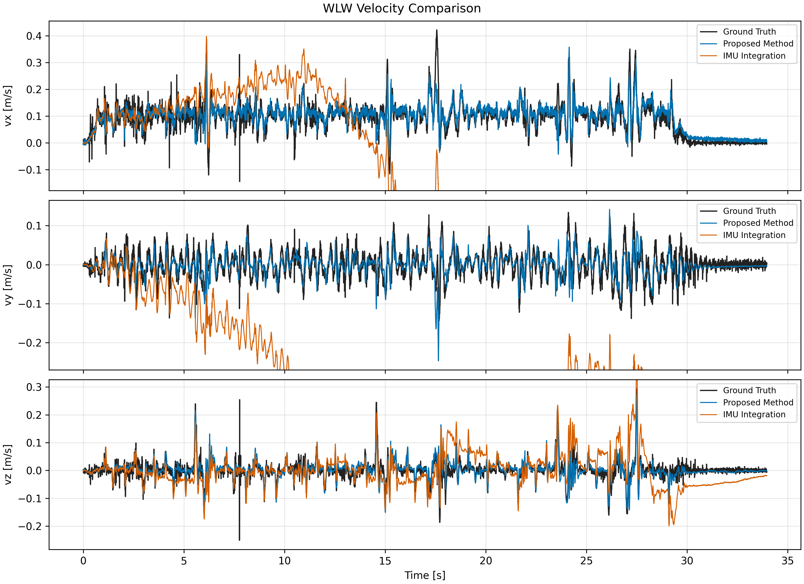
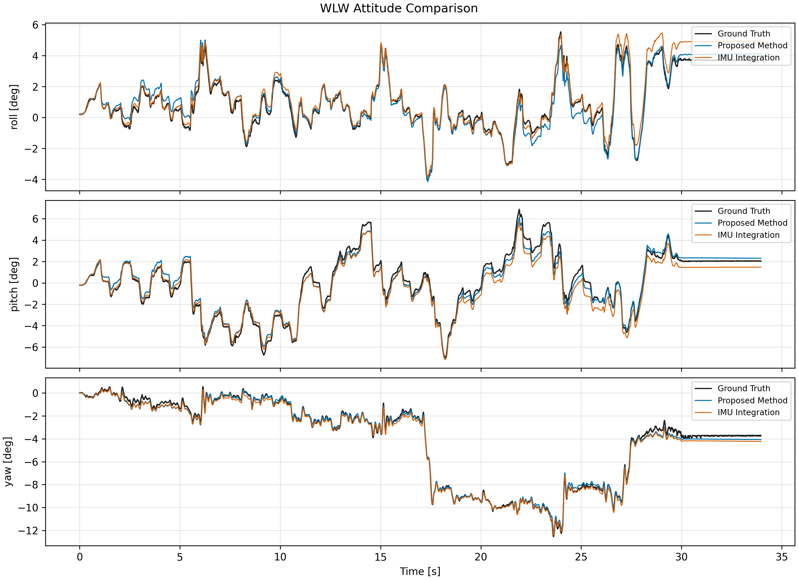

# 5.4 崎嶇地實驗

## 5.4.1 資料選取與分析方法

本節僅分析崎嶇地 Walk。NEW 與 OLD 各選取三筆品質較佳且完整的試驗，報告平均值 ± 樣本標準差。純 IMU 積分以選入的三筆 NEW 原始 bag 重播 prediction-only 節點取得；不使用腿部速度更新、ZUPT、GMO/contact、LiDAR 或 VICON 校正。位置、速度使用 SI 制，姿態使用 deg。

### 納入與排除清單

| 組別 | 納入統計 | 排除統計 |
|---|---|---|
| NEW Walk | RUGG_Walk_NEW_REAL_1, RUGG_Walk_NEW_REAL_2, RUGG_Walk_NEW_REAL_5 | RUGG_Walk_NEW_REAL_3（位置與姿態誤差較高）；REAL_4、REAL_6 無有效資料 |
| OLD Walk | RUGG_Walk_OLD_REAL_2, RUGG_Walk_OLD_REAL_3, RUGG_Walk_OLD_REAL_5 | RUGG_Walk_OLD_REAL_1、REAL_4（位置誤差較高） |
| 滾走 | — | 尚無資料，保留待補 |

## 5.4.2 位置與速度估測結果

| 步態 | 方法 | n | 位置 RMSE X / Y / Z [m] | 位置 RMSE 3D [m] | 速度 RMSE vx / vy / vz [m/s] | 速度 RMSE 3D [m/s] |
|---|---|---:|---:|---:|---:|---:|
| Walk | NEW（ES-EKF） | 3 | 0.068 ± 0.069 / 0.071 ± 0.025 / 0.031 ± 0.005 | 0.108 ± 0.062 | 0.081 ± 0.016 / 0.069 ± 0.016 / 0.058 ± 0.047 | 0.123 ± 0.044 |
| Walk | OLD（Legacy） | 3 | 0.225 ± 0.057 / 0.303 ± 0.029 / 0.018 ± 0.002 | 0.380 ± 0.044 | 0.071 ± 0.001 / 0.070 ± 0.007 / 0.065 ± 0.003 | 0.119 ± 0.006 |
| Walk | 純 IMU 積分 | 3 | 27.513 ± 22.887 / 21.258 ± 11.100 / 1.321 ± 0.617 | 38.739 ± 14.571 | 2.853 ± 1.653 / 1.446 ± 1.130 / 0.206 ± 0.056 | 3.467 ± 1.178 |

Walk 的 NEW 位置 3D RMSE 為 **0.108 ± 0.062 m**，相較 OLD 的 **0.380 ± 0.044 m** 降低 **71.5%**；速度 3D RMSE 為 **0.123 ± 0.044 m/s**，較 OLD 的 **0.119 ± 0.006 m/s** 高 **3.4%**。

### 代表性位置時序比較

代表性試驗採 NEW 中位置 3D RMSE 最低的 `RUGG_Walk_NEW_REAL_2`。位置與速度顯示範圍僅由 Ground Truth 與 Proposed Method 決定；IMU 漂移不擴張座標軸。$p_y$、$p_z$ 使用以 0 為中心的共同尺度，$p_x$ 顯示跨度為 Y/Z 的 2 倍。

### 納入試驗之個別位置與速度結果

| Trial | 組別 | 位置 RMSE 3D [m] | 速度 RMSE 3D [m/s] |
|---|---|---:|---:|
| RUGG_Walk_NEW_REAL_1 | NEW | 0.180 | 0.174 |
| RUGG_Walk_NEW_REAL_2 | NEW | 0.070 | 0.096 |
| RUGG_Walk_NEW_REAL_5 | NEW | 0.075 | 0.100 |
| RUGG_Walk_OLD_REAL_2 | OLD | 0.329 | 0.113 |
| RUGG_Walk_OLD_REAL_3 | OLD | 0.401 | 0.125 |
| RUGG_Walk_OLD_REAL_5 | OLD | 0.409 | 0.120 |

### 純 IMU 積分資料與個別結果

| Trial | 位置 RMSE 3D [m] | 速度 RMSE 3D [m/s] | 最終水平漂移 [m] |
|---|---:|---:|---:|
| RUGG_Walk_NEW_REAL_1 | 34.866 | 3.138 | 81.95 |
| RUGG_Walk_NEW_REAL_2 | 26.496 | 2.488 | 67.01 |
| RUGG_Walk_NEW_REAL_5 | 54.855 | 4.775 | 132.25 |

## 5.4.3 姿態估測結果

| 步態 | 方法 | n | Roll RMSE [deg] | Pitch RMSE [deg] | Yaw RMSE [deg] |
|---|---|---:|---:|---:|---:|
| Walk | NEW（ES-EKF） | 3 | 1.99 ± 1.27 | 1.40 ± 1.48 | 1.30 ± 1.41 |
| Walk | OLD（Legacy） | 3 | — | — | — |
| Walk | 純 IMU 積分 | 3 | 1.68 ± 1.40 | 1.96 ± 1.07 | 1.42 ± 1.13 |

## 5.4.4 滾走（WLW）實驗

新增崎嶇地滾走資料包含 NEW（ES-EKF）與 OLD（Legacy）各五筆試驗。依 Walk 的資料選取方式，各組僅納入三筆品質較佳且完整的試驗，數值為平均值 ± 樣本標準差。純 IMU 積分以相同三筆 NEW 原始 bag 重播 prediction-only 節點取得；不使用腿部速度更新、ZUPT、GMO/contact、LiDAR 或 VICON 狀態校正。位置與速度分別以 Inner EKF／Legacy 里程計和 VICON 比較，速度誤差使用各試驗 35%–75% 的有效時間窗；姿態僅適用於 NEW 與純 IMU。

| 組別 | 納入統計 | 排除統計 |
|---|---|---|
| NEW WLW | RUGG_WLW_NEW_REAL_2, RUGG_WLW_NEW_REAL_3, RUGG_WLW_NEW_REAL_5 | RUGG_WLW_NEW_REAL_1, RUGG_WLW_NEW_REAL_4（位置誤差較高） |
| OLD WLW | RUGG_WLW_OLD_REAL_1, RUGG_WLW_OLD_REAL_3, RUGG_WLW_OLD_REAL_5 | RUGG_WLW_OLD_REAL_2, RUGG_WLW_OLD_REAL_4（位置誤差較高） |

| 步態 | 方法 | n | 位置 RMSE X / Y / Z [m] | 位置 RMSE 3D [m] | 速度 RMSE vx / vy / vz [m/s] | 速度 RMSE 3D [m/s] |
|---|---|---:|---:|---:|---:|---:|
| WLW | NEW（ES-EKF） | 3 | 0.047 ± 0.003 / 0.033 ± 0.028 / 0.014 ± 0.007 | 0.063 ± 0.015 | 0.041 ± 0.004 / 0.032 ± 0.001 / 0.019 ± 0.003 | 0.055 ± 0.004 |
| WLW | OLD（Legacy） | 3 | 0.041 ± 0.005 / 0.153 ± 0.026 / 0.013 ± 0.004 | 0.159 ± 0.024 | 0.052 ± 0.002 / 0.039 ± 0.002 / 0.041 ± 0.001 | 0.077 ± 0.003 |
| WLW | 純 IMU 積分 | 3 | 17.454 ± 10.411 / 17.509 ± 12.356 / 0.997 ± 0.922 | 25.854 ± 13.325 | 1.699 ± 0.981 / 1.357 ± 0.905 / 0.180 ± 0.134 | 2.256 ± 1.141 |

WLW 的 NEW 位置 3D RMSE 為 **0.063 ± 0.015 m**，相較 OLD 的 **0.159 ± 0.024 m** 降低 **60.6%**；速度 3D RMSE 為 **0.055 ± 0.004 m/s**，相較 OLD 降低 **28.0%**。純 IMU 積分的平均位置 3D RMSE 為 **25.854 ± 13.325 m**，顯示缺乏外部觀測約束時的顯著累積漂移。

### 代表性 WLW 時序比較

代表性試驗選用 NEW 中位置 3D RMSE 最低的 `RUGG_WLW_NEW_REAL_5`。

### WLW 個別試驗結果

| Trial | 組別 | 位置 RMSE 3D [m] | 速度 RMSE 3D [m/s] |
|---|---|---:|---:|
| RUGG_WLW_NEW_REAL_2 | NEW | 0.080 | 0.051 |
| RUGG_WLW_NEW_REAL_3 | NEW | 0.057 | 0.059 |
| RUGG_WLW_NEW_REAL_5 | NEW | 0.051 | 0.056 |
| RUGG_WLW_OLD_REAL_1 | OLD | 0.142 | 0.080 |
| RUGG_WLW_OLD_REAL_3 | OLD | 0.149 | 0.075 |
| RUGG_WLW_OLD_REAL_5 | OLD | 0.186 | 0.075 |

### 純 IMU 積分個別結果

| Trial | 位置 RMSE 3D [m] | 速度 RMSE 3D [m/s] | 最終水平漂移 [m] |
|---|---:|---:|---:|
| RUGG_WLW_NEW_REAL_2 | 32.352 | 2.735 | 79.48 |
| RUGG_WLW_NEW_REAL_3 | 34.683 | 3.080 | 83.86 |
| RUGG_WLW_NEW_REAL_5 | 10.527 | 0.953 | 29.54 |

### WLW 姿態估測結果

| 步態 | 方法 | n | Roll RMSE [deg] | Pitch RMSE [deg] | Yaw RMSE [deg] |
|---|---|---:|---:|---:|---:|
| WLW | NEW（ES-EKF） | 3 | 0.60 ± 0.42 | 0.42 ± 0.09 | 0.45 ± 0.25 |
| WLW | OLD（Legacy） | 3 | — | — | — |
| WLW | 純 IMU 積分 | 3 | 0.66 ± 0.43 | 0.65 ± 0.33 | 0.64 ± 0.36 |

## 5.4.5 小結

崎嶇地 WLW 的 NEW 在三筆納入試驗中，位置 3D RMSE 為 0.063 ± 0.015 m，較 OLD 降低 60.6%；速度 3D RMSE 同樣較 OLD 降低 28.0%。純 IMU 積分的平均位置 3D RMSE 為 25.854 ± 13.325 m，證實僅靠慣性 propagation 無法抑制長時間漂移。WLW 的誤差主要出現在水平 Y 軸，NEW 的平均 Y 軸位置 RMSE 仍明顯低於 OLD。
