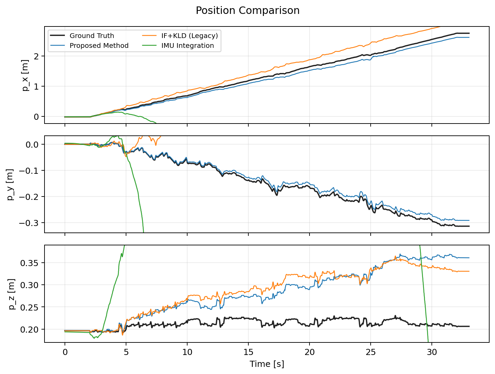
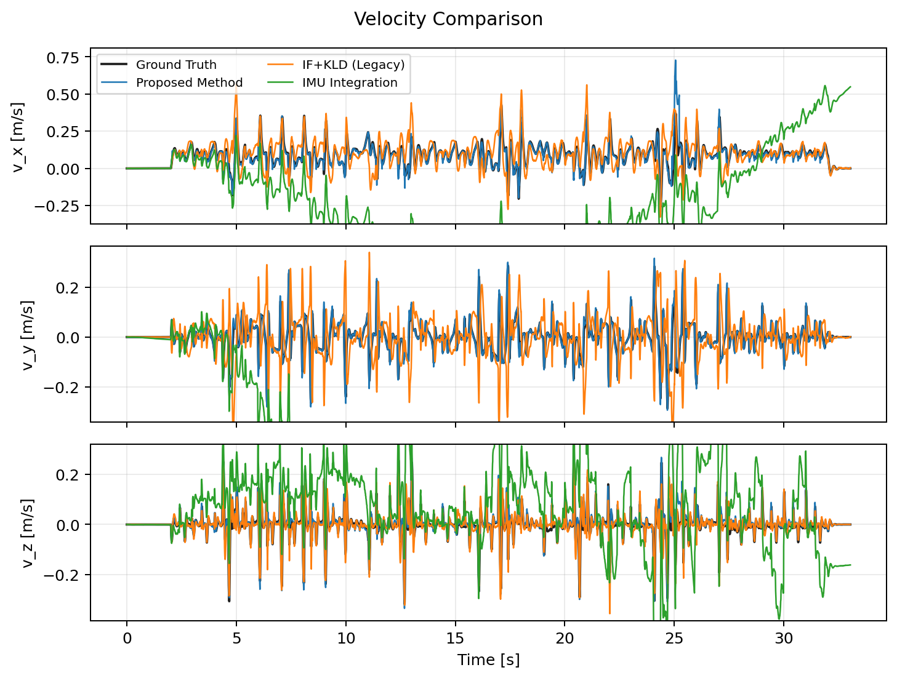
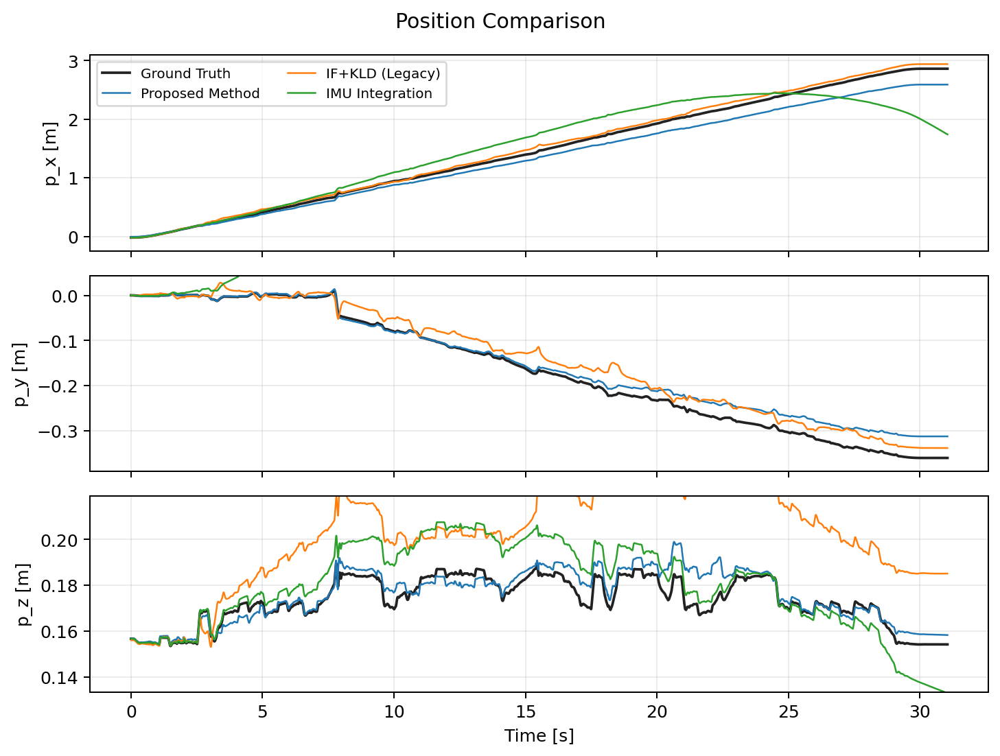
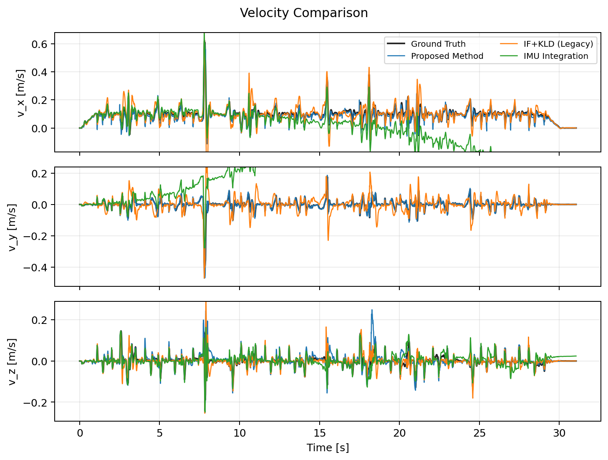
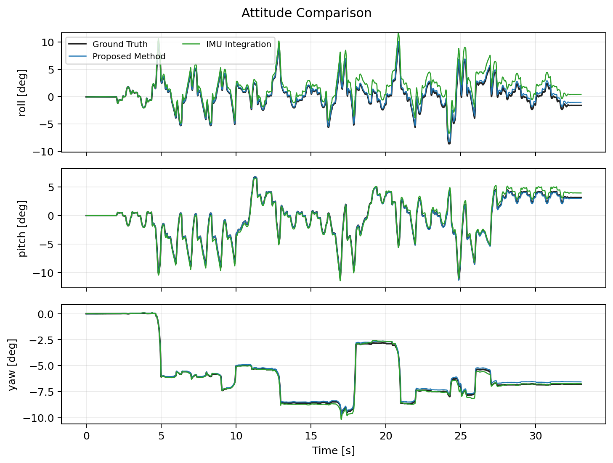
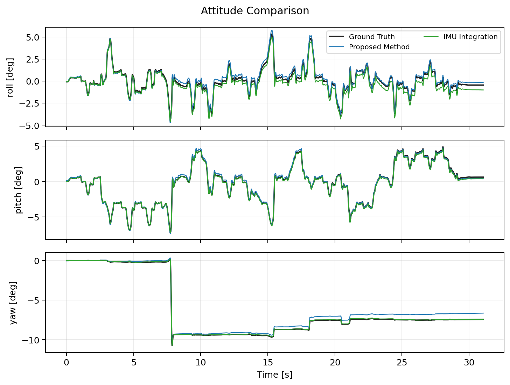

# 5.4 崎嶇地實驗（模擬）

## 5.4.1 資料選取與分析方法

本節分析固定亂數種子（seed=42）重新錄製的崎嶇地 Walk 與 WLW（Walk–Lie–Walk）單筆模擬資料。因模擬資料固定且每種步態僅有一組，本報告僅呈現單次結果，不計算平均值、標準差或顯著性檢定。全篇位置與速度使用 SI 制，姿態角使用 deg。

| 步態 | 原始資料 | 分析區間 [s] | 重複次數 |
|---|---|---:|---:|
| Walk | `RUGG_WALK_SIM/RUGG_WALK_SIM_0.db3` | 0.000–33.036 | 1 |
| WLW | `RUGG_WLW_SIM/RUGG_WLW_SIM_0.db3` | 0.000–31.049 | 1 |

Ground Truth 位置與機體速度分別取自無 header 的 `/sim/position` 與 `/sim/body_velocity`；以錄製的 `/clock` 將 bag storage time 映射回 simulation time，再與估測器 header time 對齊。姿態真值取 `/tf` 中 simulator 發布的 `odom → base_link`。位置以共同區間起始 500 個有效時間點的固定 offset 對齊；姿態移除相同區間的固定角度 offset；速度不做 offset 對齊。WLW bag 的 storage duration 較長，但量化僅使用 trigger ON/OFF 定義的 31.049 s 實驗時間窗。

Proposed Method 與 IMU Integration 均直接取自各步態的新主 bag：前者為 `/ekf`，後者為 `/imu_only/ekf`。兩者共同使用 Webots `/imu` 經 `imu_noise_sim`（seed=42）**一次**加噪所產生的 `/imu_noisy`；IMU-only 節點不使用腿部速度更新、ZUPT、GMO/contact、LiDAR、`/fusion/bv` 或 ground truth 校正。重複 header timestamp 的估測輸出僅保留該 simulation time 的最後完成狀態，避免同一時刻在 RMSE 中被重複加權。

IF+KLD 使用各步態對應的 Legacy bag，重播輸入限定為主 bag 的 `/imu_noisy`、`/motor/state` 與 `/trigger`。Walk 的 Legacy Y 軸需取負後轉回 simulator frame；WLW 則與 simulator 同方向，維持原始正號。Legacy 不輸出姿態，故姿態表不列該方法。

## 5.4.2 位置與速度估測結果

| 步態 | 方法 | 位置 RMSE X / Y / Z [m] | 位置 RMSE 3D [m] | 速度 RMSE vx / vy / vz [m/s] | 速度 RMSE 3D [m/s] |
|---|---|---:|---:|---:|---:|
| Walk | Proposed Method（ES-EKF） | 0.099 / 0.013 / 0.089 | **0.134** | 0.035 / 0.015 / 0.020 | **0.043** |
| Walk | IF+KLD（Legacy） | 0.251 / 0.344 / 0.087 | 0.435 | 0.088 / 0.126 / 0.023 | 0.156 |
| Walk | IMU Integration | 11.081 / 32.558 / 0.912 | 34.404 | 0.462 / 3.433 / 0.183 | 3.469 |
| WLW | Proposed Method（ES-EKF） | 0.194 / 0.032 / 0.005 | 0.196 | 0.025 / 0.010 / 0.019 | **0.033** |
| WLW | IF+KLD（Legacy） | 0.054 / 0.026 / 0.034 | **0.069** | 0.040 / 0.044 / 0.019 | 0.062 |
| WLW | IMU Integration | 0.314 / 7.874 / 0.012 | 7.880 | 0.196 / 0.851 / 0.020 | 0.874 |

此兩份 bag 未錄製 `/odom_mapping`、`/fusion/bv` 或 `/lidar_odom`，故本節僅比較 Proposed Method、IF+KLD 與 IMU Integration，不將未錄製的外部融合結果補入表格。

位置與速度圖的顯示範圍僅由 Ground Truth 與 Proposed Method 決定；IF+KLD 與 IMU Integration 僅疊加顯示，其超出範圍的漂移不會擴張座標軸。

### Walk 位置與速度時序

### WLW 位置與速度時序

### IMU 積分漂移分析

| 步態 | 最終水平位置誤差 [m] | 最終速度誤差 X / Y / Z [m/s] |
|---|---:|---:|
| Walk | 88.181 | 0.549 / -7.431 / -0.161 |
| WLW | 20.463 | -0.507 / 1.811 / 0.024 |

IMU Integration 的位置與速度誤差均隨時間快速累積。Walk 的位置 3D RMSE 為 34.404 m、速度 3D RMSE 為 3.469 m/s，分別為 Proposed Method 的 257.5 與 79.8 倍；WLW 分別為 7.880 m 與 0.874 m/s，為 Proposed Method 的 40.2 與 26.6 倍。此結果反映僅靠帶噪 IMU propagation、而無腿部觀測約束時的漂移特性。

- Walk Proposed Method：15,985 個有效時間點，正時間差中位數 2.000 ms（約 500 Hz）。
- Walk IMU Integration：4,903 個唯一 header timestamp，正時間差中位數 6.000 ms；原始 16,523 筆輸出含同一 simulation time 的重複發布，已在統計前去重。
- WLW Proposed Method：7,191 個有效時間點，正時間差中位數 2.000 ms（約 500 Hz）。
- WLW IMU Integration：15,525 個有效時間點，正時間差中位數 2.000 ms（約 500 Hz）。

因此「1 kHz IMU」是輸入資料率；本節指標均依實際且唯一的 estimator state timestamp 計算，不以重複發布次數作為額外權重。

## 5.4.3 姿態估測結果

| 步態 | 方法 | Roll RMSE [deg] | Pitch RMSE [deg] | Yaw RMSE [deg] |
|---|---|---:|---:|---:|
| Walk | Proposed Method（ES-EKF） | **0.288** | **0.075** | 0.139 |
| Walk | IMU Integration | 1.448 | 0.428 | **0.127** |
| WLW | Proposed Method（ES-EKF） | **0.227** | 0.144 | 0.568 |
| WLW | IMU Integration | 0.363 | **0.132** | **0.033** |

單一 yaw 或 pitch 分量較小不代表整體狀態較佳；位置與速度結果仍顯示 Proposed Method 具有明顯較低的整體誤差。

### Walk 姿態時序

### WLW 姿態時序

## 5.4.4 小結

Walk 單次模擬中，Proposed Method 的位置與速度 3D RMSE 分別為 **0.134 m** 與 **0.043 m/s**，IF+KLD 為 **0.435 m** 與 **0.156 m/s**，純 IMU 積分為 **34.404 m** 與 **3.469 m/s**。

WLW 單次模擬中，Proposed Method 的位置與速度 3D RMSE 分別為 0.196 m 與 **0.033 m/s**，IF+KLD 為 **0.069 m** 與 0.062 m/s，純 IMU 積分為 7.880 m 與 0.874 m/s。

在相同的單次加噪 IMU 與馬達輸入下，Walk 由 Proposed Method 得到最低的整體位置與速度誤差；WLW 的 IF+KLD 位置誤差最低，而 Proposed Method 的速度誤差最低。純 IMU 積分即使部分姿態分量可接近其他方法，Roll/Pitch 誤差仍會投影為重力補償誤差，並經速度與位置積分而顯著放大。由於每種步態僅一組固定資料，本節僅報告案例結果，不將其解讀為跨隨機種子的統計分布。
