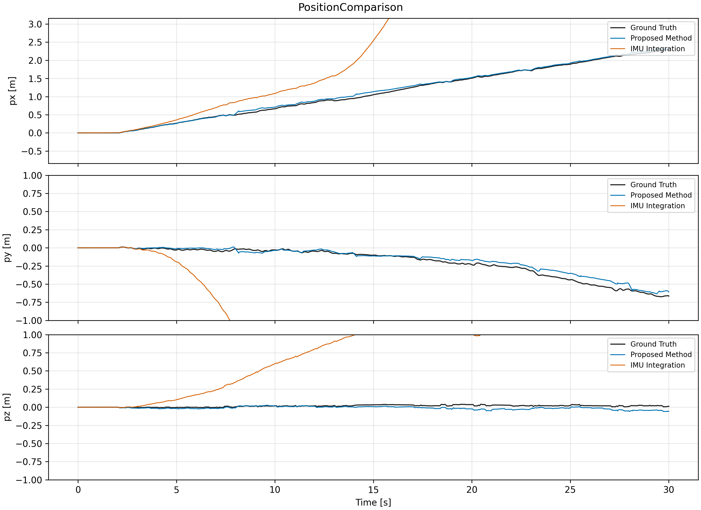
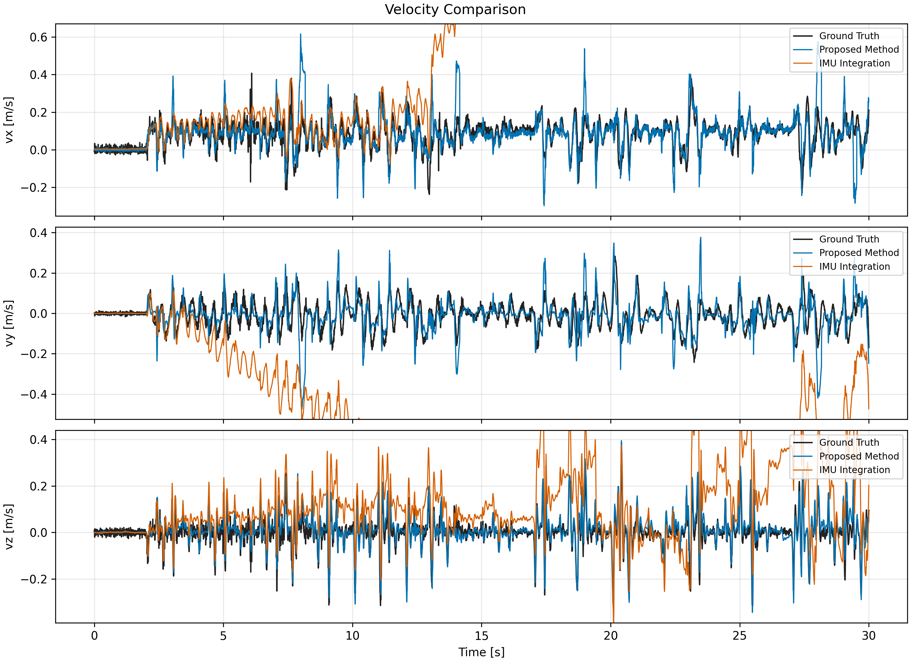
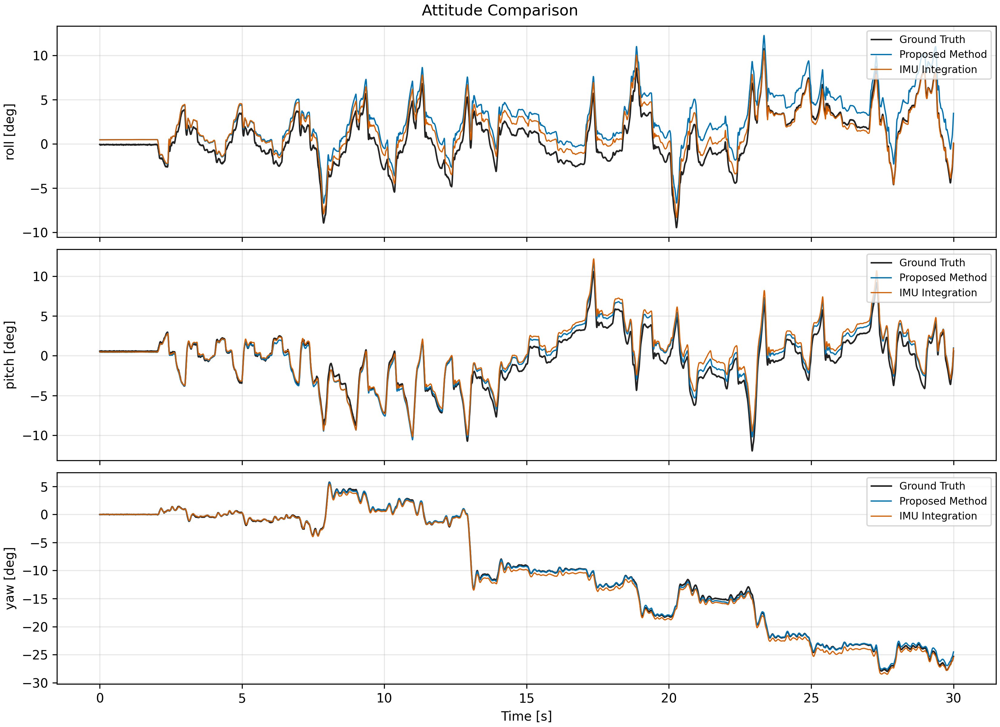

# 5.4 崎嶇地實驗

## 5.4.1 資料選取與分析方法

本節僅分析崎嶇地 Walk。NEW 與 OLD 各選取三筆品質較佳且完整的試驗，報告平均值 ± 樣本標準差。純 IMU 積分以選入的三筆 NEW 原始 bag 重播 prediction-only 節點取得；不使用腿部速度更新、ZUPT、GMO/contact、LiDAR 或 VICON 校正。位置、速度使用 SI 制，姿態使用 deg。

### 納入與排除清單

| 組別 | 納入統計 | 排除統計 |
|---|---|---|
| NEW Walk | RUGG_Walk_NEW_REAL_1, RUGG_Walk_NEW_REAL_2, RUGG_Walk_NEW_REAL_5 | RUGG_Walk_NEW_REAL_3（位置與姿態誤差較高）；REAL_4、REAL_6 無有效資料 |
| OLD Walk | RUGG_Walk_OLD_REAL_2, RUGG_Walk_OLD_REAL_3, RUGG_Walk_OLD_REAL_5 | RUGG_Walk_OLD_REAL_1、REAL_4（位置誤差較高） |
| 滾走 | — | 尚無資料，保留待補 |

## 5.4.2 位置與速度估測結果

| 步態 | 方法 | n | 位置 RMSE X / Y / Z [m] | 位置 RMSE 3D [m] | 速度 RMSE vx / vy / vz [m/s] | 速度 RMSE 3D [m/s] |
|---|---|---:|---:|---:|---:|---:|
| Walk | NEW（ES-EKF） | 3 | 0.068 ± 0.069 / 0.071 ± 0.025 / 0.031 ± 0.005 | 0.108 ± 0.062 | 0.081 ± 0.016 / 0.069 ± 0.016 / 0.058 ± 0.047 | 0.123 ± 0.044 |
| Walk | OLD（Legacy） | 3 | 0.225 ± 0.057 / 0.303 ± 0.029 / 0.018 ± 0.002 | 0.380 ± 0.044 | 0.071 ± 0.001 / 0.070 ± 0.007 / 0.065 ± 0.003 | 0.119 ± 0.006 |
| Walk | 純 IMU 積分 | 3 | 27.513 ± 22.887 / 21.258 ± 11.100 / 1.321 ± 0.617 | 38.739 ± 14.571 | 2.853 ± 1.653 / 1.446 ± 1.130 / 0.206 ± 0.056 | 3.467 ± 1.178 |

Walk 的 NEW 位置 3D RMSE 為 **0.108 ± 0.062 m**，相較 OLD 的 **0.380 ± 0.044 m** 降低 **71.5%**；速度 3D RMSE 為 **0.123 ± 0.044 m/s**，較 OLD 的 **0.119 ± 0.006 m/s** 高 **3.4%**。

### 代表性位置時序比較

代表性試驗採 NEW 中位置 3D RMSE 最低的 `RUGG_Walk_NEW_REAL_2`。位置與速度顯示範圍僅由 Ground Truth 與 Proposed Method 決定；IMU 漂移不擴張座標軸。$p_y$、$p_z$ 使用以 0 為中心的共同尺度，$p_x$ 顯示跨度為 Y/Z 的 2 倍。

### 納入試驗之個別位置與速度結果

| Trial | 組別 | 位置 RMSE 3D [m] | 速度 RMSE 3D [m/s] |
|---|---|---:|---:|
| RUGG_Walk_NEW_REAL_1 | NEW | 0.180 | 0.174 |
| RUGG_Walk_NEW_REAL_2 | NEW | 0.070 | 0.096 |
| RUGG_Walk_NEW_REAL_5 | NEW | 0.075 | 0.100 |
| RUGG_Walk_OLD_REAL_2 | OLD | 0.329 | 0.113 |
| RUGG_Walk_OLD_REAL_3 | OLD | 0.401 | 0.125 |
| RUGG_Walk_OLD_REAL_5 | OLD | 0.409 | 0.120 |

### 純 IMU 積分資料與個別結果

| Trial | 位置 RMSE 3D [m] | 速度 RMSE 3D [m/s] | 最終水平漂移 [m] |
|---|---:|---:|---:|
| RUGG_Walk_NEW_REAL_1 | 34.866 | 3.138 | 81.95 |
| RUGG_Walk_NEW_REAL_2 | 26.496 | 2.488 | 67.01 |
| RUGG_Walk_NEW_REAL_5 | 54.855 | 4.775 | 132.25 |

## 5.4.3 姿態估測結果

| 步態 | 方法 | n | Roll RMSE [deg] | Pitch RMSE [deg] | Yaw RMSE [deg] |
|---|---|---:|---:|---:|---:|
| Walk | NEW（ES-EKF） | 3 | 1.99 ± 1.27 | 1.40 ± 1.48 | 1.30 ± 1.41 |
| Walk | OLD（Legacy） | 3 | — | — | — |
| Walk | 純 IMU 積分 | 3 | 1.68 ± 1.40 | 1.96 ± 1.07 | 1.42 ± 1.13 |

## 5.4.4 滾走實驗

尚無滾走 NEW／OLD 資料；本節與圖表保留待補。

## 5.4.5 小結

崎嶇地 Walk 的 NEW 在三筆選入試驗上具有較低的位置 3D RMSE；速度 3D RMSE 與 OLD 相近但略高 3.4%。純 IMU 積分的平均位置 3D RMSE 為 38.739 ± 14.571 m，顯示缺乏觀測約束時漂移顯著。
