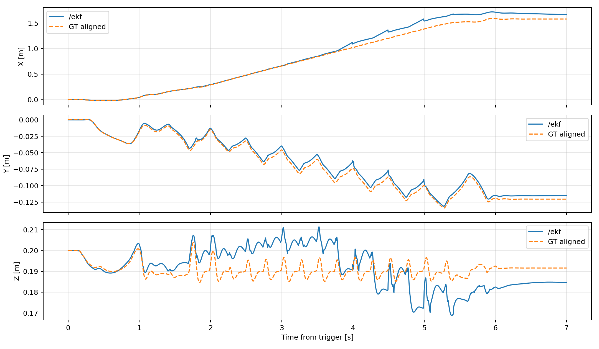
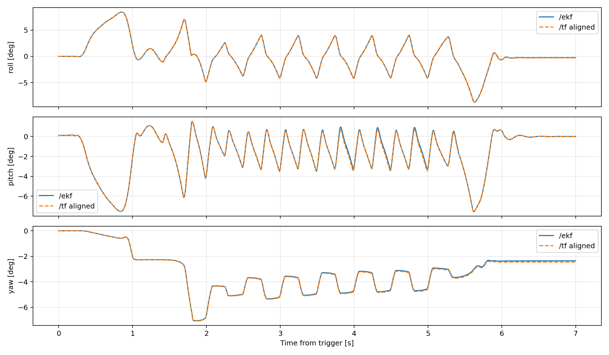
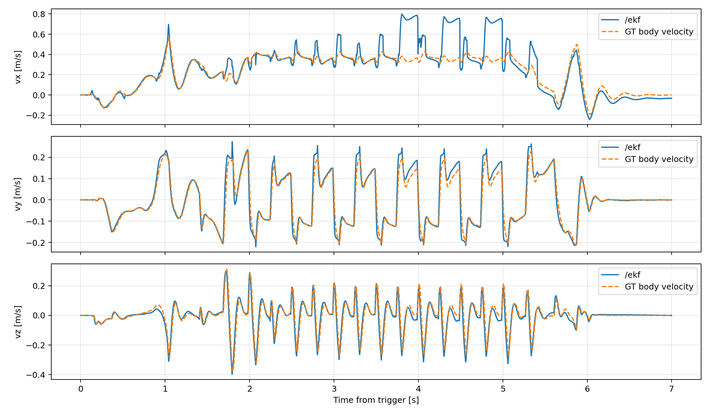
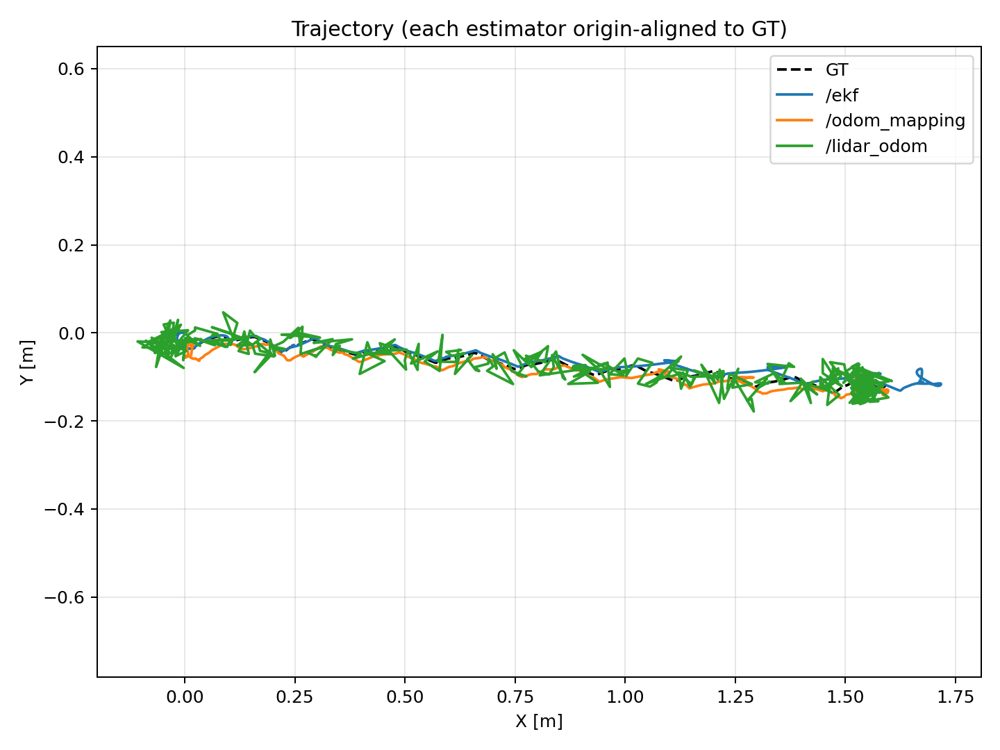
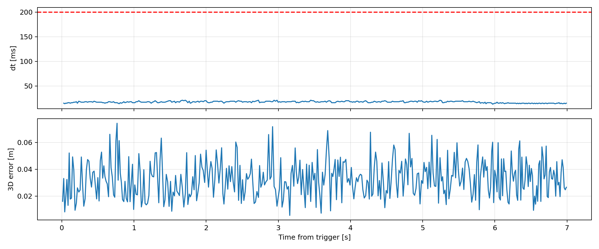
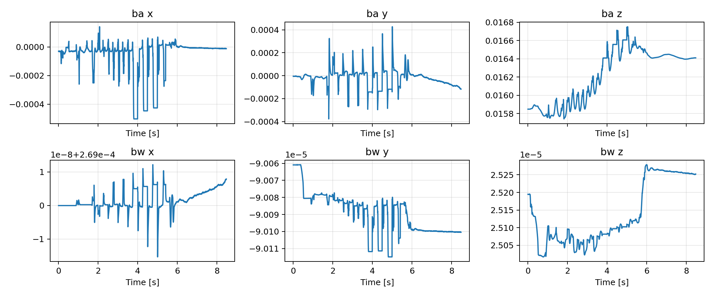

# FLAT_TROT_NEW_SIM 模擬分析報告

## 分析設定

- 量化區間：trigger 後 0.001–7.000 s（6.999 s）。
- Ground truth：位置 `/sim/position`、世界速度 `/sim/velocity`、機體速度 `/sim/body_velocity`、姿態 `/tf` 的 `odom → base_link`、接觸 `/sim/leg_contact`。
- 位置與姿態指標均以共同區間起始樣本的固定 offset 對齊，以排除各估測器初始化原點差異；因此量測的是追蹤與漂移誤差。

## 內部 EKF

- 位置 RMSE (X/Y/Z/3D)：0.084, 0.005, 0.009 / 0.085 m；最大 3D 誤差 0.200 m。
- 機體速度 RMSE (vx/vy/vz)：0.130, 0.029, 0.035 m/s。
- 姿態 RMSE (roll/pitch/yaw)：0.02, 0.08, 0.05 deg。

## 外部融合與 LiDAR

- `/odom_mapping` 位置 3D RMSE：0.019 m；姿態 RMSE (R/P/Y)：0.80, 0.58, 0.28 deg。
- `/fusion/bv` 機體速度 RMSE (vx/vy/vz)：0.266, 0.106, 0.088 m/s。
- `/lidar_odom`：406 筆，平均間隔 17.2 ms，>200 ms gap 0，>5 cm jump 173，3D RMSE 0.036 m。

## 接觸狀態

- 有效區間：trigger 後 0–7 s；GT 為 `/sim/leg_contact`。
- 固定使用 Schmitt trigger：`rm_threshold_high/low = 40/30`、`beta_threshold_high/low = 3/2`；啟動條件為 `|rm| > high OR |beta| > high`，解除條件為 `|rm| < low AND |beta| < low`。
- 四腿 macro F1 為 0.9920，平均準確率為 99.00%，合併 FP/FN 比例分別為 0.55%／0.45%。

| LF 準確率 | RF 準確率 | RH 準確率 | LH 準確率 | 四腿平均準確率 | FP 比例 | FN 比例 |
|---:|---:|---:|---:|---:|---:|---:|
| 99.41% | 99.26% | 98.53% | 98.79% | 99.00% | 0.55% | 0.45% |

| 腿 | Accuracy | F1 | FP | FN |
|---|---:|---:|---:|---:|
| LF | 99.41% | 0.9946 | 27 | 14 |
| RF | 99.26% | 0.9934 | 34 | 18 |
| RH | 98.53% | 0.9892 | 35 | 68 |
| LH | 98.79% | 0.9908 | 58 | 27 |

[接觸狀態示意圖（40/30、3/2；PDF）](FLAT_TROT_NEW_SIM.pdf)

## Bias

最後 5 s 的 accelerometer bias 平均值：[-6.5e-05, -2e-05, 0.016338] m/s²；gyro bias 平均值：[0.000269, -9e-05, 2.5e-05] rad/s。

## 結論

- 以上結果直接以模擬原生真值比較，不涉及 VICON 時間同步或座標轉換。
- LiDAR topic 的 header frame 為 `odom`，故本次直接在 odom 座標比較；仍使用起始固定 offset 對齊以隔離初始化差異。
