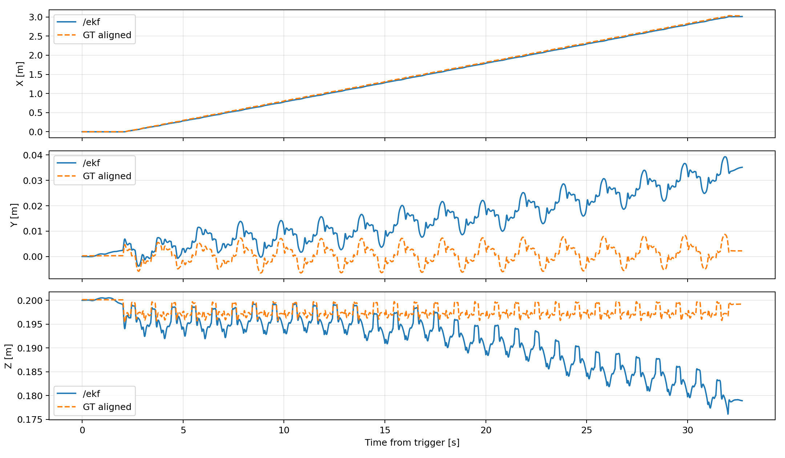
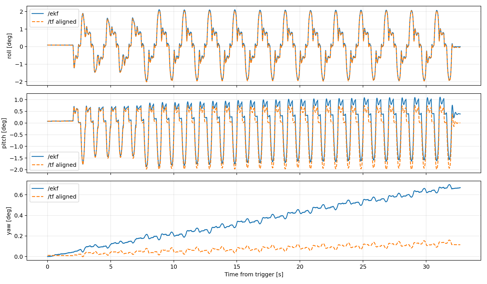
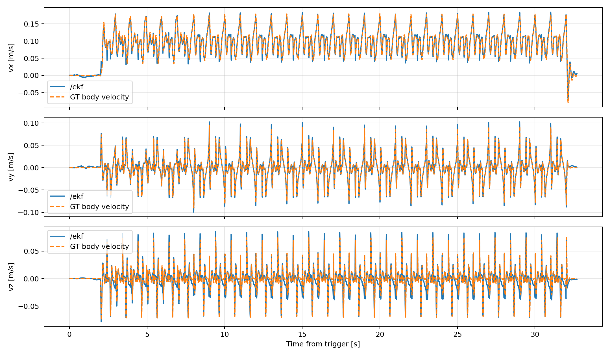
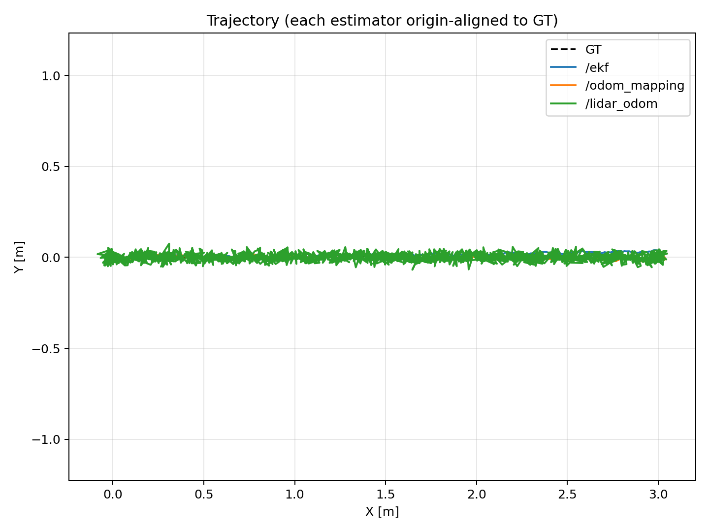
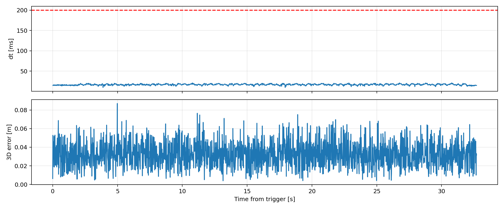
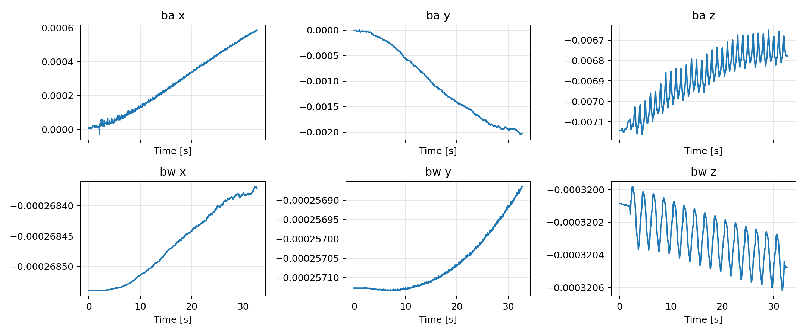

# walk_openloop 模擬分析報告

## 分析設定

- 量化區間：trigger 後 0.001–32.705 s（32.704 s）。
- Ground truth：位置 `/sim/position`、世界速度 `/sim/velocity`、機體速度 `/sim/body_velocity`、姿態 `/tf` 的 `odom → base_link`、接觸 `/sim/leg_contact`。
- 位置與姿態指標均以共同區間起始樣本的固定 offset 對齊，以排除各估測器初始化原點差異；因此量測的是追蹤與漂移誤差。

## 內部 EKF

- 位置 RMSE (X/Y/Z/3D)：0.023, 0.017, 0.008 / 0.029 m；最大 3D 誤差 0.045 m。
- 機體速度 RMSE (vx/vy/vz)：0.007, 0.006, 0.009 m/s。
- 姿態 RMSE (roll/pitch/yaw)：0.05, 0.25, 0.32 deg。

## 外部融合與 LiDAR

- `/odom_mapping` 位置 3D RMSE：0.012 m；姿態 RMSE (R/P/Y)：0.24, 0.27, 0.03 deg。
- `/fusion/bv` 機體速度 RMSE (vx/vy/vz)：0.107, 0.027, 0.021 m/s。
- `/lidar_odom`：1936 筆，平均間隔 16.9 ms，>200 ms gap 0，>5 cm jump 749，3D RMSE 0.035 m。

## 接觸狀態

以 `rm_threshold_high/low = 25/15`、`beta_threshold_high/low = 2/1` 的 Schmitt trigger，從 `/gmo/contact_state` 的原始 `rm_force` 與 `beta_torque` 重新計算。FP/FN 比例為四腿樣本合併後的 FP/N、FN/N。

| LF 準確率 | RF 準確率 | RH 準確率 | LH 準確率 | 四腿平均準確率 | FP 比例 | FN 比例 |
|---:|---:|---:|---:|---:|---:|---:|
| 99.21% | 99.41% | 91.19% | 90.82% | 95.16% | 0.21% | 4.63% |

[LF 接觸狀態示意圖（PDF）](FLAT_WALK_NEW_SIM.pdf)

## Bias

最後 5 s 的 accelerometer bias 平均值：[0.000541, -0.001948, -0.006756] m/s²；gyro bias 平均值：[-0.000268, -0.000257, -0.00032] rad/s。

## 結論

- 以上結果直接以模擬原生真值比較，不涉及 VICON 時間同步或座標轉換。
- LiDAR topic 的 header frame 為 `odom`，故本次直接在 odom 座標比較；仍使用起始固定 offset 對齊以隔離初始化差異。
