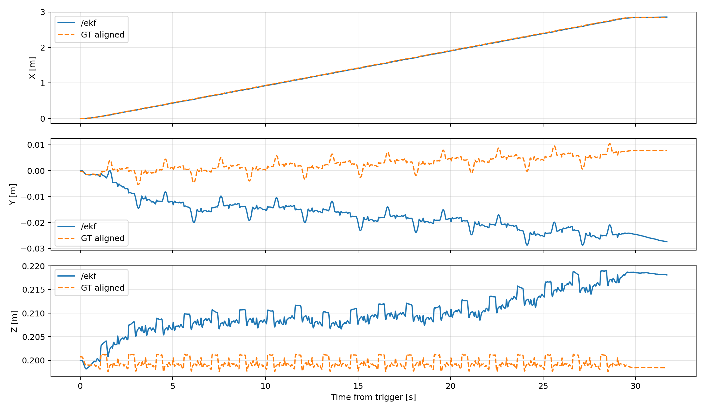
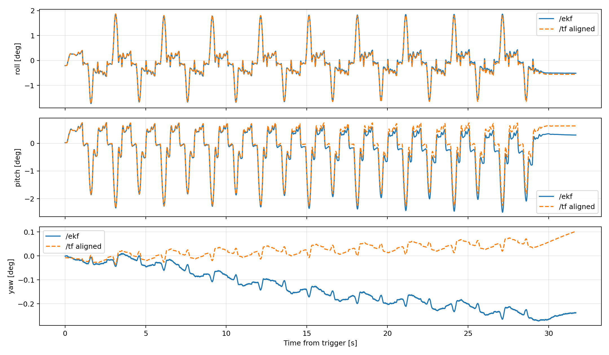
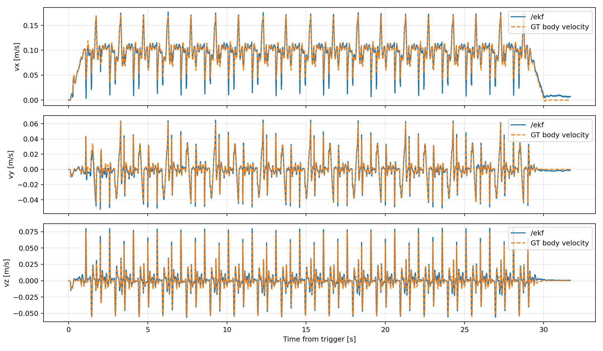
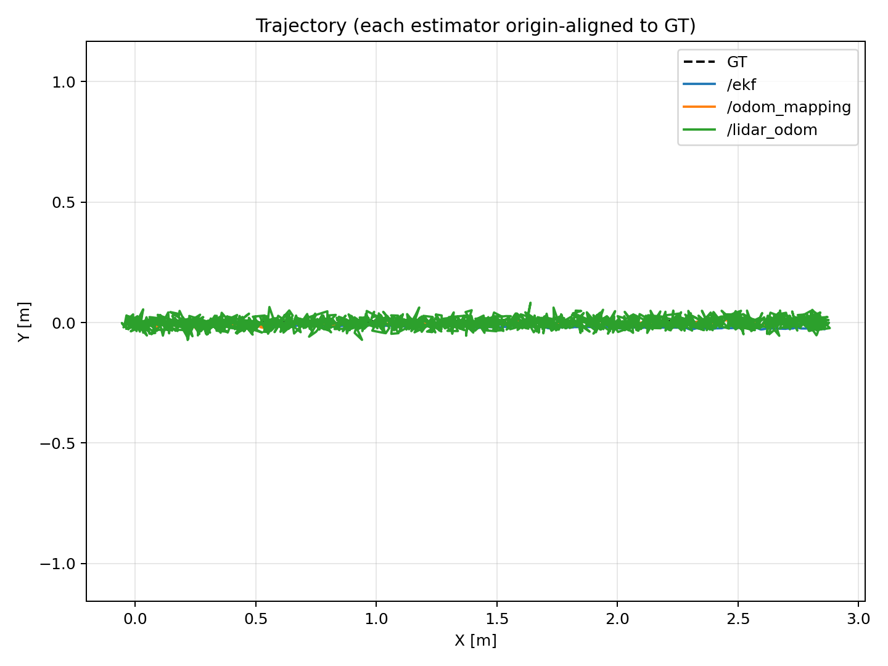
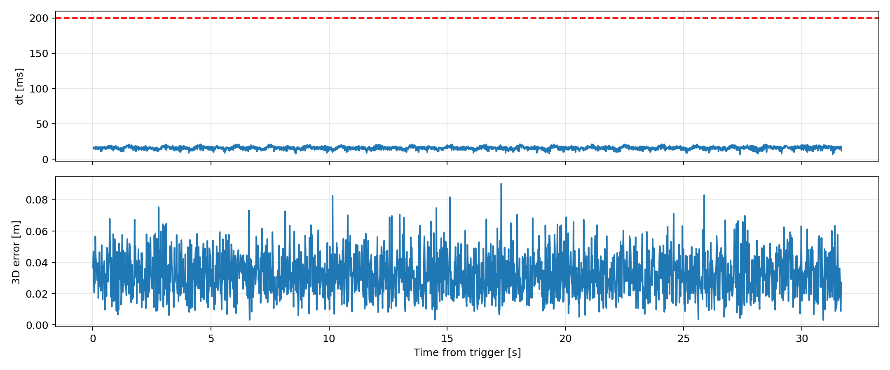
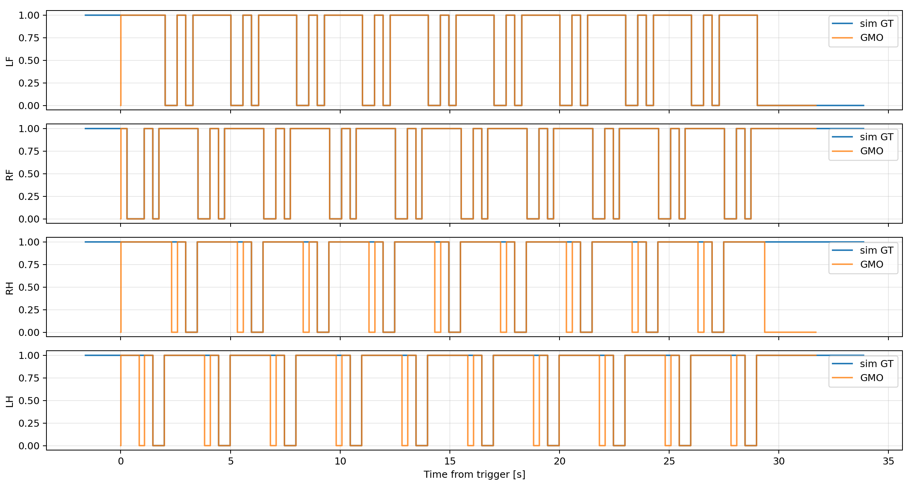
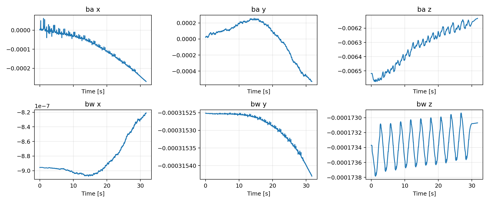

# FLAT_WLW_NEW_SIM 模擬分析報告

## 分析設定

- 量化區間：trigger 後 0.001–31.687 s（31.686 s）。
- Ground truth：位置 `/sim/position`、世界速度 `/sim/velocity`、機體速度 `/sim/body_velocity`、姿態 `/tf` 的 `odom → base_link`、接觸 `/sim/leg_contact`。
- 位置與姿態指標均以共同區間起始樣本的固定 offset 對齊，以排除各估測器初始化原點差異；因此量測的是追蹤與漂移誤差。

## 內部 EKF

- 位置 RMSE (X/Y/Z/3D)：0.009, 0.022, 0.012 / 0.026 m；最大 3D 誤差 0.041 m。
- 機體速度 RMSE (vx/vy/vz)：0.009, 0.004, 0.006 m/s。
- 姿態 RMSE (roll/pitch/yaw)：0.03, 0.16, 0.19 deg。

## 外部融合與 LiDAR

- `/odom_mapping` 位置 3D RMSE：0.009 m；姿態 RMSE (R/P/Y)：0.15, 0.20, 0.04 deg。
- `/fusion/bv` 機體速度 RMSE (vx/vy/vz)：0.106, 0.015, 0.018 m/s。
- `/lidar_odom`：1996 筆，平均間隔 15.9 ms，>200 ms gap 0，>5 cm jump 738，3D RMSE 0.035 m。

## 接觸狀態

| 腿 | Precision | Recall | F1 | 平均接觸延遲 (ms) |
|---|---:|---:|---:|---:|
| LF | 0.999 | 0.997 | 0.998 | 2.8 |
| RF | 1.000 | 0.996 | 0.998 | 3.9 |
| RH | 1.000 | 0.822 | 0.902 | 3.6 |
| LH | 1.000 | 0.900 | 0.947 | 3.8 |

## Bias

最後 5 s 的 accelerometer bias 平均值：[-0.00023, -0.000424, -0.006161] m/s²；gyro bias 平均值：[-1e-06, -0.000315, -0.000173] rad/s。

## 結論

- 以上結果直接以模擬原生真值比較，不涉及 VICON 時間同步或座標轉換。
- LiDAR topic 的 header frame 為 `odom`，故本次直接在 odom 座標比較；仍使用起始固定 offset 對齊以隔離初始化差異。
